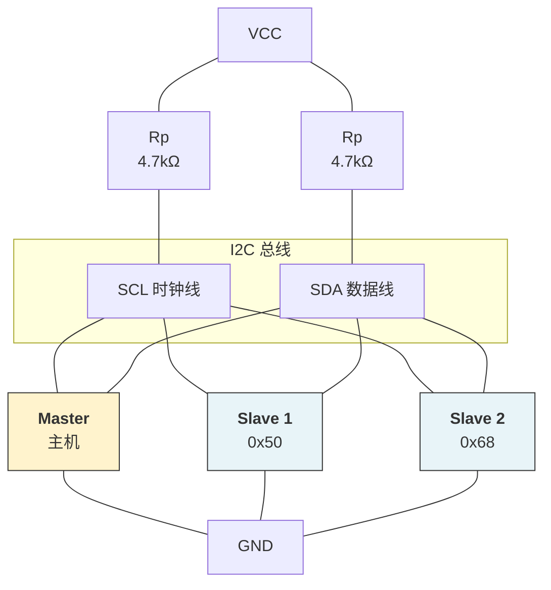
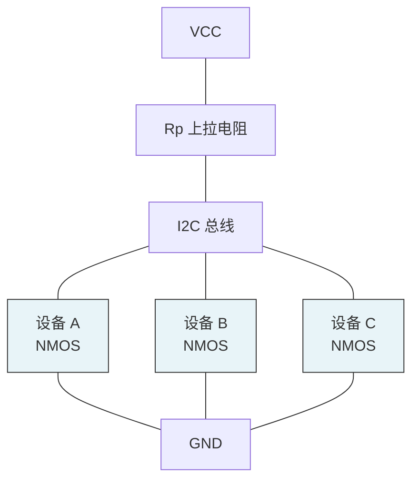
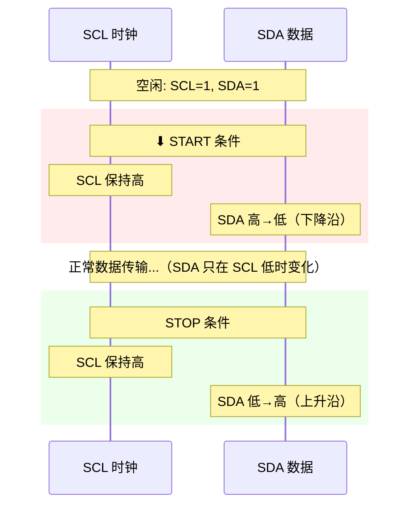
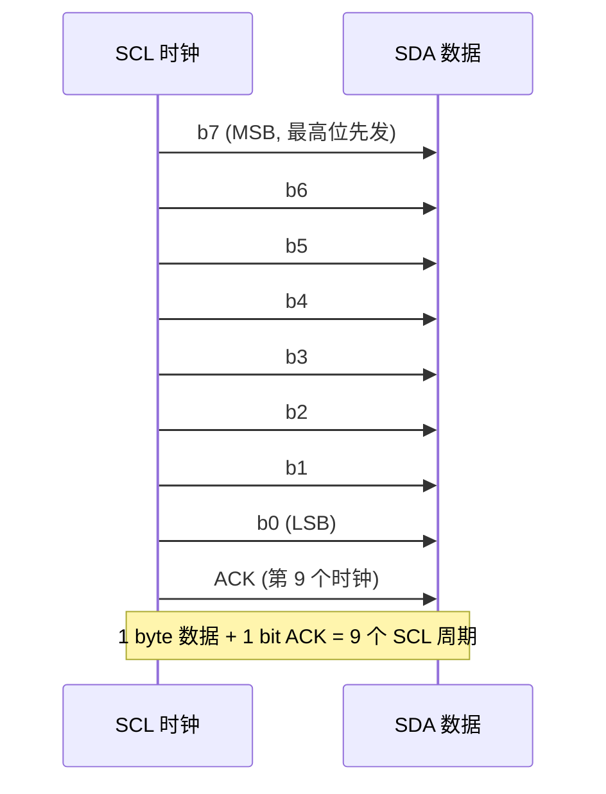
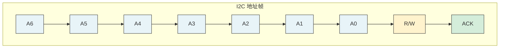
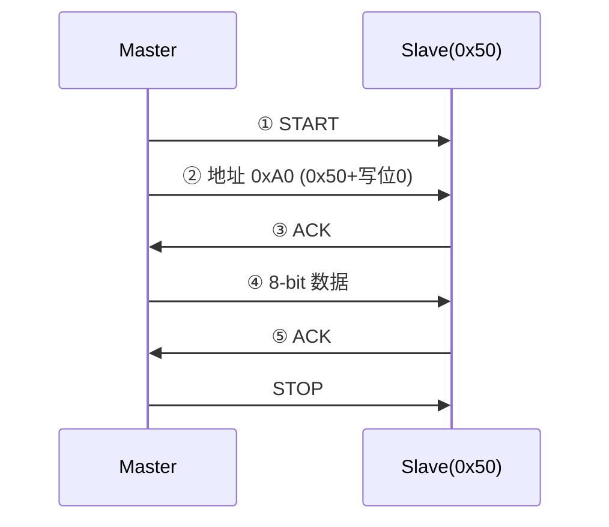
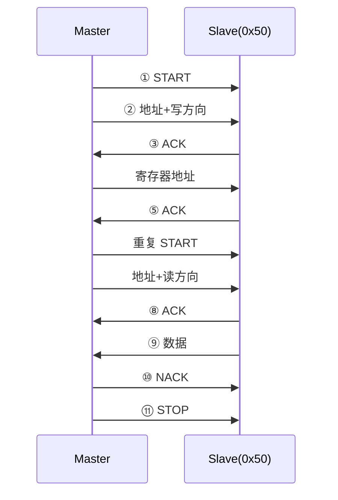
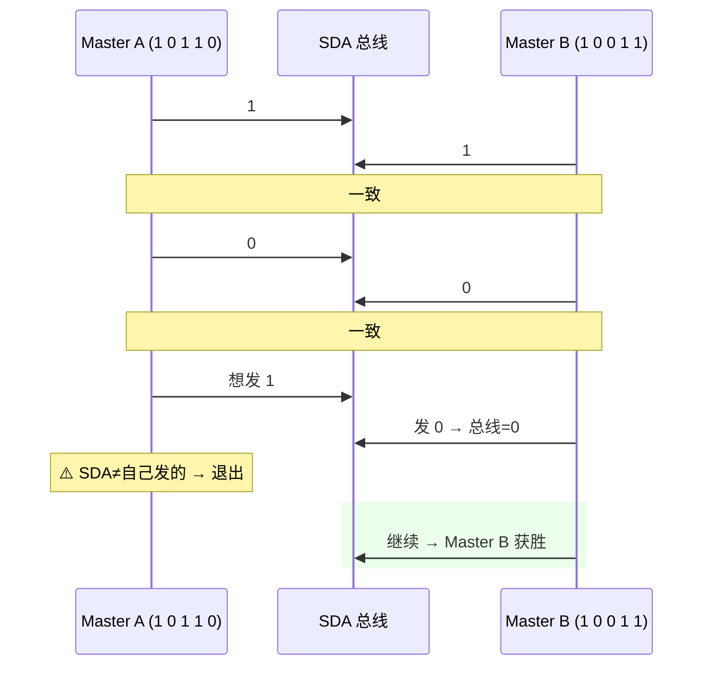

---
tags:
  - FPGA
  - 接口协议
  - I2C
  - IIC
  - 串行通信
created: 2026-07-22
---

# I2C（I²C）串行通信协议

## 一、大白话一句话理解

> I2C 就像**一个微信群**——群里只有两条"频道"（SCL 和 SDA），所有设备都挂在这两条线上。谁要说话先喊对方的"群昵称"（7-bit 地址），被叫到的设备才回应。同一时刻只能一个人说话（半双工），但好处是只需要 2 根线就能连 128 个设备！

---

## 二、I2C 是什么

I2C（Inter-Integrated Circuit，内部集成电路总线）是 Philips（现 NXP）公司发明的**半双工同步串行通信**协议。

**核心特征：**

| 特征 | 说明 |
|------|------|
| 同步/异步 | **同步**——需要共享时钟信号（SCL） |
| 双工方式 | **半双工**——同一时刻只能单向传输 |
| 物理线条 | **2 根**：SCL（时钟）、SDA（数据） |
| 主从关系 | 支持**多主多从**——任何设备都可以发起通信 |
| 寻址方式 | 7-bit 或 10-bit 地址 |
| 速率 | 标准100kHz / 快速400kHz / 高速3.4MHz |
| 总线负载 | 每级需要**上拉电阻** |

---

## 三、硬件连接

### 3.1 总线结构



**关键特点：**
- SCL 和 SDA 都是**开漏输出（Open-Drain）**，需要上拉电阻
- 所有设备并联在同两条线上
- 每个从机有唯一的 7-bit 地址
- 任何设备都可以做 Master（但同一时刻只有一个 Master 控制总线）

### 3.2 为什么需要上拉电阻？



> - **设备输出低电平**：内部 NMOS 导通 → 把线拉到 GND → 线上为 0
> - **设备释放总线**：内部 NMOS 断开 → 线上没有驱动 → 靠上拉电阻拉到 VCC → 线上为 1

> 💡 这就是"线与"（Wired-AND）特性——**任意一个设备拉低，总线就是低**。这是 I2C 仲裁机制的物理基础。

---

## 四、协议详解

### 4.1 通信流程总览

一次完整的 I2C 传输由以下步骤组成：

```
START → [地址 + R/W] → ACK → [数据1] → ACK → [数据2] → ACK → ... → STOP
```

### 4.2 START 和 STOP 条件

这是 I2C 最特殊的两个信号——**在 SCL 为高时，SDA 的跳变代表特殊含义**：



>  正常数据传输时，SDA **只在 SCL 为低时变化**。只有在 START/STOP 时，SDA 才在 SCL 高时跳变。

### 4.3 数据帧格式



### 4.4 地址帧



| 位 | 说明 |
|----|------|
| A6~A0 | 7-bit 设备地址 |
| R/W | **0** = 写（Master→Slave），**1** = 读（Slave→Master） |
| ACK | 第 9 位：接收方应答 |

**ACK/NACK：**
- **ACK（应答）**：接收方拉低 SDA（第 9 个时钟周期），表示"我收到了"
- **NACK（非应答）**：SDA 保持高，表示"没收到/最后一个字节/不想要了"

### 4.5 写操作时序



### 4.6 读操作时序



> **为什么要"重复 START"？** 因为很多设备（如 EEPROM）需要先写"寄存器地址"再读数据：START → 写地址+寄存器地址 → **重复 START** → 读地址 → 读数据 → STOP

### 4.7 完整的 EEPROM 读取示例

```
读 EEPROM 0x50 的 0x0A 地址的数据：

① START
② 发送 0xA0 (0x50<<1 | 0)    ← 写方向
③ 等待 ACK
④ 发送 0x0A (寄存器地址)      ← 要读的地址
⑤ 等待 ACK
⑥ 重复 START
⑦ 发送 0xA1 (0x50<<1 | 1)    ← 读方向
⑧ 等待 ACK
⑨ 读取 1 字节数据
⑩ 发送 NACK（表示读完）
⑪ STOP
```

---

## 五、I2C 速率

| 模式 | 速率 | 说明 |
|------|------|------|
| 标准模式（Sm） | 100 kbps | 最基础 |
| 快速模式（Fm） | 400 kbps | 最常用 |
| 快速模式+（Fm+） | 1 Mbps | 较新设备 |
| 高速模式（Hs） | 3.4 Mbps | 需要特殊主机 |
| 超快速模式 | 5 Mbps | 极少见 |

---

## 六、Verilog 代码实现

### 6.1 I2C Master 模块

```verilog
module i2c_master #(
    parameter CLK_FREQ = 50_000_000,  // 系统时钟 50MHz
    parameter I2C_FREQ = 100_000      // I2C 时钟 100kHz
)(
    input  wire       clk,
    input  wire       rst_n,

    // 用户命令接口
    input  wire       start_cmd,    // 启动命令
    input  wire       stop_cmd,     // 停止命令
    input  wire [7:0] tx_data,     // 待发送数据
    input  wire       tx_valid,    // 发送数据有效
    output reg  [7:0] rx_data,     // 接收到的数据
    output reg        rx_valid,    // 接收数据有效
    output reg        busy,        // 忙标志
    output reg        ack_error,   // ACK 错误

    // I2C 引脚（开漏，需要外部上拉）
    output reg        scl,         // I2C 时钟
    inout  wire       sda          // I2C 数据（双向）
);

    // ======== 时钟分频 ========
    // I2C 一个周期需要 4 个阶段：
    //   LOW → HIGH → HIGH → LOW
    // 每段 = CLK_FREQ / (4 * I2C_FREQ)
    localparam CLK_CNT_MAX = CLK_FREQ / (4 * I2C_FREQ);

    reg [15:0] clk_cnt;
    reg [1:0]  clk_phase;     // 0=LOW, 1=RISING, 2=HIGH, 3=FALLING

    // ======== 状态机 ========
    localparam IDLE       = 4'd0;
    localparam START_PREP = 4'd1;   // 准备 START
    localparam START_SDA  = 4'd2;   // SDA 拉低
    localparam TX_BIT     = 4'd3;   // 发送数据位
    localparam RX_BIT     = 4'd4;   // 接收数据位
    localparam ACK_TX     = 4'd5;   // 发送 ACK/NACK
    localparam ACK_RX     = 4'd6;   // 接收 ACK
    localparam STOP_SDA   = 4'd7;   // STOP 条件
    localparam DONE       = 4'd8;

    reg [3:0] state;
    reg [7:0] shift_reg;
    reg [2:0] bit_cnt;       // 0~7 数据位, 8=ACK
    reg       sda_out;       // SDA 输出值
    reg       sda_oe;        // SDA 输出使能（0=释放，1=拉低）

    // SDA 三态控制
    assign sda = sda_oe ? 1'b0 : 1'bz;  // 开漏：0 拉低，1 释放
    wire sda_in = sda;                    // 读取 SDA 状态

    // ======== 时钟计数器 ========
    wire clk_tick = (clk_cnt == CLK_CNT_MAX - 1);

    always @(posedge clk or negedge rst_n) begin
        if (!rst_n) begin
            clk_cnt   <= 0;
            clk_phase <= 0;
        end else if (state != IDLE && state != DONE) begin
            if (clk_tick) begin
                clk_cnt   <= 0;
                clk_phase <= clk_phase + 1'b1;
            end else begin
                clk_cnt <= clk_cnt + 1'b1;
            end
        end else begin
            clk_cnt   <= 0;
            clk_phase <= 0;
        end
    end

    // ======== 主状态机 ========
    always @(posedge clk or negedge rst_n) begin
        if (!rst_n) begin
            state     <= IDLE;
            scl       <= 1'b1;
            sda_out   <= 1'b1;
            sda_oe    <= 1'b0;
            busy      <= 1'b0;
            bit_cnt   <= 0;
            shift_reg <= 0;
            rx_data   <= 0;
            rx_valid  <= 1'b0;
            ack_error <= 1'b0;
        end else begin
            rx_valid <= 1'b0;

            case (state)
                IDLE: begin
                    scl    <= 1'b1;
                    sda_oe <= 1'b0;   // 释放 SDA
                    busy   <= 1'b0;

                    if (start_cmd) begin
                        busy  <= 1'b1;
                        state <= START_PREP;
                    end else if (stop_cmd) begin
                        busy  <= 1'b1;
                        state <= STOP_SDA;
                    end else if (tx_valid) begin
                        busy      <= 1'b1;
                        shift_reg <= tx_data;
                        bit_cnt   <= 0;
                        sda_out   <= tx_data[7]; // MSB first
                        sda_oe    <= 1'b1;
                        state     <= TX_BIT;
                    end
                end

                // ===== START 条件 =====
                START_PREP: begin
                    // SCL=1, SDA=1 → 准备拉低 SDA
                    scl    <= 1'b1;
                    sda_oe <= 1'b0;
                    if (clk_tick && clk_phase == 0) begin
                        state <= START_SDA;
                    end
                end

                START_SDA: begin
                    // SCL 保持高，SDA 拉低 → START
                    scl    <= 1'b1;
                    sda_oe <= 1'b1;  // 拉低 SDA
                    if (clk_tick && clk_phase == 0) begin
                        scl   <= 1'b0;  // SCL 也拉低
                        state <= IDLE;
                        busy  <= 1'b0;
                    end
                end

                // ===== 发送数据位 =====
                TX_BIT: begin
                    if (clk_phase == 0) begin
                        // SCL 低 → 准备数据
                        scl     <= 1'b0;
                        sda_out <= shift_reg[7];
                        sda_oe  <= shift_reg[7]; // 0 则拉低，1 则释放
                    end else if (clk_phase == 1) begin
                        // SCL 上升沿
                        scl <= 1'b1;
                    end else if (clk_phase == 3) begin
                        // SCL 下降沿 → 移下一位
                        scl       <= 1'b0;
                        shift_reg <= {shift_reg[6:0], 1'b0};
                        bit_cnt   <= bit_cnt + 1'b1;

                        if (bit_cnt == 7) begin
                            // 8 bit 发完 → 进入 ACK 接收
                            sda_oe <= 1'b0;  // 释放 SDA，等从机 ACK
                            state  <= ACK_RX;
                            bit_cnt <= 0;
                        end
                    end
                end

                // ===== 接收 ACK =====
                ACK_RX: begin
                    if (clk_phase == 1) begin
                        scl <= 1'b1;  // SCL 拉高，读取 ACK
                    end else if (clk_phase == 2) begin
                        // SCL 高时采样 SDA
                        if (sda_in == 1'b1) begin
                            ack_error <= 1'b1;  // NACK → 错误
                        end else begin
                            ack_error <= 1'b0;  // ACK → 正常
                        end
                    end else if (clk_phase == 3) begin
                        scl   <= 1'b0;
                        state <= IDLE;
                        busy  <= 1'b0;
                    end
                end

                // ===== STOP 条件 =====
                STOP_SDA: begin
                    // SCL 低 → SDA 拉低 → SCL 高 → SDA 释放（上升沿 = STOP）
                    if (clk_phase == 0) begin
                        scl    <= 1'b0;
                        sda_oe <= 1'b1;  // SDA 拉低
                    end else if (clk_phase == 1) begin
                        scl <= 1'b1;     // SCL 拉高
                    end else if (clk_phase == 3) begin
                        sda_oe <= 1'b0;  // SDA 释放 → 上升沿 = STOP
                        state  <= DONE;
                    end
                end

                DONE: begin
                    state <= IDLE;
                    busy  <= 1'b0;
                end

                default: state <= IDLE;
            endcase
        end
    end

endmodule
```

### 6.2 I2C 顶层使用示例（读写 EEPROM）

```verilog
module i2c_eeprom_test #(
    parameter CLK_FREQ = 50_000_000,
    parameter I2C_FREQ = 100_000
)(
    input  wire       clk,
    input  wire       rst_n,
    input  wire       read_btn,     // 读按钮
    output wire [7:0] led,          // LED 显示读到的数据
    output reg        scl,
    inout  wire       sda
);

    // ======== I2C Master 实例 ========
    wire        start_cmd;
    wire        stop_cmd;
    wire [7:0]  tx_data;
    wire        tx_valid;
    wire [7:0]  rx_data;
    wire        rx_valid;
    wire        busy;
    wire        ack_error;

    i2c_master #(
        .CLK_FREQ(CLK_FREQ),
        .I2C_FREQ(I2C_FREQ)
    ) u_i2c (
        .clk       (clk),
        .rst_n     (rst_n),
        .start_cmd (start_cmd),
        .stop_cmd  (stop_cmd),
        .tx_data   (tx_data),
        .tx_valid  (tx_valid),
        .rx_data   (rx_data),
        .rx_valid  (rx_valid),
        .busy      (busy),
        .ack_error (ack_error),
        .scl       (scl),
        .sda       (sda)
    );

    // ======== 读写控制状态机 ========
    localparam EEPROM_ADDR = 7'h50;  // AT24C02 地址

    reg [3:0] step;
    reg       btn_d1;
    wire      btn_press = read_btn & ~btn_d1;

    always @(posedge clk or negedge rst_n) begin
        if (!rst_n) begin
            btn_d1   <= 1'b0;
            step     <= 0;
            start_cmd <= 1'b0;
            stop_cmd  <= 1'b0;
            tx_data   <= 8'd0;
            tx_valid  <= 1'b0;
            led       <= 8'd0;
        end else begin
            btn_d1   <= read_btn;
            start_cmd <= 1'b0;
            stop_cmd  <= 1'b0;
            tx_valid  <= 1'b0;

            case (step)
                0: if (btn_press) begin
                       start_cmd <= 1'b1;   // START
                       step <= 1;
                   end

                1: if (!busy) begin
                       tx_data  <= {EEPROM_ADDR, 1'b0}; // 地址+写
                       tx_valid <= 1'b1;
                       step <= 2;
                   end

                2: if (!busy) begin
                       tx_data  <= 8'h0A;    // 寄存器地址
                       tx_valid <= 1'b1;
                       step <= 3;
                   end

                3: if (!busy) begin
                       start_cmd <= 1'b1;    // Repeated START
                       step <= 4;
                   end

                4: if (!busy) begin
                       tx_data  <= {EEPROM_ADDR, 1'b1}; // 地址+读
                       tx_valid <= 1'b1;
                       step <= 5;
                   end

                5: if (!busy) begin
                       // 读取数据（需特殊处理，简化示意）
                       step <= 6;
                   end

                6: begin
                       stop_cmd <= 1'b1;     // STOP
                       step <= 7;
                   end

                7: if (!busy) begin
                       led  <= rx_data;
                       step <= 0;
                   end

                default: step <= 0;
            endcase
        end
    end

endmodule
```

---

## 七、关键设计要点

### 7.1 上拉电阻的选择

```
上拉电阻不能太大也不能太小：

太大 → 上升沿太慢（RC 时间常数大）→ 高速时信号不到位
太小 → 灌电流太大 → 功耗高、可能损坏器件

推荐值：
  100kHz: 4.7kΩ
  400kHz: 2.2kΩ ~ 4.7kΩ
  3.4MHz: 1kΩ

公式：Rp(min) = (VCC - VOL_max) / IOL_max
      Rp(max) = tr / (0.8473 × Cb)   ← tr 是上升时间，Cb 是总线电容
```

### 7.2 总线电容

I2C 总线有最大电容限制（通常 400pF），超过后信号质量恶化：
- 每个器件引脚约 10~15pF
- PCB 走线约 1~2pF/cm
- 总线太长或设备太多 → 需要总线缓冲器（如 PCA9600）

### 7.3 地址冲突

常见 I2C 设备地址：

| 设备类型 | 典型地址 | 说明 |
|---------|---------|------|
| EEPROM (AT24C02) | 0x50~0x57 | A0/A1/A2 引脚配置 |
| 加速度计 (ADXL345) | 0x53 或 0x1D | SDO 引脚选择 |
| 温湿度 (SHT30) | 0x44 或 0x45 | ADDR 引脚选择 |
| OLED (SSD1306) | 0x3C 或 0x3D | SA0 引脚选择 |
| RTC (DS3231) | 0x68 | 固定地址 |

---

## 八、I2C 的仲裁机制

当多个 Master 同时尝试控制总线时，I2C 通过"线与"特性实现仲裁：

```
Master A 想发: 1 0 1 1 0 ...
Master B 想发: 1 0 0 1 1 ...

SDA 实际:  1 0 0 1 0 ...  (线与：任一拉低则为低)
                  ↑
             Master A 发现 SDA=0 ≠ 自己发的 1
             → Master A 退出，Master B 获胜
```

> 仲裁过程**不丢数据**——获胜的 Master 完全不知道有竞争发生。

---

## 九、I2C 的优缺点

### 优点 ✅
- **省线**：只需 2 根线，不管挂多少设备
- **地址寻址**：一个总线最多 128 个设备（7-bit 地址）
- **多主支持**：内置仲裁机制
- **应答机制**：每个字节都有 ACK 确认
- **普及度高**：传感器、存储器大量使用

### 缺点 ❌
- **半双工**：同一时刻只能单向传输
- **速度受限**：比 SPI 慢（标准 100kHz/400kHz）
- **需要上拉电阻**：增加 BOM 成本和功耗
- **协议复杂**：START/STOP/ACK/重启动 等概念多
- **总线电容限制**：设备多了速度下降
- **没有标准错误恢复**：通信出错后恢复比较复杂

---

## 十、常见应用场景

- **传感器读取**：温湿度、加速度计、陀螺仪、气压计
- **EEPROM 读写**：AT24C02/04/08 等小容量存储
- **RTC 时钟芯片**：DS3231、PCF8563
- **I/O 扩展**：PCA9555、PCF8574
- **DAC 控制**：低速高精度 DAC（如 AD5xxx）
- **电源管理**：PMIC 配置
- **显示屏**：小尺寸 OLED（SSD1306）

---

## 十一、三种协议终极对比

| 特性 | UART | SPI | I2C |
|------|------|-----|-----|
| 线数 | 2 | 4+N | **2** |
| 速度 | ⭐ | ⭐⭐⭐ | ⭐⭐ |
| 双工 | 全 | 全 | 半 |
| 多设备 | ❌ | CS 扩展 | **地址寻址** |
| 应答 | ❌ | ❌ | ✅ |
| 多主机 | ❌ | ❌ | ✅ |
| 上拉电阻 | ❌ | ❌ | ✅ 需要 |
| 复杂度 | ⭐ | ⭐⭐ | ⭐⭐⭐ |
| 典型应用 | 调试串口 | Flash/ADC | 传感器/EEPROM |

---

## 十二、FAQ 常见问题

**Q：I2C 和 IIC 是一回事吗？**
> 是的！I2C = I²C = IIC，只是写法不同。因为 "I²C" 中的上标 "²" 在文本中不方便写，所以也写作 I2C 或 IIC。

**Q：为什么 I2C 需要上拉电阻，SPI 不需要？**
> I2C 使用开漏输出，器件只能拉低或释放，不能主动输出高电平，所以需要上拉电阻提供高电平。SPI 使用推挽输出，可以主动输出高低电平。

**Q：I2C 地址中的"读写位"是什么意思？**
> I2C 的 7-bit 地址后面跟着 1 bit R/W：0 表示写（主机发给从机），1 表示读（从机发给主机）。所以常说"0xA0 是写地址，0xA1 是读地址"——其实 0x50 左移 1 位再加 R/W。

**Q：I2C 通信失败怎么排查？**
> 1. 检查上拉电阻是否焊接
> 2. 用示波器看 SCL 和 SDA 波形
> 3. 确认地址是否正确（很多芯片地址可配置）
> 4. 检查时钟频率是否超出从机支持范围
> 5. 用 I2C 扫描工具枚举总线上的设备### 4.3 数据帧格式


### 八、I2C 的仲裁机制

当多个 Master 同时尝试控制总线时，I2C 通过"线与"特性实现仲裁：



> 仲裁过程**不丢数据**——获胜的 Master 完全不知道有竞争发生。

---

# I2C（I²C）串行通信协议

## 一、大白话一句话理解

> I2C 就像**一个微信群**——群里只有两条"频道"（SCL 和 SDA），所有设备都挂在这两条线上。谁要说话先喊对方的"群昵称"（7-bit 地址），被叫到的设备才回应。同一时刻只能一个人说话（半双工），但好处是只需要 2 根线就能连 128 个设备！

---

