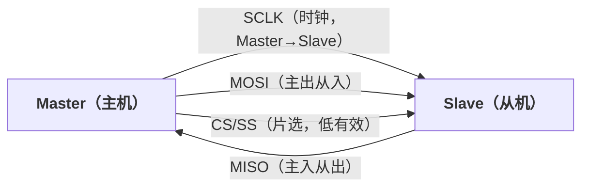
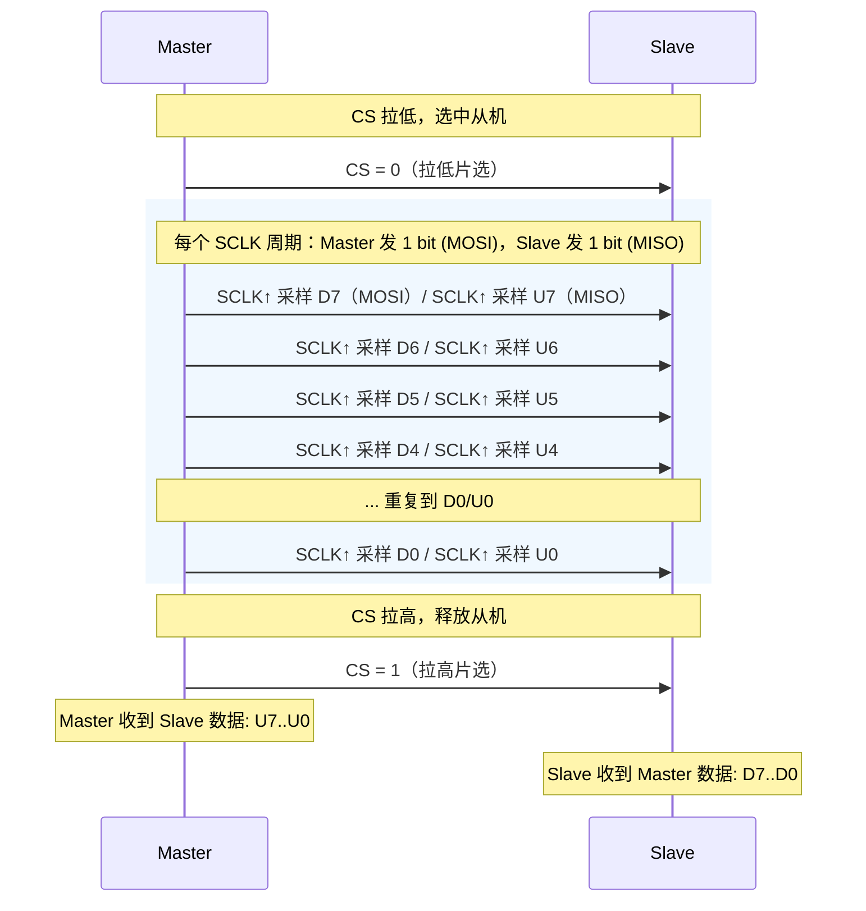
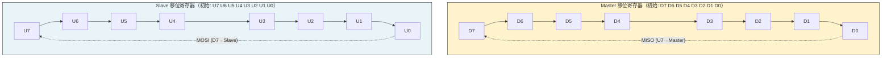
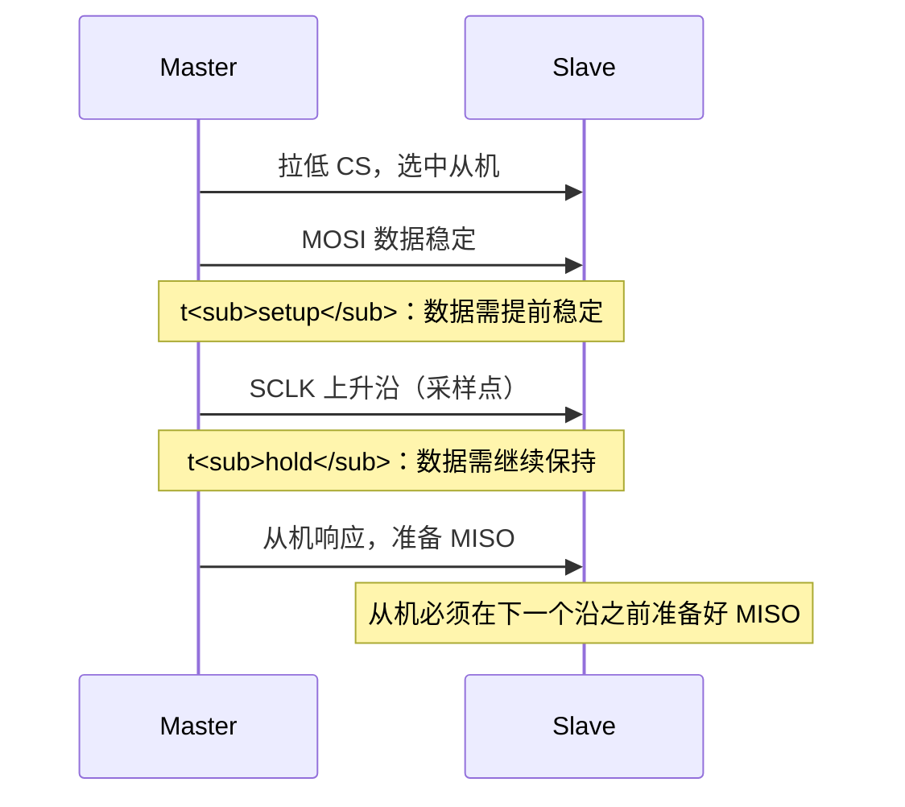

---
tags:
  - FPGA
  - 接口协议
  - SPI
  - 串行通信
created: 2026-07-22
---

# SPI 串行通信协议

## 一、大白话一句话理解

> SPI 就像**餐厅的转盘传送带**——老板（Master）控制转盘转速（时钟），从厨房（MOSI）往桌上送菜，同时空盘子（MISO）从桌上回收到厨房。一根管送、一根管收，同时干活，又快又利索。每个桌子（Slave）有独立的呼叫按钮（CS 片选）。

---

## 二、SPI 是什么

SPI（Serial Peripheral Interface，串行外设接口）是 Motorola 公司提出的**同步串行通信**接口。

**核心特征：**

| 特征 | 说明 |
|------|------|
| 同步/异步 | **同步**——需要共享时钟信号（SCLK） |
| 双工方式 | **全双工**——收发同时进行 |
| 物理线条 | **4 根**：SCLK、MOSI、MISO、CS/SS |
| 主从关系 | **一主多从**——Master 控制时钟，CS 选择从机 |
| 速率 | 可达数十甚至上百 Mbps（远超 UART） |

---

## 三、硬件连接

### 3.1 信号线定义



| 信号线 | 全称 | 方向 | 功能 |
|--------|------|------|------|
| **SCLK** | Serial Clock | Master → Slave | 时钟信号，由主机产生 |
| **MOSI** | Master Out Slave In | Master → Slave | 主机发送、从机接收 |
| **MISO** | Master In Slave Out | Master ← Slave | 从机发送、主机接收 |
| **CS/SS** | Chip Select / Slave Select | Master → Slave | 片选，低有效，选中哪个从机 |

### 3.2 一主多从连接

```mermaid
flowchart TB
    subgraph Shared["共享总线"]
        SCLK["SCLK ──┐"]
        MOSI["MOSI ──┤"]
        MISO["MISO ─┤"]
    end

    S0["<b>Slave 0</b><br/>CS0"]
    S1["<b>Slave 1</b><br/>CS1"]
    S2["<b>Slave 2</b><br/>CS2"]

    SCLK --- S0 & S1 & S2
    MOSI --> S0 & S1 & S2
    S0 & S1 & S2 --> MISO

    Master["<b>Master</b>"]
    Master --- Shared
    Master -.- "CS0" -.- S0
    Master -.- "CS1" -.- S1
    Master -.- "CS2" -.- S2

    style S0 fill:#e8f4f8,stroke:#333
    style S1 fill:#e8f4f8,stroke:#333
    style S2 fill:#e8f4f8,stroke:#333
    style Master fill:#fff3cd,stroke:#333
```

> 💡 **MOSI 和 MISO 是共享总线**，但 **CS 是每个从机独立的**。这就是为什么设备多了线会很多。

---

## 四、SPI 的四种工作模式（CPOL & CPHA）

这是 SPI 最让人头疼的地方。核心就是两个参数：

### 4.1 CPOL（Clock Polarity，时钟极性）

决定**空闲时**时钟是高还是低：

| CPOL | 空闲电平 | 波形示意 | 第一个边沿 | 第二个边沿 |
|------|---------|---------|-----------|-----------|
| **0** | 低 (0) | 低→高→低→高→低（方波脉冲，空闲低电平） | 上升沿 ↑ | 下降沿 ↓ |
| **1** | 高 (1) | `‾‾‾└‾‾‾┘‾‾┘└‾` | 下降沿 ↓ | 上升沿 ↑ |

> 表格中的波形：下划线 `_` 代表低电平，上划线 `‾` 代表高电平。CPOL=0 空闲低，CPOL=1 空闲高。

### 4.2 CPHA（Clock Phase，时钟相位）

决定**在哪个边沿采样数据**：

| CPHA | 采样边沿 | 通俗理解 |
|------|---------|---------|
| **0** | 第一个边沿 | "前缘采样"——时钟跳变后立即采 |
| **1** | 第二个边沿 | "后沿采样"——时钟回到空闲前采 |

### 4.3 四种模式组合

| 模式 | CPOL | CPHA | 空闲电平 | 采样边沿 | 移位边沿 |
|------|------|------|---------|---------|---------|
| Mode 0 | 0 | 0 | 低 | 上升沿 | 下降沿 |
| Mode 1 | 0 | 1 | 低 | 下降沿 | 上升沿 |
| Mode 2 | 1 | 0 | 高 | 下降沿 | 上升沿 |
| Mode 3 | 1 | 1 | 高 | 上升沿 | 下降沿 |

> ⚡ **Mode 0 和 Mode 3 最常用！** 大部分 SPI Flash、ADC、DAC 都用这两个模式。

### 4.4 Mode 0 时序图（最常用）

Mode 0 = CPOL(0) + CPHA(0)：空闲低，**上升沿采样**，下降沿移位



> 在 Mode 0 中：CS 拉低 → 每个 SCLK 上升沿同时采样 MOSI 和 MISO → 循环 8 次 → CS 拉高。

---

## 五、SPI 传输过程详解

### 5.1 一次完整的 8-bit 传输


### 5.2 本质理解：移位寄存器交换

SPI 的本质就是**两个移位寄存器互换数据**：



> 经过 8 个 SCLK 后，Master 寄存器里变成 U7~U0，Slave 寄存器里变成 D7~D0——**数据完全互换**。
>
> 💡 这意味着 **SPI 没有纯粹的"只发"或"只收"**——每次传输必然是发 8 bit 同时收 8 bit。如果你只关心读，那发出去的 8 bit 就是"垃圾数据"（通常是 0x00 或 0xFF）。

---

## 六、Verilog 代码实现

### 6.1 SPI Master 模块

```verilog
module spi_master #(
    parameter CLK_DIV = 4,      // 分频系数：SCLK = CLK / (2*CLK_DIV)
    parameter DATA_WIDTH = 8    // 数据宽度
)(
    input  wire                  clk,
    input  wire                  rst_n,

    // 用户接口
    input  wire [DATA_WIDTH-1:0] tx_data,     // 待发送数据
    input  wire                  start,        // 启动传输
    output reg  [DATA_WIDTH-1:0] rx_data,     // 接收到的数据
    output reg                   rx_valid,    // 接收数据有效

    // SPI 引脚
    output reg                   sclk,        // SPI 时钟
    output reg                   mosi,        // 主出从入
    input  wire                  miso,        // 主入从出
    output reg                   cs_n         // 片选（低有效）
);

    // ======== 状态机 ========
    localparam IDLE  = 2'd0;
    localparam TRANS = 2'd1;
    localparam DONE  = 2'd2;

    reg [1:0]             state;
    reg [$clog2(CLK_DIV)-1:0] clk_cnt;    // 分频计数器
    reg [DATA_WIDTH-1:0]  shift_reg;      // 移位寄存器
    reg [$clog2(DATA_WIDTH)-1:0] bit_cnt; // 位计数
    reg                   sclk_toggle;    // 时钟翻转标志

    // ======== 主状态机 ========
    always @(posedge clk or negedge rst_n) begin
        if (!rst_n) begin
            state      <= IDLE;
            cs_n       <= 1'b1;
            sclk       <= 1'b0;    // Mode 0: CPOL=0
            clk_cnt    <= 0;
            bit_cnt    <= 0;
            shift_reg  <= 0;
            mosi       <= 1'b0;
            rx_data    <= 0;
            rx_valid   <= 1'b0;
            sclk_toggle <= 1'b0;
        end else begin
            rx_valid <= 1'b0;

            case (state)
                IDLE: begin
                    cs_n <= 1'b1;    // 空闲时 CS 拉高
                    sclk <= 1'b0;
                    if (start) begin
                        cs_n       <= 1'b0;   // 拉低 CS 选中从机
                        shift_reg  <= tx_data; // 加载发送数据
                        bit_cnt    <= 0;
                        clk_cnt    <= 0;
                        sclk_toggle <= 1'b0;
                        state      <= TRANS;
                        mosi       <= tx_data[DATA_WIDTH-1]; // MSB first
                    end
                end

                TRANS: begin
                    if (clk_cnt == CLK_DIV - 1) begin
                        clk_cnt     <= 0;
                        sclk_toggle <= ~sclk_toggle;

                        if (sclk_toggle) begin
                            // SCLK 下降沿 → 更新 MOSI（移位）
                            sclk <= ~sclk;
                            if (bit_cnt < DATA_WIDTH - 1) begin
                                shift_reg <= {shift_reg[DATA_WIDTH-2:0], miso};
                                mosi      <= shift_reg[DATA_WIDTH-2];
                            end else begin
                                // 最后一个 bit
                                shift_reg <= {shift_reg[DATA_WIDTH-2:0], miso};
                            end
                            bit_cnt <= bit_cnt + 1'b1;
                        end else begin
                            // SCLK 上升沿
                            sclk <= ~sclk;
                            if (bit_cnt >= DATA_WIDTH) begin
                                state <= DONE;
                            end
                        end
                    end else begin
                        clk_cnt <= clk_cnt + 1'b1;
                    end
                end

                DONE: begin
                    rx_valid <= 1'b1;
                    rx_data  <= shift_reg;
                    cs_n     <= 1'b1;    // 释放从机
                    state    <= IDLE;
                end
            endcase
        end
    end

endmodule
```

### 6.2 SPI Slave 模块

```verilog
module spi_slave #(
    parameter DATA_WIDTH = 8
)(
    input  wire                  clk,     // 从机本地时钟（用于同步 CS）
    input  wire                  rst_n,

    // 用户接口
    input  wire [DATA_WIDTH-1:0] tx_data, // 待发送数据（提前准备好）
    output reg  [DATA_WIDTH-1:0] rx_data, // 接收到的数据
    output reg                   rx_valid,

    // SPI 引脚
    input  wire                  sclk,
    input  wire                  mosi,
    output reg                   miso,
    input  wire                  cs_n
);

    // ======== CS 同步 ========
    reg cs_sync1, cs_sync2;
    wire cs_active = ~cs_sync2;

    always @(posedge clk or negedge rst_n) begin
        if (!rst_n) begin
            cs_sync1 <= 1'b1;
            cs_sync2 <= 1'b1;
        end else begin
            cs_sync1 <= cs_n;
            cs_sync2 <= cs_sync1;
        end
    end

    // ======== SCLK 边沿检测 ========
    reg sclk_d1, sclk_d2;

    always @(posedge clk or negedge rst_n) begin
        if (!rst_n) begin
            sclk_d1 <= 1'b0;
            sclk_d2 <= 1'b0;
        end else if (cs_active) begin
            sclk_d1 <= sclk;
            sclk_d2 <= sclk_d1;
        end else begin
            sclk_d1 <= 1'b0;
            sclk_d2 <= 1'b0;
        end
    end

    wire sclk_rise  =  sclk_d2 & ~sclk_d1;  // 上升沿
    wire sclk_fall  = ~sclk_d2 &  sclk_d1;  // 下降沿

    // ======== 移位寄存器 ========
    reg [DATA_WIDTH-1:0] shift_reg;
    reg [$clog2(DATA_WIDTH)-1:0] bit_cnt;

    // Mode 0 示例：上升沿采样，下降沿移位
    always @(posedge clk or negedge rst_n) begin
        if (!rst_n) begin
            shift_reg <= 0;
            bit_cnt   <= 0;
            miso      <= 1'b0;
            rx_data   <= 0;
            rx_valid  <= 1'b0;
        end else begin
            rx_valid <= 1'b0;

            if (!cs_active) begin
                // CS 无效 → 复位
                shift_reg <= tx_data;
                miso      <= tx_data[DATA_WIDTH-1]; // MSB first
                bit_cnt   <= 0;
            end else begin
                if (sclk_rise) begin
                    // 上升沿：采样 MOSI
                    shift_reg <= {shift_reg[DATA_WIDTH-2:0], mosi};
                    bit_cnt   <= bit_cnt + 1'b1;

                    if (bit_cnt == DATA_WIDTH - 1) begin
                        rx_valid <= 1'b1;
                        rx_data  <= {shift_reg[DATA_WIDTH-2:0], mosi};
                    end
                end

                if (sclk_fall) begin
                    // 下降沿：更新 MISO 输出
                    miso <= shift_reg[DATA_WIDTH-2];
                    shift_reg <= {shift_reg[DATA_WIDTH-2:0], 1'b0};
                end
            end
        end
    end

endmodule
```

---

## 七、关键设计要点

### 7.1 时序约束

SPI 的速度受限于以下因素：
- **Setup/Hold 时间**：数据必须在时钟边沿前稳定（setup），且边沿后保持一段时间（hold）
- **传播延迟**：信号在线上的传输延迟
- **从机响应速度**：从机必须在下一个时钟边沿前准备好 MISO 数据



### 7.2 时钟分频

在 FPGA 中，SCLK 由系统时钟分频得到：

$$f_{SCLK} = \frac{f_{CLK}}{2 \times CLK\_DIV}$$

例如系统时钟 50MHz，CLK_DIV = 5 → SCLK = 5MHz。

### 7.3 片选策略

- **独立 CS**：每个从机一根 CS 线（最常见，简单直接）
- **菊花链（Daisy Chain）**：多个从机串联，只需一根 CS（如某些 LED 驱动芯片）
- **3 线模式**：MOSI/MISO 合并为一根双向线（节省引脚）

```mermaid
flowchart LR
    Master["<b>Master</b>"]
    S0["<b>Slave 0</b>"]
    S1["<b>Slave 1</b>"]
    S2["<b>Slave 2</b>"]

    Master -->|MOSI (串联传递)| S0 -->|MOSI| S1 -->|MOSI| S2
    Master <--|MISO (串联返回)| S0 <--|MISO| S1 <--|MISO| S2

    Note["只需 1 根 CS，所有从机共用<br/>数据像流水一样逐个传递"]

    style S0 fill:#e8f4f8,stroke:#333
    style S1 fill:#e8f4f8,stroke:#333
    style S2 fill:#e8f4f8,stroke:#333
    style Master fill:#fff3cd,stroke:#333
    style Note fill:#f0f0f0,stroke:#999,stroke-dasharray: 5 5
```

---

## 八、SPI 的优缺点

### 优点 ✅
- **速度快**：可达数十 Mbps，远超 UART 和 I2C
- **全双工**：收发同时进行
- **协议简单**：没有复杂的地址机制、仲裁逻辑
- **灵活**：数据宽度可自定义（8/16/32 bit 都行）
- **无上拉电阻**：推挽输出，信号质量好

### 缺点 ❌
- **线多**：N 个从机需要 N 根 CS 线（3+N 根总线）
- **没有应答机制**：Master 不知道 Slave 是否正确收到
- **无多主支持**：标准 SPI 只支持一个 Master
- **距离短**：板级通信，不适合长距离

---

## 九、常见应用场景

- **SPI Flash**：W25Q64 等 NOR Flash，存储程序/数据
- **DAC**：AD9xxx 系列高速 DAC 配置
- **ADC**：AD7xxx 系列 ADC 数据读取
- **LCD/OLED 显示屏**：SPI 接口的小屏
- **SD 卡**：SPI 模式读写（虽然 SD 卡有自己的 4-bit 模式）
- **传感器**：加速度计、陀螺仪等

---

## 十、SPI vs 其他协议对比

| 特性 | SPI | I2C | UART |
|------|-----|-----|------|
| 线数 | 4 + N(CS) | 2 | 2 |
| 速度 | ⭐⭐⭐ 最快 | ⭐⭐ 中等 | ⭐ 最慢 |
| 双工 | 全双工 | 半双工 | 全双工 |
| 多从机 | CS 扩展（线多） | 地址寻址（省线） | 不支持 |
| 硬件复杂度 | 低 | 中 | 最低 |
| 上拉电阻 | 不需要 | **需要** | 不需要 |

---

## 十一、FAQ 常见问题

**Q：CPOL 和 CPHA 到底怎么选？**
> 看从机芯片的数据手册！每个 SPI 从机芯片都有规定的模式，Master 必须匹配。最常见的 Flash 芯片（如 W25Qxx）用 Mode 0 或 Mode 3。

**Q：SPI 的"全双工"有什么实际意义？**
> 比如读 SPI Flash 时，你发 1 字节命令（同时收到 1 字节"垃圾"），然后发 0x00 读数据（同时往 Flash 送"空数据"）。收发是同步进行的。

**Q：SPI 最多能接多少个从机？**
> 理论上受 CS 线数量限制。实际上 CS 线太多会有布线问题和负载电容问题。一般不超过 8 个。更多的话考虑用 I2C 或 SPI 多路复用器。
