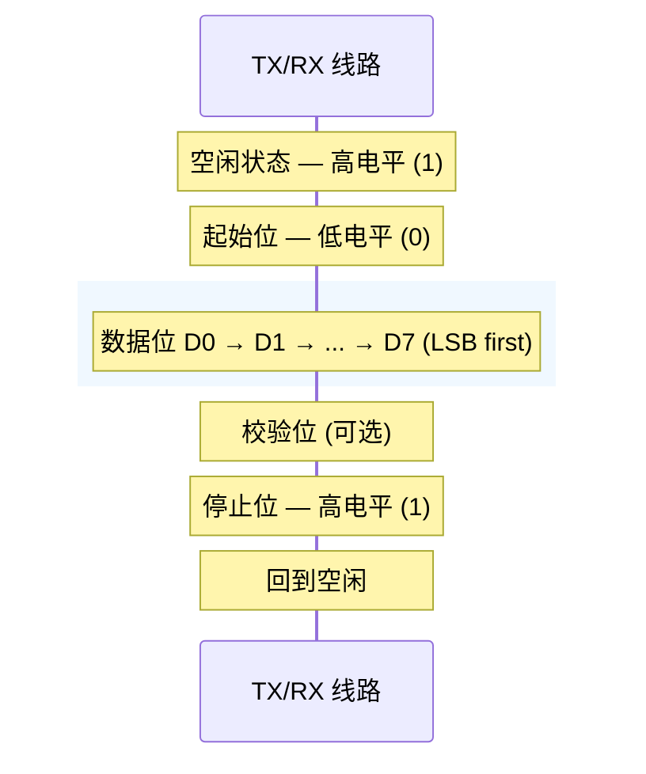
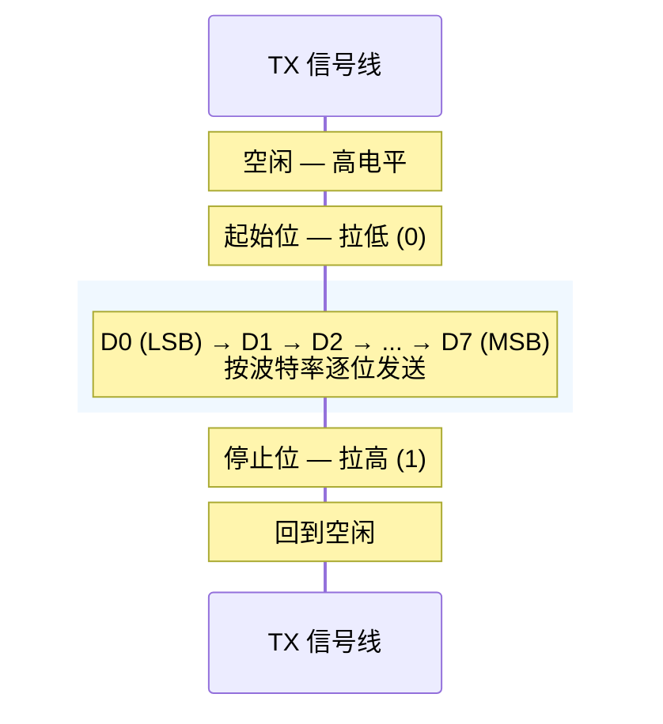

---
tags:
  - FPGA
  - 接口协议
  - UART
  - 串行通信
created: 2026-07-22
---

# UART 串行通信协议

## 一、大白话一句话理解

> UART 就像**两个人打电话**——不需要共享时钟线，只要提前约定好"语速"（波特率），各说各听就行。一根线发、一根线收，各走各的。

---

## 二、UART 是什么

UART（Universal Asynchronous Receiver/Transmitter，通用异步收发器）是最经典的**全双工异步串行通信**协议。

**核心特征：**

| 特征 | 说明 |
|------|------|
| 同步/异步 | **异步**——不需要共享时钟信号 |
| 双工方式 | **全双工**——收发可同时进行 |
| 物理线条 | 最少 **2 根**：TX（发送）、RX（接收） |
| 通信距离 | 短距离（通常 < 1m），电平逻辑 |
| 速率 | 常见波特率：9600、115200、921600 等 |

---

## 三、工作原理详解

### 3.1 物理层结构

```mermaid
flowchart LR
    A["<b>设备 A (UART)</b>"]
    B["<b>设备 B (UART)</b>"]
    A -- "TX ──► RX" --> B
    B -- "TX ─► RX" --> A
    A --- "GND (共地)" --- B
    style A fill:#fff3cd,stroke:#333
    style B fill:#e8f4f8,stroke:#333
```


- **TX → RX**：A 的发送端连 B 的接收端
- **RX ← TX**：B 的发送端连 A 的接收端
- **GND**：共地（必须！否则参考电平不一致）

> 💡 注意：TX 和 RX 是**交叉连接**的——A 的 TX 接 B 的 RX，A 的 RX 接 B 的 TX。

### 3.2 数据帧格式

UART 把数据打包成"帧"来发送，每一帧的结构如下：




| 部分 | 说明 |
|------|------|
| **空闲状态** | 线路保持**高电平**（逻辑 1）——这是 UART 的默认状态 |
| **起始位** | 拉低 1 个 bit 时间（逻辑 0），告诉接收方"数据来了！" |
| **数据位** | 实际有效数据，通常 8 位，**低位先发**（LSB first） |
| **校验位** | 可选。用于简单检错（奇校验/偶校验），常用 None |
| **停止位** | 1 位、1.5 位或 2 位高电平，标记一帧结束 |

### 3.3 波特率（Baud Rate）

波特率 = 每秒传输的码元数 = 每 bit 持续的时间倒数。

- 波特率 = 9600 → 每个 bit 持续 $T = \frac{1}{9600} \approx 104.17\mu s$
- 波特率 = 115200 → 每个 bit 持续 $T = \frac{1}{115200} \approx 8.68\mu s$

> ⚠️ **发送方和接收方的波特率必须一致**（误差通常 < 3%），否则采样会出错。

### 3.4 发送流程（TX）



1. 空闲时 TX 线保持高电平
2. 拉低起始位 → 接收方检测到下降沿，开始同步
3. 按波特率节奏逐位发送数据（低位先出）
4. 发送停止位（高电平）→ 回到空闲

> 推荐在 bit **中间的 50% 位置**采样 → 最远离跳变沿，信号最稳定。

### 3.5 接收流程（RX）

接收方的核心操作是**采样**：

```mermaid
gantt
    title 一个 bit 周期内的采样位置
    dateFormat X
    axisFormat %s

    section 采样点
    起始跳变 (不稳定)     :a1, 0, 25
    1/4 位置              :a2, 25, 25
    1/2 位置 (最佳采样点) :crit, a3, 50, 25
    3/4 位置              :a4, 75, 25
    下一 bit 跳变          :a5, 100, 25
```



推荐在 bit **中间的 50% 位置采样** → 最远离跳变沿，最稳定。

**接收步骤：**
1. 持续监测 RX 线
2. 检测到**下降沿**（空闲→起始位）
3. 等待 **1.5 个 bit 周期**（跳过起始位，到达第一个数据位中间）
4. 每隔 1 个 bit 周期采样一次，共采 8 次
5. 采样停止位，验证是否正确（应为高电平）
6. 将 8 个采样值组装成数据字节

---

## 四、Verilog 代码实现

### 4.1 UART 发送模块

```verilog
module uart_tx #(
    parameter CLK_FREQ  = 50_000_000,  // 系统时钟频率 50MHz
    parameter BAUD_RATE = 115200       // 波特率
)(
    input  wire       clk,        // 系统时钟
    input  wire       rst_n,      // 异步复位，低有效
    input  wire [7:0] tx_data,    // 待发送数据
    input  wire       tx_start,   // 发送启动脉冲
    output reg        tx,         // UART TX 输出
    output wire       tx_done     // 一帧发送完成标志
);

    // ======== 波特率计数器 ========
    // 每个 bit 需要计数的时钟周期数
    // 例如 50MHz / 115200 = 434
    localparam BIT_PERIOD = CLK_FREQ / BAUD_RATE;

    reg [8:0]  cnt_clk;      // 波特率计数器
    reg [3:0]  cnt_bit;      // 位计数器（起始+8数据+停止 = 10 位）
    reg [7:0]  tx_shift;     // 移位寄存器
    reg        tx_active;    // 发送状态标志

    // 发送完成标志
    assign tx_done = (cnt_bit == 4'd9) && (cnt_clk == BIT_PERIOD - 1);

    // ======== 波特率计数器 & 位计数器 ========
    always @(posedge clk or negedge rst_n) begin
        if (!rst_n) begin
            cnt_clk  <= 9'd0;
            cnt_bit  <= 4'd0;
        end else if (!tx_active) begin
            cnt_clk  <= 9'd0;
            cnt_bit  <= 4'd0;
        end else begin
            if (cnt_clk == BIT_PERIOD - 1) begin
                cnt_clk <= 9'd0;
                cnt_bit <= cnt_bit + 1'b1;   // 一个 bit 发完，进下一位
            end else begin
                cnt_clk <= cnt_clk + 1'b1;
            end
        end
    end

    // ======== 发送状态机 ========
    always @(posedge clk or negedge rst_n) begin
        if (!rst_n) begin
            tx         <= 1'b1;     // 空闲为高
            tx_active  <= 1'b0;
            tx_shift   <= 8'd0;
        end else begin
            case (tx_active)
                1'b0: begin
                    // 空闲态：等待发送请求
                    tx <= 1'b1;
                    if (tx_start) begin
                        tx_shift  <= tx_data;   // 锁存数据
                        tx_active <= 1'b1;
                        tx        <= 1'b0;      // 发送起始位（低电平）
                    end
                end

                1'b1: begin
                    if (cnt_clk == BIT_PERIOD - 1) begin
                        // 每个 bit 结束时，输出下一位
                        if (cnt_bit <= 4'd8) begin
                            // 数据位：D0~D7（LSB first）
                            tx       <= tx_shift[0];
                            tx_shift <= {1'b0, tx_shift[7:1]}; // 右移
                        end else begin
                            // 停止位
                            tx <= 1'b1;
                        end
                    end

                    // 一帧发完
                    if (tx_done) begin
                        tx_active <= 1'b0;
                    end
                end
            endcase
        end
    end

endmodule
```

### 4.2 UART 接收模块

```verilog
module uart_rx #(
    parameter CLK_FREQ  = 50_000_000,
    parameter BAUD_RATE = 115200
)(
    input  wire       clk,
    input  wire       rst_n,
    input  wire       rx,         // UART RX 输入
    output reg  [7:0] rx_data,    // 接收到的数据
    output reg        rx_valid    // 数据有效脉冲
);

    localparam BIT_PERIOD = CLK_FREQ / BAUD_RATE;

    reg [8:0]  cnt_clk;
    reg [3:0]  cnt_bit;
    reg [7:0]  rx_shift;
    reg        rx_active;

    // ======== 输入同步（防亚稳态） ========
    reg rx_d1, rx_d2;
    wire rx_sync = rx_d2;

    always @(posedge clk or negedge rst_n) begin
        if (!rst_n) begin
            rx_d1 <= 1'b1;
            rx_d2 <= 1'b1;
        end else begin
            rx_d1 <= rx;
            rx_d2 <= rx_d1;
        end
    end

    // ======== 下降沿检测 ========
    wire rx_negedge = (~rx_sync) & rx_d1;  // 用同步后的信号检测

    // ======== 波特率计数器 & 采样 ========
    always @(posedge clk or negedge rst_n) begin
        if (!rst_n) begin
            cnt_clk   <= 9'd0;
            cnt_bit   <= 4'd0;
            rx_active <= 1'b0;
            rx_shift  <= 8'd0;
            rx_data   <= 8'd0;
            rx_valid  <= 1'b0;
        end else begin
            rx_valid <= 1'b0;  // 默认清除

            if (!rx_active) begin
                cnt_clk <= 9'd0;
                if (rx_negedge) begin        // 检测到起始位下降沿
                    rx_active <= 1'b1;
                    cnt_clk   <= 9'd0;
                    cnt_bit   <= 4'd0;
                end
            end else begin
                if (cnt_clk == BIT_PERIOD - 1) begin
                    cnt_clk <= 9'd0;

                    if (cnt_bit == 4'd0) begin
                        // 第 0 位是起始位，跳过（验证应为 0）
                        cnt_bit <= cnt_bit + 1'b1;
                    end else if (cnt_bit <= 4'd8) begin
                        // 数据位 D0~D7（在 bit 中间采样）
                        rx_shift <= {rx_sync, rx_shift[7:1]};  // 右移，新 bit 放最高位
                        cnt_bit  <= cnt_bit + 1'b1;
                    end else begin
                        // 停止位
                        rx_valid <= 1'b1;
                        rx_data  <= rx_shift;
                        rx_active <= 1'b0;
                    end
                end else begin
                    cnt_clk <= cnt_clk + 1'b1;
                end
            end
        end
    end

endmodule
```

### 4.3 顶层回环测试

```verilog
module uart_loopback_top #(
    parameter CLK_FREQ  = 50_000_000,
    parameter BAUD_RATE = 115200
)(
    input  wire       clk,
    input  wire       rst_n,
    input  wire [7:0] sw_data,     // 拨码开关输入的数据
    input  wire       send_btn,    // 按键触发发送
    output wire       tx_pin,      // 连接到 TX 引脚
    input  wire       rx_pin,      // 从 RX 引脚接收
    output wire [7:0] led_data,    // LED 显示收到的数据
    output wire       data_ready   // 收到数据指示
);

    // 内部连线
    wire [7:0] tx_data;
    wire       tx_done;
    wire [7:0] rx_data;
    wire       rx_valid;

    // 发送模块
    uart_tx #(
        .CLK_FREQ(CLK_FREQ),
        .BAUD_RATE(BAUD_RATE)
    ) u_tx (
        .clk      (clk),
        .rst_n    (rst_n),
        .tx_data  (sw_data),
        .tx_start (send_btn),
        .tx       (tx_pin),
        .tx_done  (tx_done)
    );

    // 接收模块
    uart_rx #(
        .CLK_FREQ(CLK_FREQ),
        .BAUD_RATE(BAUD_RATE)
    ) u_rx (
        .clk      (clk),
        .rst_n    (rst_n),
        .rx       (rx_pin),
        .rx_data  (rx_data),
        .rx_valid (rx_valid)
    );

    // 输出
    assign led_data    = rx_data;
    assign data_ready  = rx_valid;

endmodule
```

---

## 五、关键设计要点

### 5.1 为什么接收端要在 bit 中间采样？

```mermaid
gantt
    title Bit 周期内信号稳定性
    dateFormat X
    axisFormat %s

    section 信号状态
    前一位 (稳定)            :done, a1, 0, 10
    跳变沿 (不稳定/毛刺)     :crit, a2, 10, 20
    稳定区域 (最佳采样区)    :active, a3, 30, 50
    下一跳变 (可能跳变)      :crit, a4, 80, 10
    下一位                   :done, a5, 90, 10
```



- bit 跳变瞬间有**毛刺和振铃**
- 中间位置离两边跳变沿最远，信号最稳定
- 实际工程中也有采 3 次取多数表决（3-sample majority voting）的做法

### 5.2 异步接收的同步问题

外部 RX 信号和系统时钟**不同步**，直接采样可能遇到亚稳态。所以要用 **2 级触发器同步**：

```verilog
always @(posedge clk) begin
    rx_d1 <= rx;      // 第一级
    rx_d2 <= rx_d1;   // 第二级 → rx_d2 是同步后的稳定信号
end
```

### 5.3 波特率误差

发送方和接收方的波特率允许有误差，但累积误差不能超过 **±5%**（大约）。

| 波特率 | 每 bit 时间 | 一帧 (10bit) 时间 |
|--------|------------|-------------------|
| 9600   | 104.17 μs  | 1.04 ms           |
| 115200 | 8.68 μs    | 86.8 μs           |
| 921600 | 1.09 μs    | 10.9 μs           |

> 波特率越高 → 每 bit 时间越短 → 对时钟精度要求越高。

---

## 六、UART 的优缺点

### 优点 ✅
- **极简**：只需 2 根信号线（TX/RX），硬件开销最小
- **异步**：不需要时钟线，两端独立运行
- **普及**：几乎所有芯片都内置 UART 外设
- **调试利器**：最常用的打印调试信息的方式

### 缺点 ❌
- **速度慢**：每字节要加起始位+停止位（10bit 传 8bit 数据，效率 80%）
- **点对点**：只能一对一，不能挂载多个设备（没有地址机制）
- **距离有限**：TTL 电平传输，超过 1 米容易出错（RS-232/RS-485 可以延长）
- **无应答机制**：发出去不知道对方收没收到（需要上层协议补）

---

## 七、UART vs 其他协议速览

| 特性 | UART | SPI | I2C |
|------|------|-----|-----|
| 同步/异步 | 异步 | 同步 | 同步 |
| 线数 | 2 (TX/RX) | 4+ (SCLK/MOSI/MISO/CS) | 2 (SCL/SDA) |
| 速度 | 中（~1 Mbps） | 高（~100 Mbps） | 中（~3.4 Mbps） |
| 双工 | 全双工 | 全双工 | 半双工 |
| 多设备 | 不支持 | 每设备需独立 CS 线 | 支持（地址寻址） |
| 复杂度 | 低 | 中 | 中高 |

---

## 八、常见应用场景

- **调试串口**：FPGA/MCU 打印 log 到 PC（最经典用途）
- **GPS 模块**：输出 NMEA 数据
- **蓝牙模块**：HC-05/HC-06 通过 UART 透传
- **Wi-Fi 模块**：ESP8266 AT 指令控制
- **传感器通信**：部分低速传感器使用 UART

---

## 九、FAQ 常见问题

**Q：UART 和 RS-232 有什么区别？**
> UART 是芯片级的协议（TTL 电平：0/3.3V 或 0/5V），RS-232 是物理层标准（±3~15V）。UART 数据经过 MAX232 等电平转换芯片后就变成 RS-232 信号，可以传更远距离。

**Q：为什么叫"异步"？**
> 因为没有时钟线。发送方用自己的时钟发，接收方用自己的时钟收，双方靠"起始位"来同步。只要波特率差不多就能工作。

**Q：波特率越高越好吗？**
> 不一定。波特率越高，每 bit 时间越短，对时钟精度和信号质量要求越高，容易出错。够用就好。
