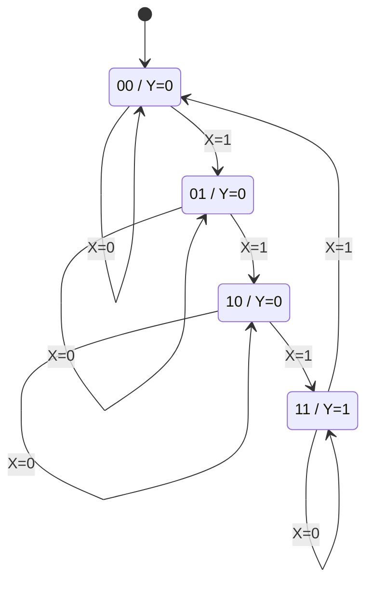

---
tags:
  - FPGA
  - 数字电路
  - 时序逻辑
created: 2026-08-05
---

# 时序逻辑电路

> 时序逻辑 = **输出由当前输入 + 历史状态共同决定**的电路。它和组合逻辑的根本区别是**有记忆**——靠存储元件（锁存器/触发器）记住"过去的状态"。本篇按知识链条展开：**存储元件 → 触发方式 → 描述方法 → 分析 → 设计 → 寄存器/计数器**。前置见 [[FPGA/数字电路基础.md|数字电路基础]] 与 [[FPGA/组合逻辑电路.md|组合逻辑电路]]。

---

## 一、时序电路概述

### 1.1 特点与结构

- 任意时刻输出 = **当前输入 + 电路原状态（历史）** 的函数
- 结构上 = **组合电路 + 存储元件 + 反馈**（存储元件把输出"喂回"输入，形成记忆）

**结构框图**：

```
输入 X ──►┌────────────┐
          │ 组合电路    ├──► 输出 Y
状态 Q ──►│            │
          └─────┬──────┘
        ▲       │(驱动 W)
        │       ▼
   ┌────────────────┐
   │  存储元件(触发器)│◄── CLK
   └────────────────┘
        状态 Q（记忆）
```

三组方程（时序电路的"数学模型"）：

| 方程 | 形式 | 含义 |
|------|------|------|
| 输出方程 | $Y = F(X, Q)$ | 输出由输入和现态决定 |
| 驱动（激励）方程 | $W = G(X, Q)$ | 组合电路送给触发器输入端的信号 |
| 状态方程 | $Q^* = H(W, Q)$ | 把驱动代入触发器特性方程，得次态 |

### 1.2 分类

- 按有无统一时钟：**同步**（所有触发器共用一个 CLK，同时翻转）/ **异步**（触发器时钟不同，逐级 ripple）
- 按输出依赖：**Moore 型**（输出只与状态有关，$Y=F(Q)$）/ **Mealy 型**（输出与状态和输入都有关，$Y=F(X,Q)$）

---

## 二、存储元件：锁存器与触发器

### 2.1 为什么需要存储

组合电路"给什么出什么"，没有记忆。要记住 1 位信息，需要**双稳态电路**——两个交叉耦合的反相/与非门，能稳定停在 0 或 1 两个状态之一，这就是最基本的存储单元。

### 2.2 基本 RS 锁存器

用两个与非门交叉耦合构成，输入 $\overline{S}$（置位）、$\overline{R}$（复位）**低电平有效**：

| $\overline{S}$ | $\overline{R}$ | $Q^*$ | 功能 |
|------|------|------|------|
| 1 | 1 | $Q$ | 保持 |
| 0 | 1 | 1 | 置 1（Set） |
| 1 | 0 | 0 | 置 0（Reset） |
| 0 | 0 | 1* | **禁用**（两输出同为 1，且撤除后状态不定） |

特点：**没有时钟**，输入一变输出立刻变（异步）。它是所有时序元件的"细胞"，但不便于同步系统使用。

### 2.3 钟控锁存器与电平触发方式

给基本锁存器加上时钟控制门，得到**钟控（电平触发）锁存器**：只在 $CLK=1$ 期间输入才起作用。

**电平触发方式**：在 $CLK$ 有效电平（高电平）的**整个期间**，输出都随输入变化——像"门开着，随时能进"。

**D 锁存器**（透明锁存器）：把钟控 RS 的 $S=D$、$R=\overline{D}$ 即得，消除了禁用状态。

| D | $Q^*$（CLK=1 期间） |
|---|------|
| 0 | 0 |
| 1 | 1 |

特性方程：$Q^* = D$（CLK 有效时）。

**空翻（race-around）现象**：电平触发期间，若输入多次变化，输出就跟着**多次翻转**；在计数器这类带反馈的电路里，一个时钟脉冲内可能连翻好几次，造成计数错误。这是电平触发的固有缺陷。

### 2.4 边沿触发方式：解决空翻

**边沿触发方式**：触发器**只在 CLK 的上升沿（或下降沿）那一瞬间**采样输入并翻转，其余时刻输入变化一律不理。由于采样窗口极窄，一个时钟周期只翻转一次，**从根本上消除空翻**。

> **过渡方案——主从（脉冲）触发**：CLK 高电平期间主触发器接收输入、从触发器保持；CLK 下降沿主→从一次传递。也避免了空翻，但高电平期间输入仍可能影响主级（"一次变化"问题），故现代设计普遍采用真正的边沿触发。

**三种触发方式对比**：

| 触发方式 | 采样窗口 | 空翻 | 典型器件 |
|----------|----------|------|----------|
| 电平触发 | CLK 有效电平整个期间 | 有 | 锁存器 |
| 脉冲触发（主从） | 一个脉冲分两步 | 无（但有一次变化问题） | 主从 JK |
| 边沿触发 | 仅时钟沿瞬间 | 无 | 现代触发器、FPGA |

**时序约束**：数据必须在时钟沿到来前**建立时间** $t_{su}$ 内稳定、之后保持**保持时间** $t_h$ 不变，否则进入亚稳态。这是 FPGA 时序分析的物理基础（见 [[数字IC/高性能数字电路设计.md|高性能数字电路设计]]）。

---

## 三、四种常用边沿触发器

### 3.1 特性表与特性方程

**RS 触发器**（钟控 RS 的边沿版，高有效）：

| S | R | $Q^*$ | 功能 |
|---|---|------|------|
| 0 | 0 | $Q$ | 保持 |
| 0 | 1 | 0 | 置 0 |
| 1 | 0 | 1 | 置 1 |
| 1 | 1 | × | 禁用 |

特性方程：$Q^* = S + \overline{R}Q$，约束 $SR=0$。

**D 触发器**：$Q^* = D$，输出直接跟随 D，**FPGA 中最常用**。

| D | $Q^*$ |
|---|------|
| 0 | 0 |
| 1 | 1 |

**JK 触发器**（功能最全，无禁用）：

| J | K | $Q^*$ | 功能 |
|---|---|------|------|
| 0 | 0 | $Q$ | 保持 |
| 0 | 1 | 0 | 置 0 |
| 1 | 0 | 1 | 置 1 |
| 1 | 1 | $\overline{Q}$ | 翻转 |

特性方程：$Q^* = J\overline{Q} + \overline{K}Q$。

**T 触发器**（计数用）：

| T | $Q^*$ | 功能 |
|---|------|------|
| 0 | $Q$ | 保持 |
| 1 | $\overline{Q}$ | 翻转 |

特性方程：$Q^* = T \oplus Q$。

### 3.2 触发器之间的转换

已有某种触发器、需要另一种功能时，用组合电路改造：**令目标特性方程 = 现有特性方程**，解出现有触发器输入端的驱动方程。

**例题 1（JK → D）**：用 JK 触发器实现 D 触发器。令 $Q^* = D$ 与 $Q^* = J\overline{Q} + \overline{K}Q$ 相等，取 $J = D$、$K = \overline{D}$，代入验证：$Q^* = D\overline{Q} + \overline{\overline{D}}Q = D\overline{Q} + DQ = D$ ✓。即 JK 的 J 接 D、K 接 $\overline{D}$ 就是 D 触发器。

### 3.3 边沿触发的波形理解

**例题 2（D 触发器工作波形）**：边沿 D 触发器，CLK 上升沿采样。若第 1、2、3 个上升沿前 D 分别为 1、0、1，初态 $Q=0$，则 $Q$ 依次变为 1、0、1。**注意**：上升沿**之间** D 的任何变化对 Q 无影响——这正是"边沿触发"的含义，也是它能抗毛刺、消空翻的原因。

---

## 四、描述时序逻辑的方法

同一个时序电路有五种等价描述，可互相转换：

| 方法 | 形式 | 特点 |
|------|------|------|
| **逻辑图** | 触发器 + 门的连接图 | 对应硬件实现 |
| **方程组** | 输出/驱动/状态三组方程 | 便于代数推导 |
| **特性表（状态转换表）** | 现态 + 输入 → 次态 + 输出 | 唯一、无歧义 |
| **状态图** | 圆圈=状态，箭头=转移（标 输入/输出） | 直观展示状态迁移 |
| **波形图（时序图）** | 各信号随时间变化 | 便于观察时序关系 |

> **转换链条**：逻辑图 →（写）方程组 →（代入）特性表 →（画）状态图 / 波形图。分析就是沿这条链从左往右走，设计则从右往左走。

---

## 五、同步时序电路的分析

分析的本质是"读图翻译出行为规律"，按链条推进：

```
电路图 → ① 写三个方程式 → ② 列特性表（状态转换表）→ ③ 画状态图/波形图 → ④ 据状态图分析逻辑规律
```

### 5.1 第①步：由电路图写三个方程式

- **输出方程** $Y = F(X, Q)$：看接在输出端的组合电路。若没有专门输出门，则触发器状态本身就是输出（Moore 型）。
- **驱动（输入）方程** $W = G(X, Q)$：看接在每个触发器输入端的组合电路，逐个写出，如 $J_0=\cdots$、$D_1=\cdots$。
- **状态（特性）方程** $Q^* = H(W, Q)$：把各驱动方程代入对应触发器的特性方程。例如 $J_0=K_0=X$ 代入 JK 特性方程得 $Q_0^* = X \oplus Q_0$。

注意：同步电路所有触发器共用一个 CLK，状态方程在同一时钟沿同时成立，全部状态在同一条沿上一起跳变。

### 5.2 第②步：列特性表

把"现态 + 输入"的所有组合枚举出来，代入**状态方程**求次态、代入**输出方程**求输出，得到状态转换表。它就是时序电路的"真值表"。

### 5.3 第③步：画状态图

状态图是特性表的图形版，规律一目了然。它的**基本结构**由五类元素构成：

| 元素 | 画法 | 含义 |
|------|------|------|
| **状态圈** | 圆圈（或圆角框），内写状态名/编码 | 一个圆圈 = 一个状态，如 $S_0$ 或 $Q_1Q_0=00$ |
| **圈内的输出**（Moore） | 状态圈内写"状态/输出"，如 $00/Y{=}0$ | Moore 型输出只取决于状态，故标在圈内 |
| **有向箭头** | 从现态指向次态 | 一次时钟沿引起的状态转移 |
| **箭头上的标注** | Mealy 标"输入/输出"（如 $X{=}1/Y{=}0$）；Moore 只标输入 | 转移发生的条件（及 Mealy 输出） |
| **自环** | 指向自己的箭头 | 状态保持（现态=次态） |
| **初态标记** | 无来处的箭头 $[*]\to S_0$ | 复位/起始状态 |

以例题 4 的受控计数器为例，状态图长这样（圆圈里是"状态/输出"，箭头上是输入）：



读图口诀：**看圈知状态与输出，看箭头知转移，看标注知条件，看自环知保持，看循环知功能**。

### 5.4 第④步：据状态图分析逻辑规律

看三点：① 状态如何循环（计数？序列？分频？）；② 输入起什么控制作用（何时走、何时停）；③ 输出的物理含义（进位？标志？）。最后用一句话概括"这是什么电路"。

**例题 3（两位同步计数器分析）**：两个 JK 触发器，$J_0=K_0=1$，$J_1=K_1=Q_0$，共用 CLK，无专门输出门（Moore 型，状态即输出）。

**① 三个方程式**：驱动 $J_0=K_0=1$，$J_1=K_1=Q_0$；代入 JK 特性方程得状态方程
$$Q_0^* = \overline{Q_0},\qquad Q_1^* = Q_0 \oplus Q_1$$

**② 特性表**：

| 现态 $Q_1Q_0$ | 次态 $Q_1^*Q_0^*$ |
|------|------|
| 00 | 01 |
| 01 | 10 |
| 10 | 11 |
| 11 | 00 |

**③ 状态图**：$00 \to 01 \to 10 \to 11 \to 00$，四个状态循环。

**④ 逻辑规律**：$Q_0$ 每拍必翻，$Q_1$ 在 $Q_0=1$ 时翻——**两位同步二进制加法计数器（模 4）**。

**例题 4（完整分析：带输入 X 与输出 Y）**：两个 JK 触发器，输入 X：$J_0=K_0=X$，$J_1=K_1=XQ_0$；输出门 $Y = Q_1Q_0$。

**① 三个方程式**：
- 输出方程：$Y = Q_1Q_0$
- 驱动方程：$J_0=K_0=X$；$J_1=K_1=XQ_0$
- 状态方程（JK 接成 $J=K=T$，即 $Q^*=T\oplus Q$）：
$$Q_0^* = X \oplus Q_0,\qquad Q_1^* = (XQ_0) \oplus Q_1$$

**② 特性表**（次态 / 输出 Y）：

| 现态 $Q_1Q_0$ | $X=0$ 时次态/Y | $X=1$ 时次态/Y |
|------|------|------|
| 00 | 00 / 0 | 01 / 0 |
| 01 | 01 / 0 | 10 / 0 |
| 10 | 10 / 0 | 11 / 0 |
| 11 | 11 / 0 | 00 / 1 |

**③ 状态图**：$X=1$ 时沿 $00 \to 01 \to 10 \to 11 \to 00$ 循环；$X=0$ 时各状态自环保持；状态 11 时 $Y=1$。

**④ 逻辑规律**：X=1 计数、X=0 保持——**带计数使能的两位同步加法计数器**，计满 11 时进位输出 Y=1。

---

## 六、同步时序电路的设计

**设计是分析的逆过程**：分析是"给电路图 → 求功能"，设计是"给功能 → 造电路图"，正好把分析的链条倒过来走，中间插入几个设计特有的环节（状态化简/编码、选触发器、查自启动）：

| 步骤 | 分析（正：电路→功能） | 设计（逆：功能→电路） |
|------|----------------------|----------------------|
| 1 | 读逻辑图 | 明确功能要求，**画状态图** |
| 2 | 写三个方程式 | 状态化简/编码，**列状态表** |
| 3 | 列特性表 | 选触发器，**求驱动/输出方程** |
| 4 | 画状态图/波形图 | **画逻辑图** |
| 5 | 归纳逻辑功能 | 检查能否**自启动** |

**设计步骤**：

```
设计要求 → 画状态图 → 状态化简/编码 → 选触发器 → 求驱动方程（卡诺图）→ 画逻辑图 → 检查自启动
```

**例题 5（同步六进制计数器设计，全流程）**：用 D 触发器设计 0→1→2→3→4→5→0 循环。

**① 状态编码**：需 3 个触发器，取自然编码：000→001→010→011→100→101→000。

**② 状态转换表**（$Q^*$ 为次态）：

| 现态 $Q_2 Q_1 Q_0$ | 次态 $Q_2^* Q_1^* Q_0^*$ |
|---|---|
| 0 0 0 | 0 0 1 |
| 0 0 1 | 0 1 0 |
| 0 1 0 | 0 1 1 |
| 0 1 1 | 1 0 0 |
| 1 0 0 | 1 0 1 |
| 1 0 1 | 0 0 0 |
| 1 1 0 | ×（未用状态） |
| 1 1 1 | ×（未用状态） |

**③ 选 D 触发器**：因 $Q^* = D$，驱动方程即次态方程 $D_i = Q_i^*$。

**④ 卡诺图求次态方程**（未用状态 110、111 作无关项）：

$Q_0^*$ 卡诺图：

| $Q_2 \backslash Q_1Q_0$ | 00 | 01 | 11 | 10 |
|---|---|---|---|---|
| 0 | 1($m_0$) | 0($m_1$) | 0($m_3$) | 1($m_2$) |
| 1 | 1($m_4$) | 0($m_5$) | ×($m_7$) | ×($m_6$) |

圈四角 $m_0, m_2, m_4, m_6(\times)$ → $Q_0=0$ → $D_0 = \overline{Q_0}$。

$Q_1^*$ 卡诺图：

| $Q_2 \backslash Q_1Q_0$ | 00 | 01 | 11 | 10 |
|---|---|---|---|---|
| 0 | 0($m_0$) | 1($m_1$) | 0($m_3$) | 1($m_2$) |
| 1 | 0($m_4$) | 0($m_5$) | ×($m_7$) | ×($m_6$) |

$m_1$ 单独成圈 → $\overline{Q_2}\,\overline{Q_1}Q_0$；$m_2$ 与 $m_6(\times)$ 成圈 → $Q_1\overline{Q_0}$。得 $D_1 = \overline{Q_2}\,\overline{Q_1}Q_0 + Q_1\overline{Q_0}$。

$Q_2^*$ 卡诺图：

| $Q_2 \backslash Q_1Q_0$ | 00 | 01 | 11 | 10 |
|---|---|---|---|---|
| 0 | 0 | 0 | 1 | 0 |
| 1 | 1 | 0 | × | × |

圈 $m_3, m_7(\times)$ → $Q_1Q_0$；圈 $m_4, m_6(\times)$ → $Q_2\overline{Q_0}$。得 $D_2 = Q_1Q_0 + Q_2\overline{Q_0}$。

**⑤ 汇总驱动方程**：
$$\begin{cases} D_0 = \overline{Q_0} \\ D_1 = \overline{Q_2}\,\overline{Q_1}Q_0 + Q_1\overline{Q_0} \\ D_2 = Q_1Q_0 + Q_2\overline{Q_0} \end{cases}$$

**⑥ 自启动检查**：状态 110 → 次态 111；111 → 次态 100（回到有效循环 ✓）。电路**可以自启动**。

---

## 七、寄存器与移位寄存器

### 7.1 寄存器（并行存储）

**n 位寄存器** = n 个 D 触发器并联，共享 CLK。一个时钟沿把 n 位数据同时存入，用于**暂存数据**。FPGA 里 `always @(posedge clk) reg <= data;` 就是寄存器。

### 7.2 移位寄存器

每个触发器的 D 接前一级的 Q，数据在时钟驱动下**逐位移动**。按输入/输出方式分四种：串入串出、串入并出、并入串出、并入并出。

**4 位右移寄存器**（串入 SI）行为：每拍 $Q_0 \to Q_1 \to Q_2 \to Q_3$，SI 进入 $Q_0$。

**通用移位寄存器 74HC194**：由模式端 $S_1S_0$ 选择功能：

| $S_1$ | $S_0$ | 功能 |
|-------|-------|------|
| 0 | 0 | 保持 |
| 0 | 1 | 右移 |
| 1 | 0 | 左移 |
| 1 | 1 | 并行置数 |

### 7.3 应用

- **串并转换**：串行数据移入后并行读出（或反向）
- **延时**：数据每拍移一位，移 n 位即延时 n 个时钟
- **序列发生器**：配合反馈产生特定序列（如伪随机码）

---

## 八、计数器

### 8.1 分类

- **同步计数器**：所有触发器共用 CLK，速度快（如 74HC161）
- **异步（纹波）计数器**：前级输出作后级时钟，逐级 ripple，速度慢

### 8.2 同步计数器 74HC161

4 位同步二进制计数器，功能表：

| $\overline{CLR}$ | $\overline{LOAD}$ | ENP | ENT | CLK | 功能 |
|------|------|-----|-----|-----|------|
| 0 | × | × | × | × | 异步清零 0000 |
| 1 | 0 | × | × | ↑ | 同步置数 |
| 1 | 1 | 1 | 1 | ↑ | 计数 |
| 1 | 1 | 非全1 | | × | 保持 |

### 8.3 用 161 构成任意模计数器

**反馈置数法（同步，推荐）**：当计到 $M-1$ 时译码产生 $\overline{LOAD}=0$，下一个时钟沿置回初值，得模 M 计数。

**例题 6（161 接模 6）**：要 0→1→…→5→0。当计到 5（0101）时令 $\overline{LOAD}=\overline{Q_2 Q_0}$（即 $Q_2$、$Q_0$ 接与非门），数据端接 0000。则 0–5 正常计数，到 5 时下一沿置 0，循环六个状态，实现模 6。
（在 0–5 中只有 5 满足 $Q_2Q_0=11$，译码唯一 ✓。）

**反馈清零法（异步）**：计到 M 时译码产生 $\overline{CLR}=0$ 立即清零。因 M 状态只瞬间出现，输出有毛刺，不如置数法干净。

### 8.4 级联

把低位片的进位输出（RCO）接高位片的 ENT/ENP，可级联成更高模数（如两片 161 级联成模 256）。

---

## 九、核心概念速查表

| 概念 | 一句话 |
|------|--------|
| 锁存器 | 电平触发，CLK 有效期间输出随输入变（有空翻） |
| 触发器 | 边沿触发，仅在时钟沿采样（无空翻） |
| 空翻 | 电平触发期间一个脉冲内多次翻转 |
| RS | 置位/复位，有禁用约束 $SR=0$ |
| D | $Q^*=D$，FPGA 主力 |
| JK | 功能全，J=K=1 翻转 |
| T | $Q^*=T\oplus Q$，计数 |
| 特性表/方程/状态图/波形图 | 时序逻辑的四种等价描述 |
| 寄存器 | n 个 D 触发器并联，存数据 |
| 移位寄存器 | 数据逐位移动，串并转换/延时 |
| 计数器 | 状态循环，计数/分频 |

---

## 相关笔记

- [[FPGA/数字电路基础.md|数字电路基础]] —— 数制码制、逻辑代数、卡诺图
- [[FPGA/组合逻辑电路.md|组合逻辑电路]] —— 无记忆电路：分析/设计方法、MSI 器件
- [[数字IC/Verilog HDL核心语法与建模.md|Verilog HDL 核心语法与建模]] —— 时序逻辑的 HDL 描述（always @(posedge clk)）
