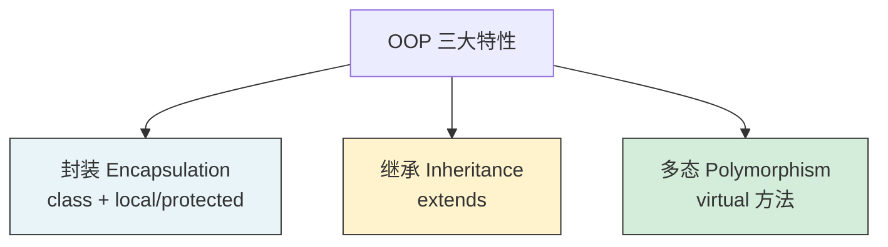
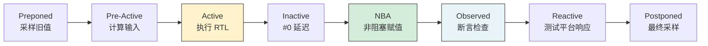
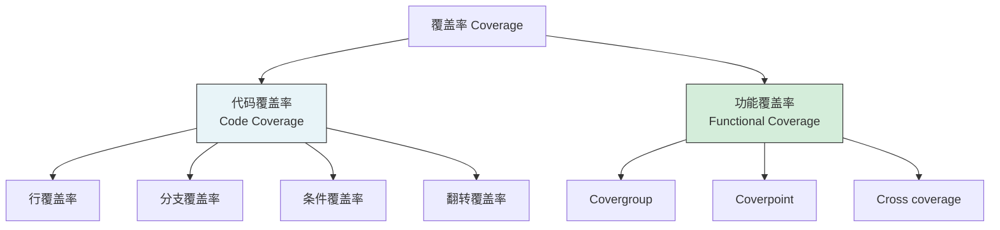

---
tags:
  - 数字IC
  - SystemVerilog
  - 验证
created: 2026-07-23
---

# SystemVerilog 核心特性

> 基于课程第26~39讲，梳理 SV 数据类型、面向对象、仿真调度、随机约束、断言、覆盖率、进程通信。

---

## 核心概念

- **SystemVerilog**：Verilog 的超集，2005 年成为 IEEE 标准，增加面向对象、随机、覆盖率
- **OOP**：Object-Oriented Programming，面向对象编程（封装、继承、多态）
- **约束随机验证**：用约束描述合法激励空间，随机生成测试用例
- **SVA**：SystemVerilog Assertions，描述设计应满足的属性
- **覆盖率**：衡量验证充分性的指标（功能覆盖率 + 代码覆盖率）

---

## 一、数据类型

### 1.1 SV 新增数据类型

| 类型 | Verilog | SystemVerilog | 说明 |
|------|---------|---------------|------|
| 二值逻辑 | `reg`, `wire` | `bit`, `logic` | `bit` 只有 0/1，`logic` 有四值 |
| 整数 | `integer` | `byte`, `shortint`, `int`, `longint` | 明确的位宽 |
| 无符号 | — | `bit [7:0]`, `byte unsigned` | 明确有无符号 |
| 动态数组 | ❌ | `int dyn[]` | 运行时可改变大小 |
| 队列 |  | `int q[$]` | 类似 C++ deque |
| 关联数组 |  | `int aa[string]` | 稀疏存储，键值对 |
| 枚举 | ❌ | `enum {IDLE, RUN} state` | 类型安全的状态名 |
| 字符串 | ❌ | `string s = "hello"` | 可变长度字符串 |
| 结构体 | ❌ | `struct {int a; bit b;} s` | 自定义复合类型 |
| 联合体 | ❌ | `union {int i; bit [31:0] b} u` | 同一内存多种解释 |

### 1.2 动态数组与队列

```systemverilog
// 动态数组
int dyn[] = new[5];       // 创建大小为 5 的动态数组
dyn = new[10](dyn);       // 扩展为 10，保留原数据

// 队列（最常用！）
int q[$];                 // 声明队列
q.push_back(1);           // 队尾插入
q.push_front(0);          // 队头插入
int val = q.pop_front();  // 队头弹出
q.delete(0);              // 删除第 0 个元素

// 关联数组（稀疏存储）
int mem[int];             // 地址→数据
mem[32'hFFFF] = 8'hAA;    // 只存这一个地址，不浪费内存
```

>  **大白话**：动态数组像可伸缩的收纳盒（大小可变）；队列像排队（先进先出）；关联数组像字典（按名字查找，不用连续内存）。

---

## 二、面向对象（OOP）

### 2.1 三大特性



### 2.2 Class 基本语法

```systemverilog
// 基类定义
class Transaction;
    // 成员变量
    bit [31:0] addr;
    bit [31:0] data;
    bit        is_write;

    // 构造函数
    function new(bit [31:0] a = 0, bit [31:0] d = 0);
        addr = a;
        data = d;
    endfunction

    // 虚方法（可被继承类重写）
    virtual function void display();
        $display("addr=%0h, data=%0h", addr, data);
    endfunction
endclass

// 继承
class ErrorTransaction extends Transaction;
    bit error_flag;

    function new();
        super.new();       // 调用父类构造函数
        error_flag = 1'b1;
    endfunction

    // 重写父类方法（多态）
    virtual function void display();
        super.display();
        $display("ERROR!");
    endfunction
endclass
```

**extern 关键字**：方法声明和实现分离（类似 C++ 的头文件和源文件）

```systemverilog
class Packet;
    bit [31:0] addr;

    // 只声明，不实现
    extern function new(bit [31:0] a = 0);
    extern function void send();
endclass

// 在类外部实现
function Packet::new(bit [31:0] a);
    addr = a;
endfunction

function Packet::send();
    $display("Sending to addr=%0h", addr);
endfunction
```

>  **大白话**：`extern` = "这个功能我包了，但具体怎么做后面再说"。代码多的时候特别有用，类定义看起来清爽。

**UVM 工厂注册宏**（重要！）

```systemverilog
class my_transaction extends uvm_transaction;
    // 这两行是必须的！让 UVM 工厂认识这个类
    `uvm_object_utils_begin(my_transaction)
        `uvm_field_int(addr, UVM_ALL_ON)
        `uvm_field_int(data, UVM_ALL_ON)
    `uvm_object_utils_end

    bit [31:0] addr;
    bit [31:0] data;
endclass
```

> ⚠️ **重要**：`uvm_object_utils` 宏必须加！不加的话，工厂机制、随机化、打印功能都不能用。这是 UVM 新手的常见错误。


---

## 三、仿真调度机制

### 3.1 仿真时间槽（Time Slot）

SV 将每个仿真时刻分为多个**区域（Region）**，按严格顺序执行：



>  **关键**：非阻塞赋值（`<=`）在 NBA 区域统一更新，保证时序逻辑无竞争。

---

## 四、随机与约束

### 4.1 随机变量

```systemverilog
class BusTransaction;
    rand bit [31:0] addr;    // 随机变量
    rand bit [7:0]  data;
    randc bit [1:0] id;      // 随机循环（不重复）

    // 约束
    constraint c_addr {
        addr >= 32'h1000;
        addr <= 32'hFFFF;
        addr[1:0] == 2'b00;  // 4字节对齐
    }

    constraint c_data {
        data inside {[8'h10:8'hFF]};  // 范围约束
    }
endclass
```

### 4.2 常用约束技巧

| 约束 | 语法 | 说明 |
|------|------|------|
| 范围 | `inside {[min:max]}` | 值在范围内 |
| 条件 | `if (mode == WRITE) data == 0` | 条件约束 |
| 权重 | `addr dist {0:/10, [1:100]:/90}` | 概率分布 |
| 唯一 | `unique {id1, id2, id3}` | 值互不相同 |

---

## 五、断言（SVA）

### 5.1 断言类型

| 类型 | 关键字 | 用途 |
|------|--------|------|
| **立即断言** | `assert()` | 组合逻辑检查 |
| **并发断言** | `assert property()` | 时序逻辑检查 |

### 5.2 常用 SVA 语法

```systemverilog
// 立即断言
always @(posedge clk) begin
    assert (fifo_count <= MAX_DEPTH)
        else $error("FIFO overflow!");
end

// 并发断言：req 拉高后，ack 必须在 1~3 个周期内拉高
property req_ack_prop;
    @(posedge clk)
    req |-> ##[1:3] ack;
endproperty

assert property (req_ack_prop)
    else $error("ACK not received!");

// 覆盖属性：某个场景是否发生过
cover property (req && ack)
    $display("req-ack handshake occurred");
```

>  **大白话**：断言 = 在代码中嵌入"检查点"，告诉仿真器"这里必须满足某个条件"。违反了立刻报错，不用等测试用例跑完才发现。

---

## 六、覆盖率

### 6.1 覆盖率类型



### 6.2 Covergroup 示例

```systemverilog
covergroup cg_bus @(posedge clk);
    // 覆盖点：地址范围
    cp_addr: coverpoint addr {
        bins low   = {[0:32'hFF]};
        bins mid   = {[32'h100:32'hFFF]};
        bins high  = {[32'h1000:32'hFFFF]};
    }

    // 覆盖点：读写操作
    cp_op: coverpoint is_write {
        bins read  = {0};
        bins write = {1};
    }

    // 交叉覆盖：地址范围 × 操作类型
    cross cp_addr, cp_op;
endgroup
```

>  覆盖率目标通常要求 **功能覆盖率 > 95%** + **代码覆盖率 > 90%** 才允许投片。

---

## 七、进程与通信

### 7.1 进程类型

| 进程 | 关键字 | 特点 |
|------|--------|------|
| 初始进程 | `initial` | 仿真开始时执行一次 |
|  always 进程 | `always` | 持续运行 |
| 线程 | `fork...join` | 并行执行 |

### 7.2 线程间通信

```systemverilog
// 事件（event）— 最简单
event done_event;
fork
    begin
        // 线程1：做某事
        #100;
        -> done_event;   // 触发事件
    end
    begin
        // 线程2：等待
        @(done_event);   // 等待事件
        $display("Done!");
    end
join

// 信箱（mailbox）— 线程间传数据
mailbox mb = new();
fork
    mb.put(data);       // 发送
    mb.get(received);   // 接收
join

// 旗语（semaphore）— 资源互斥
semaphore sem = new(1);  // 1个资源
fork
    sem.get(1);          // 获取资源
    // 访问共享资源
    sem.put(1);          // 释放资源
join
```

---

## 关键要点总结

- SV 是 Verilog 超集，新增 OOP、随机、覆盖率、断言
- 数据类型：`bit`（二值）、`logic`（四值）、动态数组、队列、关联数组
- OOP 三特性：封装（class）、继承（extends）、多态（virtual）
- 仿真分区域执行，非阻塞赋值在 NBA 区统一更新
- 约束随机 = 定义合法空间 + 随机生成激励
- SVA 断言 = 嵌入式检查点，违反立即报错
- 覆盖率目标：功能 > 95%，代码 > 90%

## 延伸阅读

- [[数字IC/数字芯片设计与验证概述]] — 验证框架与研发流程
- [[数字IC/Verilog HDL核心语法与建模]] — Verilog 基础语法
- [[数字IC/UVM验证方法学入门]] — UVM 组件与验证平台搭建
