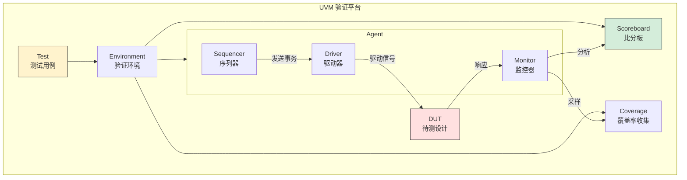
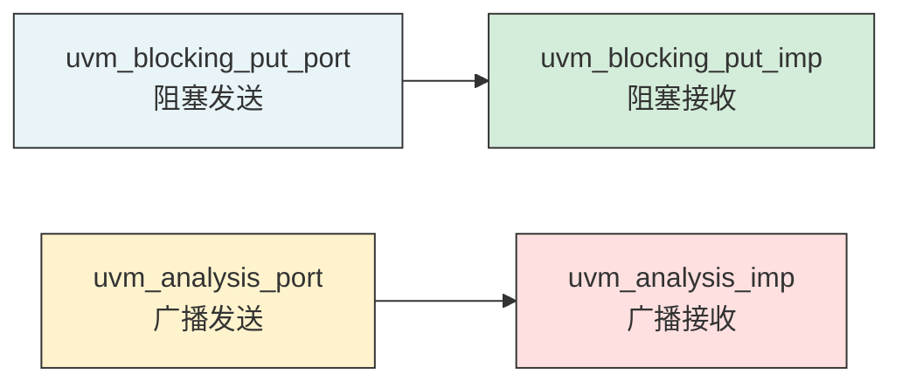
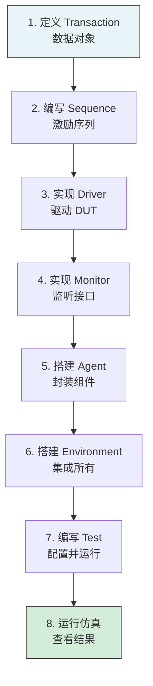
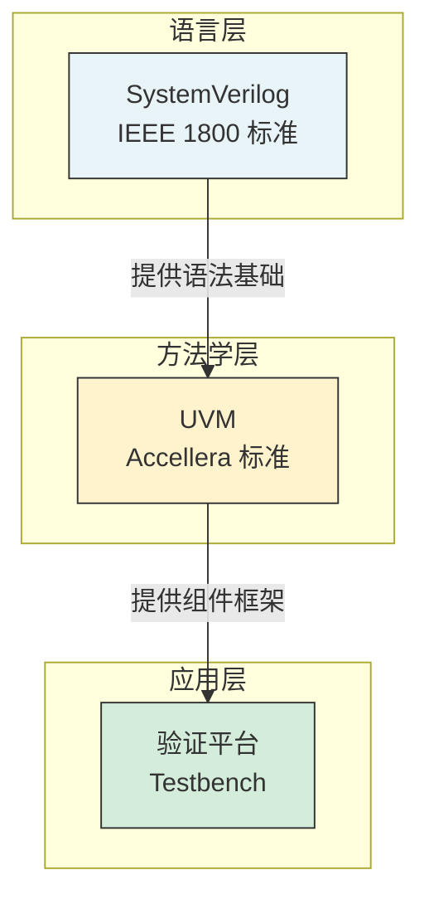
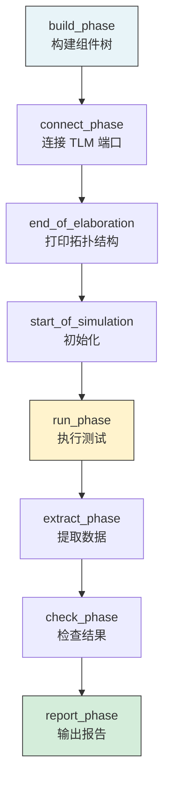
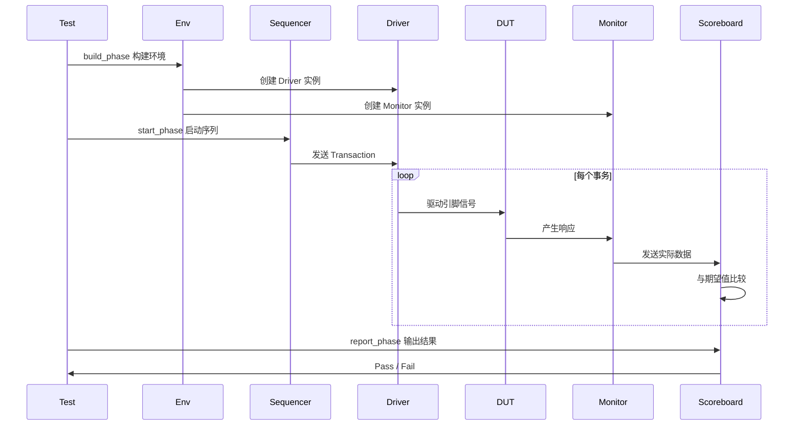

---
tags:
  - 数字IC
  - UVM
  - 验证方法学
created: 2026-07-23
---

# UVM 验证方法学入门

> 基于课程第43~44讲，梳理 UVM 的核心组件、验证平台搭建、class 封装。

---

## 核心概念

- **UVM**：Universal Verification Methodology，通用验证方法学
- **TLM**：Transaction Level Modeling，事务级建模
- **Testbench**：验证平台，包含激励生成、DUT、监控、检查
- **Factory**：UVM 工厂机制，支持组件类型重载

>  **大白话**：UVM 就像一套"验证乐高套装"——有标准接口、标准组件、标准搭建方式。不同项目用同一套方法学，换模块就行，不用重新发明轮子。

---

## 一、UVM 验证平台架构



---

## 二、核心组件详解

### 2.1 六大组件

| 组件 | 职责 | 类比 |
|------|------|------|
| **Transaction** | 定义数据对象（地址、数据、控制） | 快递包裹 |
| **Sequence** | 生成事务序列 | 发货清单 |
| **Sequencer** | 调度 Sequence，分发给 Driver | 调度中心 |
| **Driver** | 将事务转换为引脚信号 | 快递员 |
| **Monitor** | 监听 DUT 接口，收集数据 | 监控摄像头 |
| **Scoreboard** | 比较实际输出与期望输出 | 质检员 |

### 2.2 其他重要组件

| 组件 | 职责 |
|------|------|
| **Agent** | 封装 Sequencer + Driver + Monitor |
| **Environment** | 封装所有 Agent + Scoreboard + Coverage |
| **Test** | 配置环境，启动 Sequence |

---

## 三、TLM 通信机制

### 3.1 TLM 端口类型



### 3.2 典型 TLM 连接

```systemverilog
// Driver 发送事务到 DUT
class my_driver extends uvm_driver #(my_transaction);
    uvm_blocking_put_port #(my_transaction) put_port;

    virtual function void build_phase(uvm_phase phase);
        put_port = new("put_port", this);
    endfunction

    virtual task run_phase(uvm_phase phase);
        my_transaction txn;
        seq_item_port.get_next_item(txn);  // 从 Sequencer 获取
        // 驱动 DUT 引脚
        drive_txn(txn);
        put_port.put(txn);  // 发送给 Monitor
        seq_item_port.item_done();
    endtask
endclass
```

---

## 四、UVM 工厂机制

### 4.1 什么是 Factory

UVM Factory 允许**在不修改代码的情况下**替换组件类型：

```systemverilog
// 注册类到工厂
class my_transaction extends uvm_sequence_item;
    `uvm_object_utils(my_transaction)  // 工厂注册
    // ...
endclass

// 在测试中重载类型
function void build_phase(uvm_phase phase);
    // 将 my_transaction 替换为 error_transaction
    factory.set_type_override_by_type(
        my_transaction::get_type(),
        error_transaction::get_type()
    );
endfunction
```

>  **大白话**：Factory 就像"类型替换开关"——测试平台写好了，突然要测错误场景？不用改代码，一行 override 就把正常事务换成错误事务。

---

## 五、UVM 验证平台搭建步骤



---

## 六、UVM 与 SystemVerilog 的关系



| 层次 | 内容 | 说明 |
|------|------|------|
| **语言层** | SystemVerilog | 提供 class、random、coverage 语法 |
| **方法学层** | UVM | 提供标准组件库（uvm_driver、uvm_monitor...） |
| **应用层** | 验证平台 | 用 UVM 组件搭建具体项目的 Testbench |

---

### 4.2 Phase 机制（重要！）

UVM 将仿真过程分为多个**阶段（Phase）**，每个阶段有特定职责：



| Phase | 职责 | 关键操作 |
|-------|------|---------|
| **build_phase** | 创建组件 | `create()`, `config_db::set()` |
| **connect_phase** | 连接端口 | `port.connect(export)` |
| **run_phase** | 执行测试 | `start_sequence()` |
| **report_phase** | 输出结果 | `uvm_info()`, 打印 Pass/Fail |

>  **重要**：`build_phase` 是**自顶向下**执行的（先创建父组件，再创建子组件），其他 Phase 是**自底向上**执行的。这个顺序很重要！

### 4.3 uvm_config_db 配置数据库

**作用**：在不修改代码的情况下，从 Test 层向底层组件传递配置参数。

```systemverilog
// Test 层：设置配置
function void build_phase(uvm_phase phase);
    // 将 timeout 值传递给 env.agent.driver
    uvm_config_db#(int)::set(this, "env.agent.driver", "timeout", 1000);
endfunction

// Driver 层：读取配置
function void build_phase(uvm_phase phase);
    int timeout;
    // 从数据库读取 timeout
    if (!uvm_config_db#(int)::get(this, "", "timeout", timeout)) begin
        `uvm_error("NO_TIMEOUT", "timeout not set!")
        timeout = 500;  // 默认值
    end
endfunction
```

>  **大白话**：`config_db` 就像"全局配置中心"——Test 说"driver 的超时时间设为 1000"，driver 自己去取，不用一层层传参数。

---

## 七、UVM 仿真流程




---

## 关键要点总结

- UVM 是 SV 之上的验证方法学，提供标准化组件库
- 六大组件：Transaction、Sequence、Sequencer、Driver、Monitor、Scoreboard
- TLM 是组件间通信的标准接口
- Factory 机制支持类型重载，不用改代码就能换测试场景
- 搭建顺序：Transaction → Sequence → Driver → Monitor → Agent → Env → Test
- UVM 仿真分 phase：build → connect → run → report

## 延伸阅读

- [[数字IC/数字芯片设计与验证概述]] — 验证框架与研发流程
- [[数字IC/SystemVerilog核心特性]] — SV 语言基础
- [[数字IC/Verilog HDL核心语法与建模]] — RTL 设计基础
