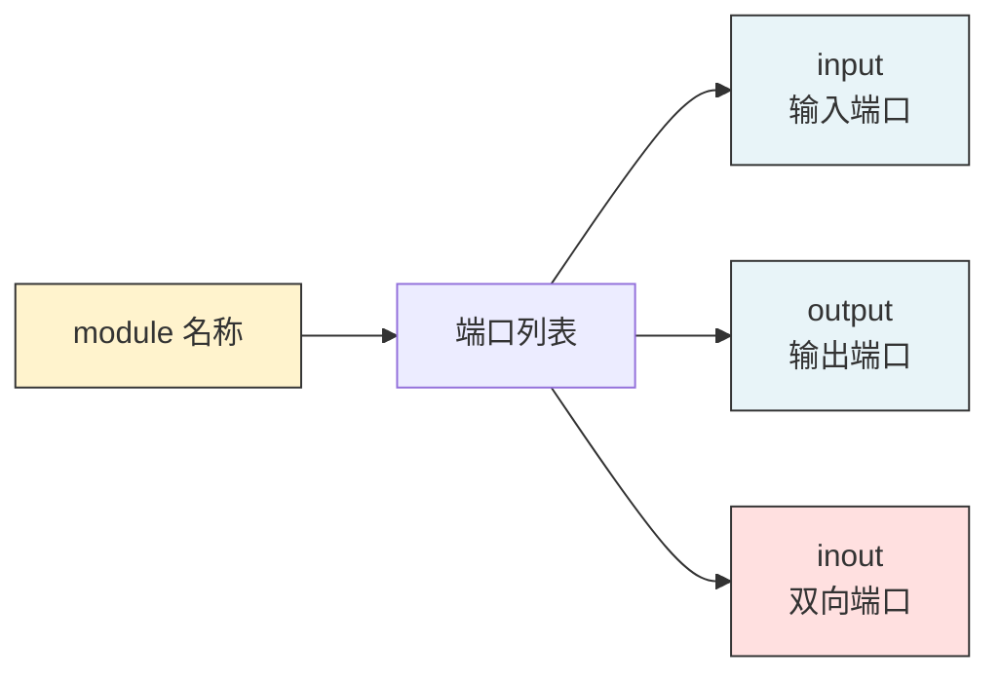
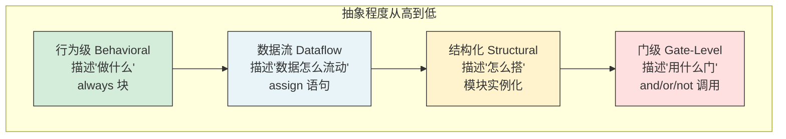

---
tags:
  - 数字IC
  - Verilog
  - HDL
created: 2026-07-23
---

# Verilog HDL 核心语法与建模

> 基于课程第9~16讲，梳理 Verilog HDL 的模块结构、语言元素、四种建模方式及代码风格。

---

## 核心概念

- **Module**：Verilog 的基本设计单元，`module` 和 `endmodule` 成对出现
- **端口**：`input`（输入）、`output`（输出）、`inout`（双向）
- **线网（wire）**：表示物理连线，用 `assign` 驱动
- **寄存器（reg）**：表示存储单元，在 `always` 块中赋值
- **RTL**：寄存器传输级，可综合的抽象层级

>  **大白话**：`module` 就像乐高积木块——有输入接口（input）、输出接口（output），内部有连线（wire）和存储单元（reg），通过不同的建模方式描述内部逻辑。

---

## 一、Module 基本结构

```verilog
module mux2to1 (
    input  wire a,      // 输入端口
    input  wire b,      // 输入端口
    input  wire sel,    // 选择信号
    output reg  y       // 输出端口
);

    // 内部逻辑
    always @(*) begin
        case (sel)
            1'b0: y = a;
            1'b1: y = b;
            default: y = 1'bx;
        endcase
    end

endmodule
```

### 端口声明方式



---

## 二、四种建模方式

### 2.1 门级建模（Gate-Level）

调用 Verilog 内置的**基本门级元件**描述逻辑图。

**12 个基本门级元件：**

| 类型 | 元件 | 说明 |
|------|------|------|
| 多输入门 | `and`, `nand`, `or`, `nor`, `xor`, `xnor` | 多个输入，一个输出 |
| 多输出门 | `buf`, `not` | 一个输入，多个输出 |
| 三态门 | `bufif1`, `bufif0`, `notif1`, `notif0` | 带控制端的三态输出 |

```verilog
// 门级建模示例：2输入与门
module and_gate (
    input  wire a, b,
    output wire y
);
    and U1(y, a, b);  // 调用与门元件
endmodule
```

>  门级网表通常由**行为级综合后**自动生成，手工写门级只用于学习理解。

### 2.2 数据流建模（Dataflow）

用 **`assign` 连续赋值语句**描述数据在寄存器之间的流动。

```verilog
// 数据流建模：2选1多路器
module mux2to1_df (
    input  wire a, b, sel,
    output wire y
);
    assign y = sel ? b : a;  // 三目运算符
endmodule
```

>  数据流建模 = 描述"数据怎么流动"，综合工具自动转为门级结构。

### 2.3 行为级建模（Behavioral）

用 **`always` 块**描述电路的行为，最接近软件编程风格。

```verilog
// 行为级建模：D触发器
module dff (
    input  wire clk, rst_n, d,
    output reg  q
);
    always @(posedge clk or negedge rst_n) begin
        if (!rst_n)
            q <= 1'b0;    // 异步复位
        else
            q <= d;       // 正常采样
    end
endmodule
```

**`always` 块的关键语法：**

```verilog
always @(敏感列表) begin
    // 时序逻辑：用 <= (非阻塞赋值)
    // 组合逻辑：用 = (阻塞赋值)
end
```

| 敏感列表 | 用途 | 赋值方式 |
|---------|------|---------|
| `@(posedge clk)` | 时序逻辑（触发器） | `<=` 非阻塞 |
| `@(*)` 或 `@(a or b)` | 组合逻辑 | `=` 阻塞 |

### 2.4 结构化建模（Structural）

通过**实例化子模块**搭建更大系统，类似"搭积木"。

```verilog
// 结构化建模：用两个 mux2to1 搭建 4选1 mux
module mux4to1 (
    input  wire [3:0] data,
    input  wire [1:0] sel,
    output wire       y
);
    wire m1, m2;

    // 实例化子模块
    mux2to1 u1(.a(data[0]), .b(data[1]), .sel(sel[0]), .y(m1));
    mux2to1 u2(.a(data[2]), .b(data[3]), .sel(sel[0]), .y(m2));
    mux2to1 u3(.a(m1),     .b(m2),     .sel(sel[1]), .y(y));

endmodule
```

>  **大白话**：结构化建模就像用乐高小积木（子模块）拼出大积木（顶层模块）。每个小积木独立测试，最后组装。

### 2.5 四种建模方式对比



---

## 三、Task 与 Function

| 特性 | Task | Function |
|------|------|----------|
| 耗时操作 | ✅ 可以（`#delay`） | ❌ 不可以 |
| 返回值 | ❌ 无 | ✅ 有（一个返回值） |
| 输入输出 | input/output/inout | 只能 input |
| 调用方式 | 语句 | 表达式中 |

```verilog
// Function 示例
function [7:0] add_8bit;
    input [7:0] a, b;
    begin
        add_8bit = a + b;
    end
endfunction

// Task 示例
task drive_bus;
    input [7:0] data;
    begin
        #5 bus = data;
        #10 bus = 8'hzz;
    end
endtask
```

---

## 四、代码风格要点

### 4.1 命名规范

```verilog
// 推荐命名
wire        clk_sys;      // 时钟：clk_xxx
wire        rst_n;        // 复位：rst_n（低有效）
reg  [7:0]  cnt;          // 计数器：cnt
wire        fifo_full;    // 状态信号：描述性命名
```

### 4.2 可综合代码 vs 不可综合代码

| 可综合 | 不可综合（仅仿真） |
|--------|------------------|
| `assign` 连续赋值 | `#delay` 延时 |
| `always @(*)` 组合逻辑 | `$display` 打印 |
| `always @(posedge clk)` 时序逻辑 | `initial` 块（部分工具） |
| `if/case` 条件语句 | `fork/join` 并行线程 |

### 4.3 常见编码陷阱

```verilog
// ❌ 错误：组合逻辑中用非阻塞赋值
always @(*) begin
    y <= a & b;   // 错误！应该用 =
end

// ✅ 正确：组合逻辑用阻塞赋值
always @(*) begin
    y = a & b;
end

// ❌ 错误：时序逻辑中用阻塞赋值（可能产生竞争）
always @(posedge clk) begin
    a = b;
    b = a;    // a 已经被改了！
end

// ✅ 正确：时序逻辑用非阻塞赋值
always @(posedge clk) begin
    a <= b;
    b <= a;   // 同时更新，无竞争
end
```

> ⚠️ **重要**：组合逻辑用 `=`，时序逻辑用 `<=`。记反了就会出 bug。这是初学者最容易犯的错误！

### 4.4 参数化设计（Parameter）

**为什么要参数化？** 让模块可复用，通过参数配置不同规格。

```verilog
// 参数化 FIFO 深度
module fifo #(
    parameter DEPTH = 16,        // 默认深度 16
    parameter WIDTH = 8          // 默认位宽 8
)(
    input  wire             clk,
    input  wire             wr_en,
    input  wire [WIDTH-1:0] wr_data,
    output reg  [WIDTH-1:0] rd_data,
    output wire             full,
    output wire             empty
);

    // 地址位宽自动计算
    localparam ADDR_WIDTH = $clog2(DEPTH);

    reg [WIDTH-1:0] mem [0:DEPTH-1];  // 存储器
    // ...
endmodule

// 实例化时指定参数
fifo #(.DEPTH(32), .WIDTH(16)) u_fifo (
    .clk(clk),
    // ...
);
```

> 💡 **大白话**：参数化就像买衣服选尺码——同一款衣服（模块），S/M/L/XL（不同参数）都能穿，不用重新设计。

### 4.5 生成语句（Generate）

**什么时候用？** 需要**循环实例化**多个相同模块时。

```verilog
// 用 generate 实例化 8 个 D 触发器
module shift_reg_8 #(
    parameter N = 8
)(
    input  wire clk,
    input  wire d,
    output wire q
);

    wire [N-1:0] q_int;

    genvar i;
    generate
        for (i = 0; i < N; i = i + 1) begin : gen_dff
            if (i == 0) begin
                dff u_dff(.clk(clk), .d(d), .q(q_int[i]));
            end else begin
                dff u_dff(.clk(clk), .d(q_int[i-1]), .q(q_int[i]));
            end
        end
    endgenerate

    assign q = q_int[N-1];

endmodule
```

>  **大白话**：generate 就像"批量生产"——不用手写 8 个 DFF 实例化，用 for 循环自动生成。

---

## 关键要点总结

- Verilog 有四种建模方式：行为级、数据流、结构化、门级
- `module` 是基本设计单元，端口分 input/output/inout
- `wire` 用 `assign` 驱动，`reg` 在 `always` 块中赋值
- 组合逻辑敏感列表用 `@(*)`，时序逻辑用 `@(posedge clk)`
- Task 可耗时但无返回值，Function 有返回值但不能耗时
- 命名要规范：`clk_`、`rst_n`、`cnt`、`_full`、`_valid`

## 延伸阅读

- [[数字IC/数字芯片设计与验证概述]] — 芯片设计流程与验证框架
- [[数字IC/高性能数字电路设计]] — 状态机、时钟时序、FIFO 设计
- [[数字IC/SystemVerilog核心特性]] — SV 数据类型、面向对象、随机约束
