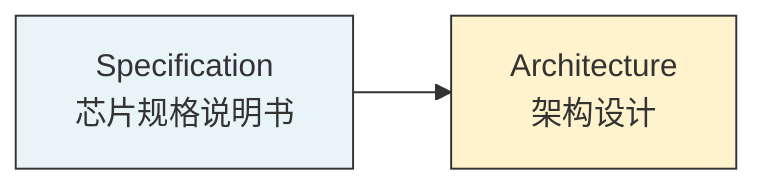
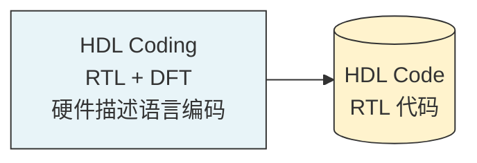
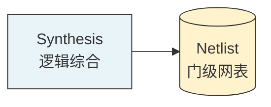
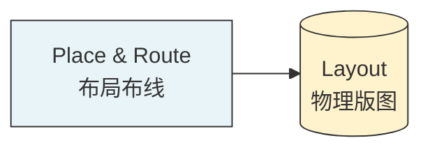
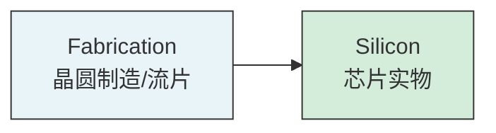
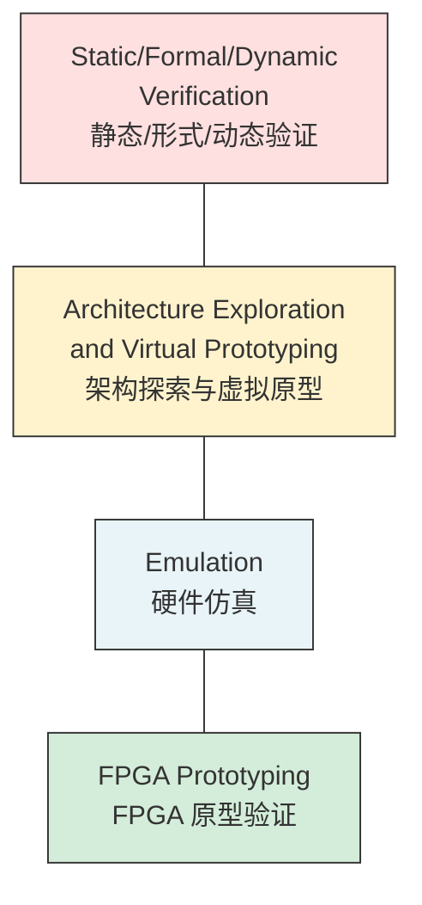
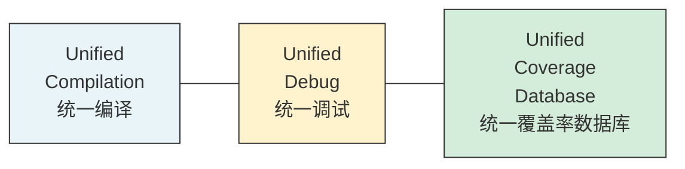
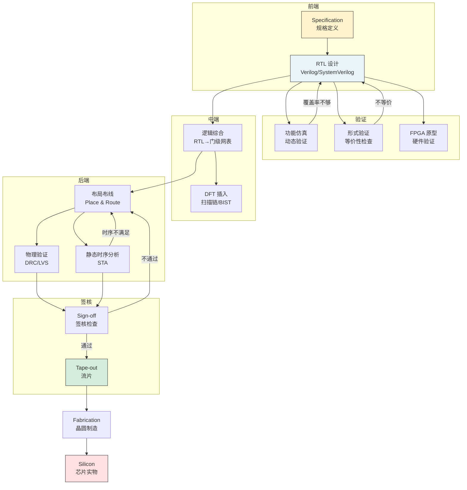

---
tags:
  - FPGA
  - 数字IC设计
  - 芯片设计流程
  - 验证
  - 综合
  - 后端
created: 2026-07-23
---

# 数字芯片设计与验证全流程

> 本文基于 Synopsys Golden UPF Low Power Flow 流程图，逐层拆解数字芯片从概念到流片的完整生命周期。

![[FPGA/Pasted image 20260723220455.png]]

---

## 一、大白话一句话理解

> 设计一颗数字芯片，就像**建一栋大楼**：先画概念草图（架构），再出施工图纸（RTL），然后交给施工队变成钢筋骨架（综合→门级网表），接着安排每个房间的具体位置（布局布线），最后浇筑混凝土（流片）。每一步都要请监理检查（验证），确保没偷工减料。

---

## 二、全图总览

这张图是一张**二维矩阵**，有两个维度：

| 维度 | 含义 |
|------|------|
| **纵向（从上到下）** | 设计的**抽象层级**，从最抽象的系统级 → 最具体的硅片级 |
| **横向（从左到右）** | 每个层级对应的**活动**（做什么）、**产出物**（得到什么）、**抽象等级**（什么级别） |

### 五个抽象层级

```
层级从抽象到具体 ↓

┌─────────────────────────────────────────────────────┐
│  System/Algorithm Level  ← 系统/算法级（最抽象）     │
─────────────────────────────────────────────────────┤
│  Register-Transfer Level ← 寄存器传输级（RTL）       │
├─────────────────────────────────────────────────────┤
│  Gate Level              ← 门级（逻辑门网络）        │
├─────────────────────────────────────────────────────┤
│  Schematic Level         ← 版图级（物理几何图形）    │
├─────────────────────────────────────────────────────┤
│  Silicon                 ← 硅片级（最具体，实物）    │
└─────────────────────────────────────────────────────┘
```

---

## 三、逐层详解

### 第一层：System/Algorithm Level（系统/算法级）



**做什么：**
- 确定芯片要**实现什么功能**、**性能指标**是多少（主频、功耗、面积）
- 制定 **Specification（规格说明书）**——这是整个项目的"合同"
- 进行**架构设计**：划分模块、确定总线、选择工艺节点

**产出物：** Specification 文档

**大白话理解：** 就像建房前的**需求沟通**——"我要建一栋3层别墅，5个卧室，带车库，预算200万"。芯片设计也一样，先搞清楚"我要做什么芯片、多少核心、跑多快、耗多少电"。

**关键决策：**
- 选什么工艺节点？（7nm / 5nm / 28nm...）
- 用几个 CPU 核心？GPU 要不要？
- 内存带宽多少？接口用什么（PCIe / DDR / USB）？
- 功耗预算多少？（手机芯片 vs 服务器芯片差别巨大）

---

### 第二层：Register-Transfer Level（寄存器传输级 / RTL）



**做什么：**
- 工程师用 **Verilog / VHDL / SystemVerilog** 写硬件描述代码
- 描述每个模块的**寄存器**（存储单元）和它们之间的**数据传输**（Transfer）
- 同时插入 **DFT（Design for Testability，可测试性设计）** 代码——为后续芯片测试预留结构

**产出物：** HDL Code（RTL 代码文件）

**大白话理解：** 需求确定后，工程师开始**画施工图纸**。用 Verilog 写的代码就像是建筑的"蓝图"——不是真正的钢筋水泥，而是用文字描述"这里有一根柱子，那里有一面墙"。

**DFT 是什么？**
> 芯片造出来后要测试好坏。DFT 就是在设计时**提前埋好"检测点"**——比如扫描链（Scan Chain），让测试设备能"看到"芯片内部的每一个寄存器。没有 DFT，芯片造出来就是个黑盒，没法高效测试。

---

### 第三层：Gate Level（门级 / 中间段 Middle End）



**做什么：**
- **逻辑综合（Synthesis）**：把 RTL 代码（行为描述）翻译成**具体的逻辑门**（与门、或门、非门、触发器...）
- 综合工具（如 Design Compiler）会同时做**优化**：面积最小？速度最快？功耗最低？
- 需要指定**工艺库**（Standard Cell Library）——告诉工具"你用台积电 7nm 的哪些标准单元来搭"

**产出物：** Netlist（门级网表）——一个巨大的"连线清单"，列出所有逻辑门和它们之间的连接关系

**大白话理解：** 施工图纸（RTL）交给**结构工程师**，他把"这里有一面承重墙"翻译成"需要 200 根钢筋、50 立方米混凝土、具体用什么标号的水泥"。网表就是这份详细的"材料清单"。

**关键概念：**
```
RTL 代码（行为级）          综合后的门级网表
─────────────            ──────────────────
always @(posedge clk)      U1: AND2(A, B, Y)
  if (en)                  U2: DFF(CLK, D, Q)
    out <= in + 1;         U3: OR2(C, D, Z)
                           ...（可能成千上万个门）
```

---

### 第四层：Schematic Level（版图级 / 后端 Back End）



**做什么：**
- **布局（Placement）**：把网表中的每个逻辑门**放到芯片的具体坐标位置**上
- **布线（Routing）**：用金属线把这些门**连起来**（就是网表中定义的连接关系）
- 要考虑：信号延迟、功耗、面积、电磁干扰、热分布...

**产出物：** Layout（物理版图）——芯片每一层金属、每一个晶体管的**精确几何形状**

**大白话理解：** 材料清单（网表）确定后，**施工队进场**了。布局 = 决定每个房间在楼里的具体位置；布线 = 铺设水管电线。最后得到的版图就是芯片的"CAD 施工图"——精确到纳米级别的几何图形。

---

### 第五层：Silicon（硅片级）



**做什么：**
- 版图数据（GDSII 格式）送到**晶圆厂**（TSMC / Samsung / Intel）
- 经过光刻、刻蚀、离子注入、金属沉积等数百道工序
- 一块晶圆上同时制造数百颗芯片，然后切割、封装、测试

**产出物：** Silicon——真正的芯片实物！

**大白话理解：** 施工图最终交给**建筑公司**，他们浇筑混凝土、砌砖、装修，最终交房。芯片的"交房"就是**流片（Tape-out）**——把版图数据发送给晶圆厂开始生产。

> ⚠️ 流片成本极高：7nm 工艺一次流片约 **3000 万美元**，5nm 约 **5000 万美元**。所以前面的验证环节至关重要——一旦流片后发现 bug，损失巨大。

---

## 四、左侧的验证与原型手段

图左侧有一列贯穿所有层级的**验证手段**，这是保证芯片正确性的关键：



### 4.1 静态/形式/动态验证

| 验证类型 | 做什么 | 对应阶段 |
|---------|--------|---------|
| **动态验证（仿真）** | 给 RTL 加测试激励，看输出对不对 | RTL 阶段 |
| **形式验证（Formal）** | 用数学方法证明设计满足属性，不依赖仿真向量 | RTL ↔ 门级 |
| **静态验证（Lint/CDC）** | 检查代码风格、跨时钟域问题，不运行仿真 | RTL 阶段 |

> 💡 动态验证像**考试**——出几道题看你能不能做对；形式验证像**数学证明**——直接证明你"永远不可能做错"。

### 4.2 架构探索与虚拟原型

- 在写 RTL 之前，用 **C/C++/SystemC** 建立系统级模型
- 快速评估不同架构方案的性能、功耗
- 软件团队可以**提前开发驱动和 OS**，不用等 RTL 完成

### 4.3 Emulation（硬件仿真）

- 用专用硬件仿真器（如 Palladium、Zebu）运行 RTL
- 速度比软件仿真快 **100~1000 倍**
- 适合跑**完整的操作系统和应用程序**来验证芯片

### 4.4 FPGA Prototyping（FPGA 原型验证）

- 把 RTL 综合到 **FPGA** 上运行
- 速度接近真实芯片（几十 MHz）
- 可以在**真实系统环境**中验证——插上真实的外设、跑真实的软件

---

## 五、右侧的 Golden UPF Low Power Flow

图右侧有一条贯穿全流程的竖条——**Golden UPF Low Power Flow**。

**UPF = Unified Power Format（统一功耗格式）**

这是 IEEE 1801 标准，用来描述芯片的**功耗管理策略**：

```
UPF 描述的内容：
├── 电源域（Power Domain）：哪些模块共用一个电源
├── 电压域（Voltage Domain）：哪些模块可以独立调压
├── 电源开关（Power Switch）：哪些模块可以断电
├── 电平转换（Level Shifter）：不同电压域之间的信号转换
├── 隔离单元（Isolation Cell）：模块断电时输出固定值
└── 保留寄存器（Retention Register）：断电时保存状态
```

**为什么需要 UPF？**
> 现代芯片（尤其是手机 SoC）有大量**低功耗技术**：DVFS（动态调压调频）、Power Gating（电源关断）、Clock Gating（时钟门控）... UPF 让功耗策略在**每个设计层级**都保持一致——从 RTL 到综合到后端，功耗意图不会丢失。

---

## 六、底部的基础设施

图底部有一行文字：**Unified Compilation, Unified Debug, Unified Coverage Database**



这是 Synopsys 工具的**底层支撑平台**：

| 组件 | 作用 |
|------|------|
| **统一编译** | RTL、门级、版图用同一套编译引擎，结果一致 |
| **统一调试** | 在任何层级发现 bug，都能追溯到 RTL 源码 |
| **统一覆盖率数据库** | 仿真覆盖率、形式验证覆盖率、FPGA 覆盖率汇总到一起，知道"测了多少、还差多少" |

---

## 七、数据流（中间的蓝色箭头）

图中中间的**弯曲蓝色箭头**展示了数据从上层流向下层的过程：

```
Specification
     ↓  （架构设计确定后开始编码）
  HDL Code
     ↓  （RTL 写完后综合）
  Netlist
     ↓  （网表完成后布局布线）
  Layout
     ↓  （版图完成后送晶圆厂）
  Silicon
```

每个箭头都代表一个**关键转折点**——数据格式变了，抽象层级降了，但**设计意图**必须保持不变。这就是为什么每一步之间都需要验证。

---

## 八、完整的验证闭环



---

## 九、每个阶段的核心工具（业界主流）

| 阶段 | 代表工具 | 厂商 |
|------|---------|------|
| 架构探索 | Platform Architect, CoCentric | Synopsys / MathWorks |
| RTL 编码 | VCS, Verdi | Synopsys |
| 功能仿真 | VCS, Xcelium, Questa | Synopsys / Cadence / Siemens |
| 形式验证 | VC Formal, JasperGold | Synopsys / Cadence |
| 逻辑综合 | Design Compiler, Genus | Synopsys / Cadence |
| DFT | DFT Compiler, Modus | Synopsys / Cadence |
| 布局布线 | ICC2, Innovus | Synopsys / Cadence |
| 静态时序 | PrimeTime, Tempus | Synopsys / Cadence |
| 物理验证 | IC Validator, Pegasus | Synopsys / Siemens |
| 功耗分析 | PrimePower, Voltus | Synopsys / Cadence |
| 硬件仿真 | Palladium, Zebu | Cadence / Synopsys |
| FPGA 原型 | HAPS, Protium | Synopsys |

---

## 十、关键术语速查表

| 术语 | 全称 | 中文 | 含义 |
|------|------|------|------|
| RTL | Register Transfer Level | 寄存器传输级 | 用 HDL 描述寄存器和数据传输 |
| HDL | Hardware Description Language | 硬件描述语言 | Verilog / VHDL / SystemVerilog |
| DFT | Design for Testability | 可测试性设计 | 为芯片测试预留结构 |
| UPF | Unified Power Format | 统一功耗格式 | 描述低功耗策略的标准 |
| STA | Static Timing Analysis | 静态时序分析 | 不跑仿真，直接计算所有路径延迟 |
| DRC | Design Rule Check | 设计规则检查 | 版图是否符合工艺厂的要求 |
| LVS | Layout vs Schematic | 版图与原理图对比 | 版图和网表是否一致 |
| Tape-out | — | 流片 | 将版图数据送晶圆厂生产 |
| Sign-off | — | 签核 | 所有检查通过后批准流片 |
| Netlist | — | 网表 | 逻辑门和连接关系的列表 |
| GDSII | — | 版图数据格式 | 送晶圆厂的标准版图文件格式 |
| CDC | Clock Domain Crossing | 跨时钟域 | 信号在不同时钟域之间传递 |
| ATPG | Automatic Test Pattern Generation | 自动测试向量生成 | 为 DFT 生成测试激励 |

---

## 十一、从 FPGA 工程师角度看这个流程

如果你是 FPGA 工程师，你主要参与的是**前三个阶段**：

```
你的工作范围 ←←←←←←←←←←←←←←←←←←
┌─────────────────────────────────┐
│  Architecture  ← 系统架构理解    │
│  RTL Design    ← 你写 Verilog    │
│  功能验证       ← 你跑仿真        │
│  FPGA Prototyping ← 你就在这里！  │
└─────────────────────────────────┘
                                        综合 → 后端 → 流片
                                        （ASIC 工程师的事）
```

**FPGA 工程师 vs ASIC 工程师的区别：**

| | FPGA 工程师 | ASIC 工程师 |
|---|---|---|
| 产出 | FPGA 比特流 | GDSII 版图 |
| 工具 | Vivado / Quartus | DC / ICC2 / Innovus |
| 周期 | 几天~几周 | 数月到数年 |
| 成本 | 几千~几万元 | 数千万美元 |
| 可修改 | 随时重新烧录 | 流片后无法修改 |
| 验证压力 | 相对较低 | 极高（流片后改不了） |

> 💡 这也是为什么 FPGA 原型验证（FPGA Prototyping）如此重要——它让 ASIC 团队在**花几千万流片之前**，先用 FPGA 跑一遍真实系统，提前发现 bug。

---

## 十二、总结：一张图记住全流程

```
需求 → 架构 → RTL → 综合 → 布局布线 → 流片 → 芯片
       ↑      ↑       ↑        ↑         ↑
      规格   代码    网表     版图      实物
       │      │       │        │         │
       └── 验证贯穿每一层 ──────────────────┘
            （仿真/形式/FPGA/Emulation）
```
