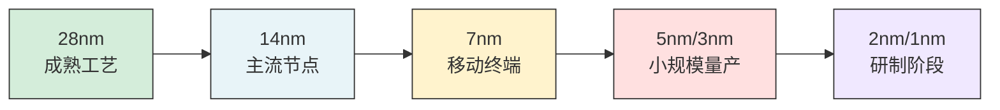
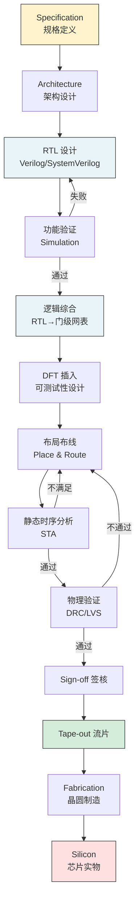
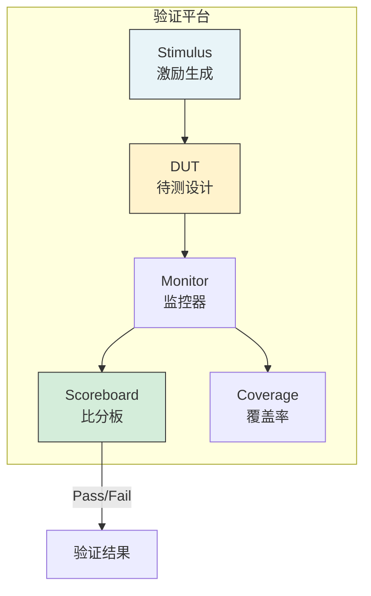
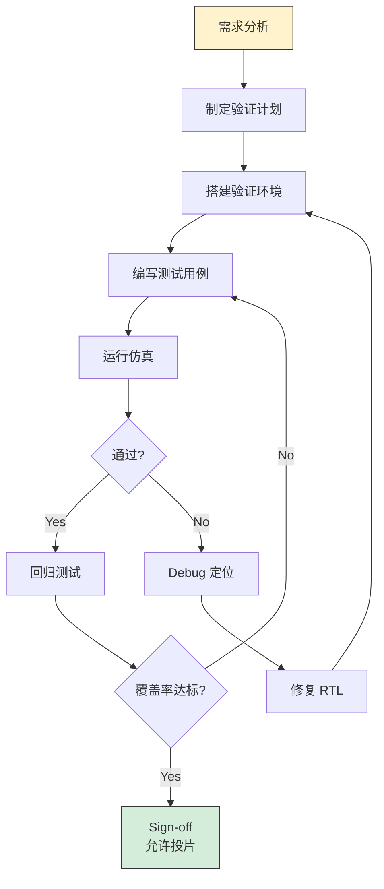
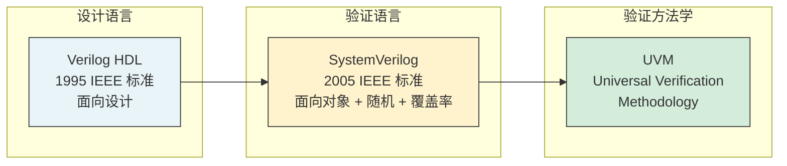

---
tags:
  - 数字IC
  - 芯片验证
  - 设计流程
created: 2026-07-23
---

# 数字芯片设计与验证概述

> 数字芯片设计验证从入门到实战 — 第1~6讲核心知识梳理。涵盖设计流程、验证概念、研发流程。

---

## 核心概念

- **PPA**：Power（功耗）、Performance（性能）、Area（面积）— 芯片设计的三个核心指标
- **RTL**：Register Transfer Level（寄存器传输级），用于设计的可综合抽象级
- **ASIC**：Application Specific Integrated Circuit（专用集成电路）
- **FPGA**：Field Programmable Gate Array（现场可编程门阵列）
- **SoC**：System on Chip（片上系统）

>  **大白话**：PPA 就像买房的三个核心指标——电费（功耗）、住得舒不舒服（性能）、房子多大（面积）。设计师永远在三个之间做权衡。

---

## 一、芯片发展趋势

### 1.1 摩尔定律与工艺演进

### 1.2 四大发展趋势

| 趋势 | 说明 |
|------|------|
| **功能复杂化** | 5G → 物联网 → 人工智能 → 芯片功能更复杂、更智能化 |
| **设计 SoC 化** | IP 复用技术，已验证模块直接集成，快速开发高性能复杂芯片 |
| **系统集成化** | SoC 集成更多器件，推动 PPA 进一步提升 |
| **软硬件协同化** | 软硬件协同设计，软件及服务在芯片销售中比重越来越大 |

---

## 二、数字芯片设计流程

>  流片（Tape-out）成本极高：7nm 约 **3000 万美元**，5nm 约 **5000 万美元**。所以验证环节至关重要！

---

## 三、数字芯片验证

### 3.1 验证的三种手段

| 手段 | 速度 | 规模 | 用途 |
|------|------|------|------|
| **Simulation（仿真）** | 慢（Hz~kHz） | 完整芯片 | 功能验证主力，覆盖率驱动 |
| **FPGA Prototype（原型）** | 中（MHz） | 中等规模 | 软硬件协同验证 |
| **Emulation（硬件仿真）** | 快（MHz~10MHz） | 大规模 | 跑完整 OS 和应用程序 |

>  **大白话**：验证就像考试——仿真是笔试（慢但全面），FPGA 原型是实操考试（快但有限），Emulation 是模拟真实工作环境（又快又全面但贵）。

### 3.2 验证平台基本框架

### 3.3 验证的核心问题

1. **输入何种激励？** → Stimulus（激励生成）
2. **如何检查正确？** → Reference Model + Scoreboard（参考模型 + 比分板）
3. **何时验证完毕？** → Coverage（覆盖率达到 100%）

---

## 四、验证研发流程

### 4.1 完整验证流程

### 4.2 回归测试（Regression）

| 要素 | 说明 |
|------|------|
| **定义** | 将已有 pass 的用例随时轮流自动执行 |
| **目的** | 保证环境健壮，修复 bug 后不引入新 bug |
| **频率** | 每日回归（后期降到每周 2-3 次） |
| **要求** | 每次随机不同种子，通过率 100% |
| **投片条件** | 连续两周回归无新 RTL 问题 |

>  **大白话**：回归测试就像"定期体检"——每次改了代码，都要把以前的测试全部重新跑一遍，确保"治好了一个病，没引发新病"。

---

## 五、验证语言工具栈

| 语言 | 起源 | 核心特性 | 用途 |
|------|------|---------|------|
| **Verilog HDL** | 1980s, 1995 IEEE | 模块、线网、寄存器、always/initial | 主要面向设计 |
| **SystemVerilog** | 2002, 2005 IEEE | 封装/继承/多态、随机约束、功能覆盖率、DPI | 验证主力语言 |
| **SystemC** | OSCI 维护 | C++ 库、事务级建模、行为建模 | 系统级设计 |

---

## 六、关键术语速查

| 术语 | 含义 |
|------|------|
| DUT | Device Under Test，待测设计 |
| Testbench | 测试平台，包含激励、监控、检查 |
| Coverage | 覆盖率，衡量验证充分性 |
| Assertion | 断言，描述设计应满足的属性 |
| IP | Intellectual Property，可复用设计模块 |
| EDA | Electronic Design Automation，电子设计自动化 |
| Tape-out | 流片，将版图数据送晶圆厂 |

---

## 关键要点总结

- 芯片设计核心指标是 PPA（功耗、性能、面积）
- 设计流程：规格 → 架构 → RTL → 验证 → 综合 → 后端 → 流片
- 验证三手段：仿真（主力）、FPGA 原型、硬件仿真
- 验证核心三问题：激励从哪来？结果对不对？何时测完？
- 回归测试是保证质量的关键，投片前必须连续两周回归无新问题
- 语言栈：Verilog（设计）→ SystemVerilog（验证）→ UVM（方法学）

## 延伸阅读

- [[FPGA/数字芯片设计与验证全流程]] — Synopsys Golden UPF Flow 五层抽象详解
- [[数字IC/Verilog HDL核心语法与建模]] — Verilog 语言元素、建模方式
- [[数字IC/高性能数字电路设计]] — 状态机、时钟时序、FIFO、低功耗
