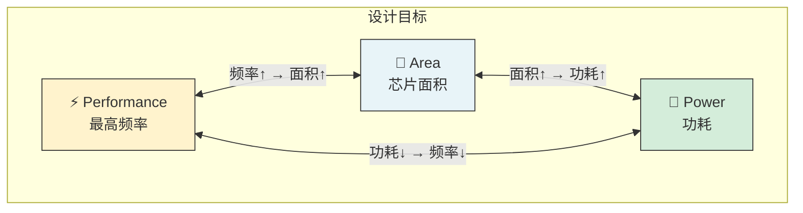
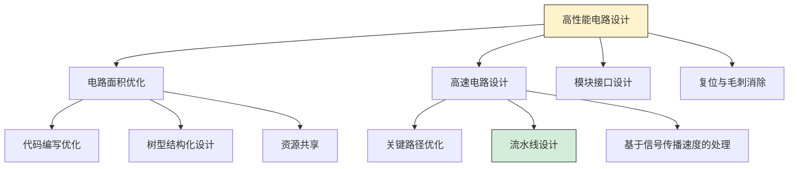
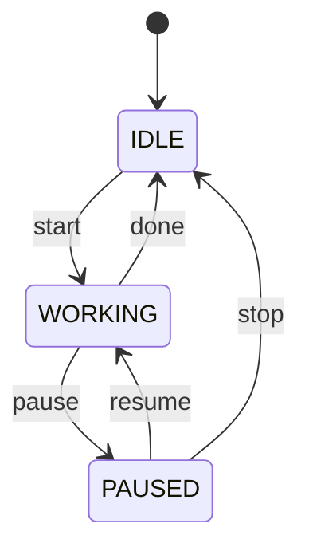
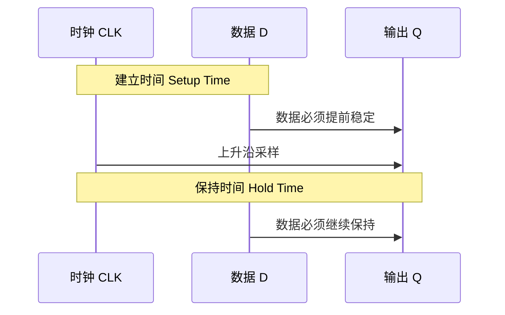
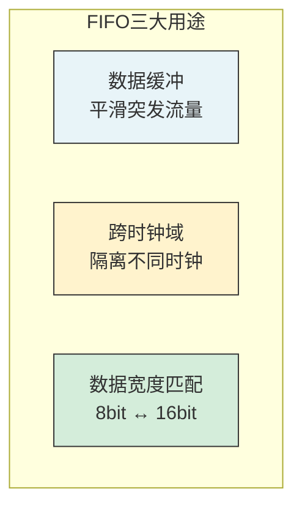
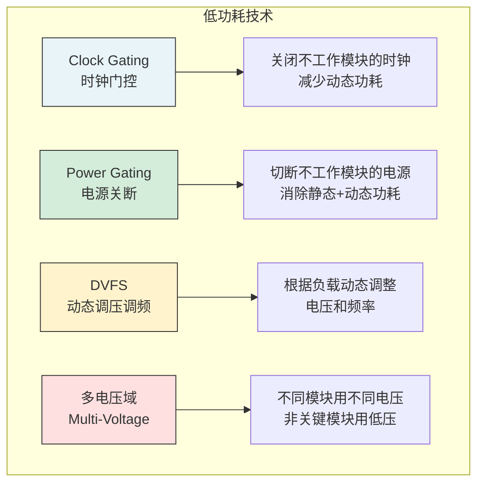

---
tags:
  - 数字IC
  - 数字电路设计
  - 状态机
  - FIFO
  - 时序分析
created: 2026-07-23
---

# 高性能数字电路设计

> 基于课程第17~25讲，梳理 PPA 优化、状态机设计、时钟时序、FIFO 设计、低功耗设计。

---

## 核心概念

- **PPA**：Power（功耗）、Performance（性能）、Area（面积）— 芯片设计三核心
- **关键路径（Critical Path）**：决定芯片最高工作频率的最慢路径
- **建立时间（Setup Time）**：时钟沿到来前，数据必须稳定的最短时间
- **保持时间（Hold Time）**：时钟沿到来后，数据必须保持的最短时间
- **FIFO**：First In First Out，先进先出存储器

---

## 一、PPA 优化理念

### 1.1 PPA 三要素关系



### 1.2 功耗分类

| 类型 | 原因 | 控制方法 |
|------|------|---------|
| **动态功耗** | 晶体管开关切换 | Clock Gating（时钟门控）、降低电压/频率 |
| **静态功耗** | 晶体管漏电 | Power Gating（电源关断） |

>  **大白话**：动态功耗 = 跑步时消耗的体力（干活才耗电）；静态功耗 = 睡觉时也消耗的基础代谢（不干活也漏电）。

### 1.3 高性能电路设计方法



---

## 二、状态机（FSM）设计

### 2.1 什么是状态机

**有限状态机（FSM）** = 一个离散数学模型，给定输入集合，根据输入的接受次序决定输出集合。



### 2.2 状态机分类

| 类型 | 输出取决于 | 特点 |
|------|-----------|------|
| **Moore 型** | 仅当前状态 | 输出稳定，与输入无关 |
| **Mealy 型** | 当前状态 + 输入 | 输出响应快，但可能不稳定 |

### 2.3 三段式编码风格（推荐）

```verilog
// 三段式状态机示例
module fsm_example (
    input  wire clk, rst_n, start, done,
    output reg  work, paused
);

    // 状态定义
    localparam IDLE    = 2'd0;
    localparam WORKING = 2'd1;
    localparam PAUSED  = 2'd2;

    // 第一段：状态寄存器（时序逻辑）
    reg [1:0] state, next_state;
    always @(posedge clk or negedge rst_n) begin
        if (!rst_n)
            state <= IDLE;
        else
            state <= next_state;
    end

    // 第二段：次态逻辑（组合逻辑）
    always @(*) begin
        case (state)
            IDLE:    next_state = start ? WORKING : IDLE;
            WORKING: next_state = done ? IDLE : (pause ? PAUSED : WORKING);
            PAUSED:  next_state = resume ? WORKING : (stop ? IDLE : PAUSED);
            default: next_state = IDLE;
        endcase
    end

    // 第三段：输出逻辑（时序/组合均可）
    always @(posedge clk or negedge rst_n) begin
        if (!rst_n) begin
            work   <= 1'b0;
            paused <= 1'b0;
        end else begin
            work   <= (state == WORKING);
            paused <= (state == PAUSED);
        end
    end

endmodule
```

>  **大白话**：三段式 = 记住当前状态（触发器）决定下一个状态（组合逻辑）③根据状态输出（触发器）。像开车：①看仪表盘 ②判断该加速还是刹车 ③踩油门或刹车。

---

### 2.4 流水线设计（Pipeline）

**什么是流水线？** 将一个长组合逻辑路径拆分成多段，每段之间插入触发器。

```mermaid
flowchart TB
    subgraph 组合逻辑（无流水线）
        A["输入"] --> B["长组合逻辑<br/>延迟大"] --> C["输出"]
    end

    subgraph 流水线设计（2级）
        D["输入"] --> E["组合逻辑1"] --> F["触发器"] --> G["组合逻辑2"] --> H["输出"]
    end

    style B fill:#ffe0e0,stroke:#333
    style F fill:#fff3cd,stroke:#333
```

**为什么需要流水线？**

| 指标 | 无流水线 | 流水线 |
|------|---------|--------|
| **延迟** | 1 个周期（长路径） | N 个周期（N 级流水线） |
| **最高频率** | 低（受限于长路径） | 高（每段路径短） |
| **吞吐率** | 低 | 高（每个周期都有输出） |

>  **大白话**：流水线就像工厂流水线——单个产品完成时间变长了（要经过多道工序），但每秒产出的产品数量变多了（每道工序同时进行）。

**流水线设计示例：**

```verilog
// 无流水线：长组合逻辑
module add_32bit (
    input  wire [31:0] a, b,
    output reg  [31:0] sum
);
    always @(*) begin
        sum = a + b;  // 32位加法，延迟大
    end
endmodule

// 流水线设计：拆分成两段
module add_32bit_pipe (
    input  wire       clk,
    input  wire [31:0] a, b,
    output reg  [31:0] sum
);
    reg [15:0] a_low, b_low;
    reg [15:0] a_high, b_high;
    wire [15:0] sum_low, sum_high;

    // 第一段：低16位加法
    always @(posedge clk) begin
        a_low  <= a[15:0];
        b_low  <= b[15:0];
    end
    assign sum_low = a_low + b_low;

    // 第二段：高16位加法
    always @(posedge clk) begin
        a_high <= a[31:16];
        b_high <= b[31:16];
    end
    assign sum_high = a_high + b_high;

    always @(posedge clk) begin
        sum <= {sum_high, sum_low};
    end
endmodule
```

>  **关键**：流水线增加了延迟（从1周期变成2周期），但提高了频率（每段逻辑更短）。对于需要高频运行的设计，这是必杀技！

---

## 三、时钟与时序

### 3.1 时钟基本概念

| 概念 | 说明 |
|------|------|
| **时钟源** | 外部：晶振/振荡器；内部：PLL（锁相环） |
| **时钟偏移（Skew）** | 时钟到达不同触发器的时间差 |
| **时钟抖动（Jitter）** | 时钟周期的随机变化 |
| **时钟树（Clock Tree）** | 时钟信号分配到各触发器的网络 |

### 3.2 建立时间与保持时间



**时序约束公式：**

```
建立时间约束：T_clk ≥ T_cq + T_logic + T_setup
保持时间约束：T_cq + T_logic ≥ T_hold

其中：
  T_clk    = 时钟周期
  T_cq     = 触发器时钟到输出延迟
  T_logic  = 组合逻辑延迟
  T_setup  = 建立时间要求
  T_hold   = 保持时间要求
```

>  **大白话**：建立时间 = 老师喊"开始答题"前，你必须已经看清题目；保持时间 = 老师喊"开始"后，你不能马上擦掉答案，至少要保留一小段时间。

### 3.3 时序违反的处理

| 问题 | 原因 | 解决方法 |
|------|------|---------|
| **Setup 违例** | 组合逻辑太慢 | 插入流水线、优化逻辑、降低频率 |
| **Hold 违例** | 组合逻辑太快 | 插入缓冲器（buffer）增加延迟 |

---

## 四、FIFO 设计

### 4.1 FIFO 是什么

**FIFO（First In First Out）** = 先进先出存储器，无地址线，按写入顺序读出。

### 4.2 FIFO 的使用场景



| 场景 | 说明 |
|------|------|
| **数据缓冲** | 写入速率高但突发，读出速率小但均匀 → FIFO 暂存平滑 |
| **跨时钟域** | 不同时钟域的数据传输 → FIFO 隔离，避免约束复杂化 |
| **宽度匹配** | 单片机 8bit 输出 → DSP 16bit 输入 → FIFO 做宽度转换 |

### 4.3 FIFO 的关键信号

```verilog
module fifo_top (
    input  wire       wr_clk,     // 写时钟
    input  wire       rd_clk,     // 读时钟
    input  wire       wr_en,      // 写使能
    input  wire       rd_en,      // 读使能
    input  wire [7:0] wr_data,    // 写数据
    output reg  [7:0] rd_data,    // 读数据
    output wire       full,       // 满标志
    output wire       empty,      // 空标志
    output wire [8:0] count       // 当前数据量
);
```

### 4.4 FIFO 深度计算

**核心公式：**

```
FIFO 深度 ≥ 写入数据量 - 读出数据量（在最坏情况下）

具体场景：
  写入频率 = f_wr, 每次写入 W_wr 字节
  读出频率 = f_rd, 每次读出 W_rd 字节
  突发长度 = B（一次连续写入的数据量）

  FIFO 最小深度 = B × (1 - f_rd × W_rd / (f_wr × W_wr))
```

>  **举个例子**：写入速率 100MB/s，读出速率 80MB/s，突发 1000 字节。FIFO 深度 ≥ 1000 × (1 - 80/100) = 200 字节。实际设计要加 20%~50% 余量。

---

## 五、低功耗设计

### 5.1 功耗优化技术



### 5.2 UPF（统一功耗格式）

UPF 描述的内容：

| 元素 | 作用 |
|------|------|
| Power Domain | 划分电源域，哪些模块共用电源 |
| Power Switch | 控制模块电源的开关 |
| Level Shifter | 不同电压域之间的电平转换 |
| Isolation Cell | 模块断电时输出固定值，防止浮动 |
| Retention Register | 断电时保存寄存器状态 |

---

## 六、复位与毛刺消除

### 6.1 复位类型

| 类型 | 优点 | 缺点 |
|------|------|------|
| **同步复位** | 时序友好，易于分析 | 需要额外逻辑检测复位 |
| **异步复位** | 响应快，不依赖时钟 | 复位释放可能违例 |
| **异步复位同步释放** | ✅ 兼顾两者优点 | 需要额外触发器 |

```verilog
// 推荐：异步复位同步释放
always @(posedge clk or negedge rst_n) begin
    if (!rst_n) begin
        rst_sync1 <= 1'b0;
        rst_sync2 <= 1'b0;
    end else begin
        rst_sync1 <= 1'b1;
        rst_sync2 <= rst_sync1;  // 同步释放
    end
end
```

### 6.2 毛刺消除

**毛刺（Glitch）** = 组合逻辑中因传播延迟不同导致的短暂错误脉冲。

消除方法：
1. **用触发器采样** — 时钟边沿采样，自然过滤毛刺
2. **格雷码计数器** — 相邻状态只有一位变化，消除译码毛刺
3. **同步器** — 跨时钟域信号用两级触发器同步

---

## 关键要点总结

- PPA 是芯片设计的核心指标，三者互相制约
- 状态机推荐三段式编码：状态寄存器 + 次态逻辑 + 输出逻辑
- 建立时间违例 → 流水线优化；保持时间违例 → 插入 buffer
- FIFO 三大用途：数据缓冲、跨时钟域、宽度匹配
- 低功耗四板斧：Clock Gating、Power Gating、DVFS、多电压域
- 复位推荐"异步复位同步释放"，兼顾响应速度和时序安全

## 延伸阅读

- [[数字IC/数字芯片设计与验证概述]] — 芯片设计流程与验证框架
- [[数字IC/Verilog HDL核心语法与建模]] — Verilog 四种建模方式
- [[数字IC/SystemVerilog核心特性]] — SV 数据类型、面向对象、随机约束
