# 多岛大学

# 学术硕士学位论文

（统招全日制）

基于FPGA多门限时域的数字雷达信号动态检测与调制识别研究

作者姓名 刘方建

指导教师 郑宇教授

学科 信号与信息处理

培养单位 电子信息学院

答辩日期 2023年5月31日

# 摘要

在现代电子战的大环境中，雷达设备和反辐射导弹以及其他武器被大量使用，使得电子侦察设备面临着复杂多样、威胁严重的电磁环境。如何提高电子侦察系统的抗干扰能力，已成为各国关注和研究的重点问题之一。信号检测和调制识别作为电子侦察系统的一个重要环节，具有决定性意义。因此，能否精确的检测出信号和鉴别出各类调制信号，是电子战胜利的关键。本文以雷达接收机作为应用背景，在时域中展开数字雷达信号的动态检测与调制识别研究。具体工作如下：

1.本文对雷达接收机经信道化处理之后的数据进行脉冲检测，因自相关检测法具有实时性好、便于工程实践等特点，所以采用自相关检测法对信号进行检测。针对传统噪声方差的门限设定方法并不能够应对复杂多变的电磁环境，提出了一种基于相关差值的门限设定方法。通过仿真对比分析，在相同信噪比情况下相关差值法比噪声方差法检测虚警率低、检测误差小，在3dB信噪比下虚警概率接近为 $10\%$ ，5dB虚警概率接近为0，并且采用的相关差值法脉冲检测易于FPGA(Field Programmable Gate Array，现场可编程门阵列)硬件实现，相关后的脉冲包络也易于进行时域参数的测量，可获得脉冲描述字(Pulse Description Word, PDW)等信息。  
2.为了更好地解决雷达脉冲信号调制识别的问题，提出了一种基于瞬时相关和瞬时频率相结合的调制识别方法。首先将信号通过功率谱3dB带宽测量粗分为FM和PSK两类，然后针对不同的信号类型采用不同的处理方法。对于FM信号，采用八点滑动均值的测频方法来分析信号频率，根据频率变化趋势进行类内识别；而对于PSK信号，则采用窗函数滤波来增强幅值的抗噪性能，并根据峰值种数进行类内识别。通过Matlab仿真与FPGA硬件设计成功地识别出了NS、BPSK、QPSK、FSK、LFM和NLFM这6类雷达信号，实现了信号准确的调制识别。

本文利用实验数据以及接收机侦收到的数据对信号检测与调制识别算法进行了仿真验证与分析，首先利用相关差值法实现信号的检测以及包络提取，然后利用基于瞬时相关与瞬时频率的方法对信号进行调制识别，最后完成整个接收机系统的FPGA硬件设计，并进行现场调试与验证，测试结果证明了系统设计的正确性和可靠性，最终完成了整个宽带雷达信号检测与PDW的功能实现。

关键词：电子侦察；信号检测；调制识别；FPGA

# Abstract

Electronic reconnaissance equipment faces a complex, diverse and threatening electromagnetic environment due to the widespread use of radar equipment, anti-radiation missiles, and other weapons in modern electronic warfare. How to improve the anti-jamming capability of electronic reconnaissance systems has become one of the key issues of concern and study in various countries. As an important part of the electronic reconnaissance system, signal detection and modulation identification are of decisive significance. Therefore, whether the signal can be accurately detected and various modulated signals can be identified is the key to the victory of electronic warfare. This paper focuses on the research of dynamic detection and modulation recognition of digital radar signals in the time domain, with radar receiver as the application background. The specific work is as follows:

1. In this dissertation, pulse detection is carried out on the channelized data of radar receiver. Since the autocorrelation detection method has the characteristics of good real-time performance and is convenient for engineering practice, it adopts the autocorrelation detection method to detect signals. In view of the traditional noise variance threshold setting method can not cope with the complex electromagnetic environment, a threshold setting method based on correlation difference is proposed. Through simulation and comparative analysis, the false alarm detection rate and detection error of correlation difference method are lower than noise variance method under the same signal-to-noise ratio. The false alarm probability is close to $10\%$ under 3dB signal-to-noise ratio, and the false alarm probability is close to 0 at 5dB. The pulse detection with the correlation difference method is easy to be implemented by FPGA (Field Programmable Gate Array) hardware, and the pulse envelope after correlation is easy to be measured in time domain parameters. Pulse Description Word(PDW) and other information can be obtained.

2. A modulation recognition method based on instantaneous correlation and instantaneous frequency combination is proposed to better solve the problem of radar pulse signal modulation recognition. Firstly, the signal is roughly divided into two categories, FM and PSK, by measuring the power spectrum 3dB bandwidth, and different processing methods are adopted for different signal types. For FM signals, the eight-point sliding mean frequency measurement method is adopted to analyze the

signal frequency, and intra-class recognition is performed according to the frequency change trend. For PSK signals, window function filtering is used to enhance the anti-noise performance of the amplitude, and intra-class recognition is performed according to the number of peak values. Through Matlab simulation and FPGA hardware design, NS, BPSK, QPSK, FSK, LFM and NLFM, the six types of radar signals, were successfully identified, achieving accurate modulation recognition of signals.

To simulate and analyze the signal detection and modulation recognition algorithm, experimental and receiver data is utilized in this paper. The detection and envelope extraction of the signal is achieved using the correlation difference method, followed by signal modulation and identification using the method based on instantaneous correlation and instantaneous frequency. The entire receiver system is then designed in FPGA hardware and field debugging and verification are carried out. The test results prove the correctness and reliability of the system design. Finally, the functional realization of the entire wideband radar signal detection and PDW was completed.

Keywords: Electronic reconnaissance; Signal detection; Modulation recognition; FPGA

# 目录

# 第一章 绪论

1.1 课题背景及研究意义  
1.2 国内外研究现状 2

1.2.1 数字雷达信号在时域中的研究现状 ..... 2  
1.2.2 信号检测与调制识别的研究现状  
1.2.3 FPGA 在数字接收机中的研究现状 ..... 5

1.3 本文的研究内容和章节安排

# 第二章 雷达数字信号中频接收技术理论 8

2.1 信号采样定理 ..... 8

2.1.1 奈奎斯特采样定理 ..... 8  
2.1.2 带通信号采样定理 9

2.2 FIR 滤波器的原理与设计 ..... 10  
2.3 数字信号处理手段 ..... 12

2.3.1 多速率数字信号—整数倍抽取 12  
2.3.2 CORDIC 算法 ..... 14

2.4 数字信道化接收模型 ..... 15

2.4.1 基于带通滤波器组的数字信道化 ..... 16  
2.4.2 基于多相滤波器组的数字信道化 ..... 18

2.5 本章小结 ..... 23

# 第三章 雷达信号检测的仿真分析与实现验证 ..... 24

3.1 常见的信号检测方法分析 24

3.1.1 滑动能量积累检测法 ..... 24  
3.1.2 自相关检测法 ..... 26  
3.1.3 小波阈值去噪检测法 ..... 28

3.2 脉冲门限检测方法分析 31

3.2.1 噪声方差法 ..... 31  
3.2.2 相关差值法 ..... 32

3.3 信号检测的FPGA实现 36

3.3.1 自相关算法模块设计 36  
3.3.2 脉冲检测模块设计 38

3.4 本章小结 ..... 41

# 第四章 雷达信号调制识别的仿真分析与实现验证 42

4.1 脉内调制识别方法 ..... 42  
4.1.1 基于瞬时频率的调制识别方法 ..... 42

4.1.2 基于瞬时相关和瞬时频率的调制识别方法 ..... 45

4.2 信号调制识别的FPGA设计 ..... 49

4.2.1 3dB频谱带宽模块设计 ..... 49  
4.2.2 PSK与FM调制识别模块设计 52

4.3.本章小结 55

第五章 基于FPGA接收机的系统集成 56

5.1 数字接收机系统平台搭建 ..... 56  
5.2 数字接收机系统功能与信号参数测试 ..... 57

5.2.1 数字接收机系统功能 ..... 57  
5.2.2 雷达信号参数测试 ..... 59

5.3 本章小结 61

第六章 总结与展望 62

6.1 全文总结 62  
6.2 工作展望 62

参考文献. 64

# 第一章 绪论

# 1.1 课题背景及研究意义

伴随着软件无线电[1,2]及数字化技术的飞速发展与广泛应用，数字雷达接收机[3-5]也应运而生，它具有抗干扰能力强、可靠性高的众多优势，并且可以通过软件升级等方式进行改进和优化，具有良好的扩展性和灵活性，使得它在现代电子系统得到越来越多的运用，并已逐渐替代模拟接收机成为当代接收机的主流。在整个雷达接收系统中，数字雷达接收机具有“承前启后”的作用，它能够在复杂的电磁环境中接收雷达系统所发射的信号，对这些信号进行初步的处理和解析，将其转化成数字信号；对接收到的信号进行滤波处理，滤除其中的噪声，使得雷达信号更加清晰和稳定。其次，数字雷达接收机还可以对雷达信号进行复杂的时域和频域信号处理，使其能够以更高的分辨率获取雷达信号，提高雷达系统的目标探测和识别能力。因此，数字雷达接收机在电子侦察系统中具有非常重要的地位。

电子侦察系统[6,7]是一种用于获取对方主动探测雷达工作参数而发展起来的电子系统。该系统采用软件无线电技术和中频数字接收技术，可以保留原始信号调制的全部特征信息，在战场上可以实时、准确地侦察到对方雷达的活动情况，提供雷达目标的位置、速度、高度等信息；还可以对对方雷达信号进行干扰，使其不能正常工作，削弱对方雷达的作战能力，从而为我方精确制导提供有力支持。但在电子侦察过程中，往往会遇到大量的干扰，例如，地面杂波、海浪反射、多普勒效应等，还有各种噪声以及突发事件，这些环境因素会对电子侦察系统的性能产生很大的影响。当目标信号被噪声或者干扰覆盖时，侦察系统的检测能力会大大降低，导致雷达系统失效或者无法正常工作。因此，这就需要电子侦察系统必须具备一定的抗干扰能力，来应对变化复杂的电磁环境。

鉴于此，为应对复杂多变的电磁环境，本文以数字雷达接收机作为应用背景，开展了雷达脉冲信号检测与调制识别的工作。从工程实际出发，结合着目前雷达信号接收和处理的发展趋势，利用已有的一些成熟技术，在高性能FPGA芯片上进行了脉冲信号检测与调制识别的全流程实现，并通过理论分析与计算机仿真验证了硬件设计，并给出了测试结果。

# 1.2 国内外研究现状

# 1.2.1 数字雷达信号在时域中的研究现状

在雷达系统中，雷达信号的处理是至关重要的一个环节，它可以帮助我们从复杂的雷达信号中提取出有用的信息，实现目标检测、距离测量、目标识别等功能。而雷达信号在时域上的研究，可以帮助我们更好地理解雷达信号的特性和行为，进一步优化雷达信号的处理方法和算法。

在国内，雷达信号在时域上的研究主要集中在雷达信号处理和应用方面。其中，时域分析方法是研究的重要内容之一。在时域分析方法中，最为常用的方法包括脉冲压缩[8]、相关分析[9]、时间-频率分析[10]和小波变换[11]等。国防科学技术大学电子科学与工程学院王渝冲，宿绍莹等提出了一种基于小波分析的雷达信号调制类型识别方法[12]，通过Morlet小波变换求得时频曲线，根据曲线形状确定脉内调制类型。此外，邹本振，张萌等提出了一种基于脉冲压缩技术的雷达信号处理方法[13]，以脉冲压缩雷达为例构建了叠加噪声并经过信号处理后的检测包络模型。

除了时域分析方法外，时域特征提取方法[14-16]也是研究的重要内容之一。时域特征提取方法是指从雷达信号中提取相关特征参数的方法，例如脉冲宽度[17]、脉冲重复周期[18]、脉冲间隔时间[19]等。这些特征参数可以用于雷达信号的分类、识别、距离测量等。常用的时域特征提取方法包括峰值检测[20]、零交叉检测[21]、边沿检测[22]等。董晖，毕大平等提出利用解析信号包络与瞬时自相关信号包络进行脉冲时域参数测量[23]，采用瞬时自相关信号中包络可在低信噪比情况下一定程度提高测量精度，为雷达信号的处理提供了重要的参考。

在国外，雷达信号在时域上的研究更注重于雷达信号的理论分析和算法优化等方面。Galati Gaspare等提出了噪声雷达的信号设计与处理[24]，通过噪声雷达技术（Noise radar technology，NRT）发射类噪声波形，并利用雷达波的相关处理对其进行最优接收。Kumlu Deniz等提出了一种基于增量非负矩阵因式分解[25]（Incremental Non-negative Matrix Factorization，INMF）的A-scan建模方法，用于地质雷达（Ground penetrating radar，GPR）探测地下物体。该方法通过将GPR接收到的A-scan信号分解为多个非负成分，对信号进行建模和分析，来实现对地下物体的快速检测和识别。此外，Hiroyuki Yamaguchi等也提出了一种新的基于非相干雷达回波的恒虚警率（Constant False Alarm Rate，CFAR）[26]检测方法，该方法应用贝叶斯理论对被测单元的局部杂波统计分布进行自适应估计，能够在非相干舰船雷达系统中进行很好地实现。

# 1.2.2 信号检测与调制识别的研究现状

# (a) 信号检测

雷达信号脉冲检测[27-30]是雷达信号处理中的一种重要技术，它是通过对雷达接收到的信号进行检测处理，从中提取出所需信息的过程。当今，国内外雷达信号的形式越来越复杂，加之电子对抗设备源源不断地出现，使电子侦察系统在可靠性，实时性等方面都面临严峻考验。而且，对雷达信号脉冲检测的研究一直是雷达领域的热点问题之一。下面对一些常见检测方法作简要介绍。

短时傅里叶变换法（Short-time Fourier Transform，STFT）是信号检测算法中一种有效的方法，其主要原理是通过将信号转换到时间-频率域中，来实现对信号的多尺度分析。周云松提出了基于高斯窗STFT的LFM信号检测[31]，根据LFM信号特征参数选取最优高斯窗，最终由STFT得到最优检测性能。郭少琨，罗建等研究了基于STFT的瞬时频率估计[32]，针对单频信号和线性调频信号分别进行了测试分析。Kwok HK，Jones DL研究了自适应的短时傅里叶变换（Auto Short-time Fourier Transform，ASTFT）[33]，利用ASTFT来进行雷达信号的检测，并开展信号的瞬时频率估计。

小波变换（Wavelet Transform，WT）是检测算法中另一种较新且较为有效的方法，小波变换可以将原始雷达信号分解成不同尺度和频率的子信号，其主要优点是能够同时提取出时间和频率信息。黄安贻，张理恒研究了基于小波变换的信号检测[34]，通过对小波变换算法的理论分析以及信号检测原理的研究，在DSP上实现了小波变换算法，成功的将含噪信号中噪声进行剔除，有用信号进行保留。孙宸，胡嘉龙等提出小波变换法去除激光雷达回波信号中的噪声[35]，通过建立模型，选择合适的小波基、分解层数和阈值，对激光雷达的有效探测距离和探测性能有了很大的提高。Patel Hardik等基于离散小波变换（Discrete Wavelet Transform，DWT）来进行信号检测[36]，在Haar、db4和db9/7这三种母小波中引入了提升方案，并进行FPGA设计来实现实时的信号检测。

电磁波能量检测法，根据在高斯白噪声下信号加噪声的能量总是大于噪声能量的原理，通过设定门限来检测信号，该方法不需要任何先验信息，具有较强的抗干扰能力和鲁棒性。隋丹、葛临东等提出了基于短时能量的突发信号检测算法[37]，可以在较少观测数据情况下，实现不同调制类型的信号检测。刘轶凡，金虎等研究了能量检测对抖动信号进行检测[38]，提出了相关抖动信号能量检测模型，并分析了在两种判决准则下的信号检测。文凯，姜赖赢提出了基于噪声方差估计的自适应多门限能量检测算法[39]，确定噪声方差的不同区间，来合理设定判决门限。

# （b）信号调制识别

雷达信号调制识别[40-42]是雷达技术中的重要研究内容之一。随着雷达技术的不断发展和应用，雷达信号调制识别的研究也得到了越来越多的关注和重视。雷达信号调制识别技术的研究主要是基于对不同调制方式下的雷达信号进行分析和识别，以实现对雷达信号的处理和应用。下面对一些常见的调制识别方法作简要介绍。

基于神经网络的调制识别算法主要通过将雷达信号的特征向量输入到神经网络中进行训练和分类，来完成对调制信号的自动识别和分类。Jiang Kaiyuan, Qin Xvan等提出了一种基于卷积神经网络（Convolutional Neural Network, CNN）[43]的通信信号调制识别模型，结合着双向长短期记忆（Bidirectional Long Short-Term Memory, BiLSTM）与对称结构，提取信号的频域特征和时序特征，进行信号的调制识别工作。薛柳勋，张文琪等提出了一种改进的卷积神经网络X-CNN[44]，该方法在连接结构、增强机制和池化方法等方面进行了优化，以提高信号的识别率和整体拟合能力。此外，张胜利，潘继飞等研究了基于BP神经网络对LFM信号进行调制识别[45]，通过BP神经网络模型，分析噪声和数据丢失率对识别精度的影响，来对带噪的线性调频信号进行识别。

基于时频分析的调制识别算法主要通过将雷达信号从时间域转换到频率域，从而实现对信号的多尺度分析。张忠民，刘刚等研究了基于快速分数傅里叶变换（Fast Fractional Fourier Transform，FRFT）的雷达信号调制方式识别[46]，能够在低信噪比情况下，利用功率谱特征对调频与非调频信号进行有效调制识别。谢存祥，张立民等研究了基于时频特征提取的雷达信号识别[47]，通过FRFT对信号进行chirp基分解，并根据残差神经网络实现雷达信号在低信噪比环境下的识别。晁娇提出了基于STFT来进行雷达信号脉内识别[48]，通过STFT求得信号的瞬时频率随时间的变化规律，根据特征分析得到雷达信号脉内识别流程。

基于调制特征的分析与提取，常见的特征包括：瞬时特征、高阶累积量、谱相关特征和星座图等。翟孝霏，刘雅轩等利用瞬时累加自相关法提取信号特征值[49]，来完成对雷达信号脉内调制识别；同样，张凌等研究了基于部分瞬时自相关频谱来提取相关谱中的子峰与最高峰的比值[50]，对集中式MIMO雷达进行调制识别。此外，刘艳萍等研究了基于相位编码的调相信号调制识别[51]，通过对调制信号进行多重相位差分，根据得到的结果设计识别所需的编码规则，从而对调相信号进行识别。刘生，于万里等研究了基于瞬时特征参数的调制识别方法[52]，通过利用瞬时幅度、瞬时频率与瞬时相位这三个参数，来解决低信噪比条件下调制识别率低的问题。

# 1.2.3 FPGA 在数字接收机中的研究现状

FPGA(Field Programmable Gate Array，现场可编程门阵列)作为一类半定制的通用器件[53]，1984年由Xilinx公司发明。由于采用流水线技术而被称为“片内可编程”的器件，它将所有可配置的物理模块封装成一个整体，并根据具体需求来定义相应的逻辑函数及时序关系。随着集成电路技术发展日新月异，越来越多的高性能芯片被设计出来并得到广泛应用。2011年，Xilinx对外公布了旗下Kintex-7芯片系列，第一次实现了 $28\mathrm{nm}$ 工艺下性能集成，此后Xilinx继续以 $28\mathrm{nm}$ 工艺开发7系列中的另外3款芯片Artix-7，Virtex-7以及Zynq，表1.1是Xilinx7系列芯片[54]的性能和应用比较。在 $28\mathrm{nm}$ 制程之后，Xilinx公司继续推出了基于 $20\mathrm{nm}$ 制程的UtralScale系列和 $16\mathrm{nm}$ 的UtralScale+系列，将工作电压（VCCINT）和结构性能继续提升到一个新的领域。

表 1.1 Xilinx 7 系列芯片的性能与应用对比  

<table><tr><td>芯片系列</td><td>性能特点</td><td>应用</td></tr><tr><td>Artix-7 系列</td><td>主要特点为低功耗、低成本；有着 3.75Gpbs 串行连接功能；采用丝焊芯片级 BGA 封装，实现了小型化和低成本</td><td>军用航空电子和通信设备；便携式超声波、数字照相机控制</td></tr><tr><td>Kintex-7 系列</td><td>拥有最佳的性价比，能满足中低端应用要求；有着 10.3125Gbps 串行连接功能；提供新一代广播视频点播系统所需的性能和带宽</td><td>3D 数字视频显示器、医学成像与航空电子成像系统</td></tr><tr><td>Virtex-7 系列</td><td>业界密度最高的 FPGA，资源丰富，功耗低；支持 400G 桥接和交换结构有线通信系统；能够满足单芯片 TeraMACC 信号处理能力的要求</td><td>兆位级交换机结构、雷达信号处理和 ASIC仿真</td></tr><tr><td>ZYNQ-7 系列</td><td>集成了 FPGA 的 PL 部分和基于 ARM 的 PS 部分；基于 ARM 处理器的 SoC 可满足复杂嵌入式系统的高性能、低功耗和多核处理能力等要求</td><td>视频监视、汽车驾驶员辅助以及工厂自动化等高端嵌入式应用</td></tr></table>

将FPGA应用于雷达数字接收机中，可以实现对雷达信号的高速处理和分析，从而提高雷达系统的工作效率和性能。张黎明利用FPGA技术设计了一种高性能雷达接收机系统[55]，该系统实现了数字下变频，使其输出的正交I、Q数据用于算法解调和DSP处理，除此之外，该系统还实现了移相滤波、多速率抽取等多项功能，用于处理分析雷达数字信号。杨媛媛与吕幼新提出了基于FPGA的并行多通道数字接收机处理技术[56]，来实现对雷达信号的高速处理和分析。周盼提

出了基于FPGA的数字接收机的复杂信号调制方式识别[57]，利用全数字锁相环技术对信号提取调制信息进行识别。

# 1.3 本文的研究内容和章节安排

本论文从数字接收机发展趋势出发，应用软件无线电等概念，主要的研究工作围绕信道化接收信号检测和调制识别以及时域参数的测量等方面展开。首先，研究了雷达信号接收和检测问题，根据多相滤波思路实现数字信道化的接收构造，并对接收到的信号进行自相关算法检测，根据相关差值法设定的门限提取脉冲信号；接着对雷达信号调制特性进行了分析，设计了一套基于瞬时相关和瞬时频率的调制类型识别的算法流程，进行信号调制识别；最后在进行了Matlab和Vivado Simulation仿真，验证其正确性与可行性，并在此基础上，完成接收机系统平台搭建和FPGA实现，并对雷达信号的时域参数进行了测量，完成对其PDW的处理。

本文的章节安排安排如下：

第一章对选题的背景和意义进行简要阐述，接着介绍了信号检测和信号调制识别方面的研究状况，以及FPGA在接收机中的应用现状和发展趋势，最后介绍了论文的主要研究工作以及章节安排。

第二章介绍数字信号中频接收的相关理论，主要阐述了信号采样，多速率数字信号处理，数字滤波器以及数字信道化的数字信号处理理论。着重研究多相滤波与数字信道化问题，在多相滤波信道化过程中，推导并证明了多相滤波信道化原理与结构的实现方法，从而为后文雷达信号检测与调制识别的实现提供了保障。

第三章主要涉及信号检测及仿真分析，对常见的几种信号检测方法在Matlab中进行了分析和仿真。然后对脉冲门限设定进行改进，对比传统的噪声方差法门限设定，采用更加灵活高效的相关差值法进行脉冲门限检测，并做了对比仿真，以及对信号检测整体流程进行了FPGA设计，其中对自相关检测模块以及脉冲检测模块做了详细介绍。

第四章是信号调制识别，本章先是介绍了几种信号调制识别方法，并在Matlab中进行分析和仿真，经对比选择更适用于硬件实现的基于瞬时相关和瞬时频率的调制识别方法，该方法分别针对调相信号与调频信号做了创新，让其能更好的识别NS、BPSK、QPSK、LFM、NLFM和FSK信号，并针对该调制识别流程进行了FPGA设计和模块介绍，其中包括3dB频谱带宽模块以及PSK与FM识别模块。

第五章简单介绍了雷达侦察接收机系统的平台实现和功能设计。在平台实现方面，首先介绍了硬件平台的搭建以及主要元器件的选择。在功能设计方面，涉及数字信道化、频谱信息和雷达信号参数测量等内容，并对基本参数的分析和处理做了简要的论述。

第六章总结与展望，本章总结了本文的主要研究工作以及取得的结果，同时指出了文中方法存在的不足之处，从而为后续雷达信号检测与调制识别的研究工作提出建议和思路。

# 第二章 雷达数字信号中频接收技术理论

# 2.1 信号采样定理

数字接收机的主要任务是从接收到的雷达模拟信号中提取数据并将其转换为数字信号[58]，以便于后续数字信号处理。为了完成这一任务，数字化接收机需要进行一系列步骤，其中第一步是在模拟信息频带内对其进行合适的采样。美国电信工程师奈奎斯特在1928年提出了采样定理，采样定理为离散采样序列的频谱不发生混叠建立了采样速率限制条件。这意味着采样率必须满足一定的条件，才能从有限带宽的连续信号中捕获全部信息。

# 2.1.1奈奎斯特采样定理

奈奎斯特采样定理[59]：对于信号 $x(t)$ 的频带限制在 $(0, f_{H})$ 内，如果以 $f_{s}$ 的频率进行采样，得到时域离散信号 $x(nT)$ ，其中 $T = 1 / f_{s}$ 被称为采样间隔。若要通过时域离散信号准确地恢复原信号 $x(t)$ ，那么采样率应满足 $f_{s} \geq 2f_{H}$ 。

对于一个最高角频率不超过 $\omega_{H}$ 的连续信号 $x(t)$ ，让其与 $\delta_T(t)$ 相乘， $\delta_T(t)$ 是一个以 $T$ 为周期、频率为 $f_s = 1 / T$ 的周期性冲激函数。采样结果用 $x_{s}(t)$ 来表示，而 $x_{s}(t)$ 则是由一系列以 $T$ 为间隔的采样值组成的离散序列。

$$
\begin{array}{l} x _ {s} (t) = x (t) \sum_ {n = - \infty} ^ {+ \infty} \delta_ {T} (t - n T) \tag {2-(1)} \\ = x (n T) \sum_ {n = - \infty} ^ {+ \infty} \delta_ {T} (t - n T) \\ \end{array}
$$

其频谱 $X_{s}(\omega)$ 为：

$$
\begin{array}{l} X _ {S} (\omega) = \frac {1}{2 \pi} X (\omega) * \left[ \frac {2 \pi}{T} \sum_ {n = - \infty} ^ {+ \infty} \delta_ {T} \left(\omega - \omega_ {S} n\right) \right] \\ = \frac {1}{T} \sum_ {n = - \infty} ^ {+ \infty} X (\omega - \omega_ {S} n) \tag {2-(2)} \\ \end{array}
$$

式2-(2)表明，在以采样率 $f_{s}$ 进行采样后，采样信号的频谱是原始信号频谱以频率 $\omega_{s} (\omega_{s} = 2\pi f_{s})$ 的周期延拓。如图2.1(a)所示为信号 $x(t)$ 的频域波形 $X(\omega)$ ，而图2.1(b)则展示了采样信号 $x_{s}(t)$ 的频域波形 $X_{S}(\omega)$ 。当式2-(2)中的角频率间隔

满足 $\omega_{s} \geq 2\omega_{H}$ 时，可以确保 $X_{S}(\omega)$ 中频谱与原始信号频谱 $X(\omega)$ 之间互不交叠，从而能够不失真地将原始信号从采样信号中恢复出来。

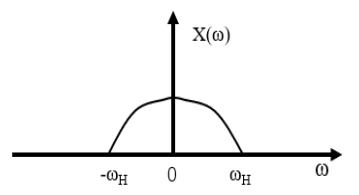  
(a)

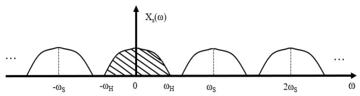  
(b)   
图2.1 信号采样前后频谱

# 2.1.2 带通信号采样定理

奈奎斯特采样定理是通信领域中一个重要的理论基石，主要用于研究频谱分布在 $(0, f_{H})$ 上的基带信号的采样问题。但在实际工程应用中，经常会遇到频谱集中在 $(f_{L}, f_{H})$ 上的有限频带信号，这种信号被称为带通信号。对于带通信号，奈奎斯特采样定理仍然可以指导我们按照 $f_{s} \geq 2f_{H}$ 的采样速率进行采样。然而，当 $f_{H}$ 远大于信号带宽 $B(B = f_{H} - f_{L})$ 时，使用奈奎斯特采样定理采样需要较高的采样频率，导致后续的信号处理速度无法满足要求，难以实现。此时，就需要引入带通采样定理，以便更好地解决带通信号采样问题。

带通采样定理[60,61]：对于一个频带限制在 $(f_{L}, f_{H})$ 内的带通信号 $x(t)$ ，其带宽为 $B$ ，如果其采样频率 $f_{s}$ 满足式2-(3)的要求，就可以精确的还原原始带通信号 $x(t)$ 。

$$
\frac {2 f _ {H}}{n} \leq f _ {s} \leq \frac {2 f _ {L}}{n - 1} \tag {2-(3)}
$$

其中 $n$ 的取值范围为 1 到 $N$ 之间的自然数， $N$ 是小于等于 $f_{H} / B$ 的最大整数。

如图2.2所示为带通信号采样前后的信号频谱，横坐标是以信号的带宽 $W$ 为单位，图2.2（b）采样率 $f_{s}$ 选用 $3W$ ，正负频率部分确实互相交错，不发生混淆，当然采样率也可以选用 $2.5W$ 。由式2-(3)可得，根据不同的 $n$ 可以得出不同的采样率取值范围：

当 $n = 1$ ： $2f_{H} \leq f_{s} \leq \infty$ ，由不等关系2-(3)就得到了奈奎斯特采样定理；

当 $n = 2$ ： $f_{H}\leq f_{s}\leq 2f_{L}$

当 $n = 3:2 / 3f_H\leq f_s\leq f_L$

···

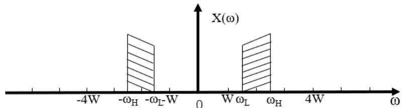

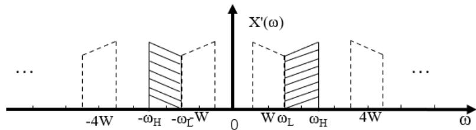  
（a）采样前频谱  
（b）采样后频谱  
图2.2带通信号采样前后的信号频谱

需要注意的是，以上所提到的频带宽度 $B$ 并不仅仅是某一个信号的带宽，它实际上是处理带宽，也就是在这一处理带宽范围内可以同时存在多个信号，而不局限于一个信号。虽然带通采样定理为带通信号的采样提供了有效的解决方案，但是在不同频带上同时存在信号时，使用带通采样定理将会引起信号混叠。因此，在进行采样之前，需要进行滤波处理以滤除不需要的频率分量，以保证信号处理的准确性，避免混叠所带来的问题。

# 2.2 FIR滤波器的原理与设计

FIR (Finite Impulse Response, 有限长单位冲激响应)滤波器[62]是目前常用的抗混叠滤波器之一。它是一种稳定系统, 具有严格的线性相位特性。由于 FIR 滤波器参数易于设计和优化, 因此在数字信号处理领域被广泛应用。在进行采样率变换系统设计时, 选择合适的抗混叠滤波器至关重要, 而 FIR 滤波器的应用可以有效地提高抽样的质量和效率, 从而保证滤波系统的准确性和稳定性。

例如输入信号 $x(n)$ ，若有长度(抽头数)为 $N$ 、阶数为 $N - 1$ 的FIR系统，其转移函数、输出信号 $y(n)$ 和滤波器冲激响应 $h(n)$ 分别如式2-(4)、式2-(5)和式2-(6)所示。

$$
H (z) = \sum_ {n = 0} ^ {N - 1} h (n) z ^ {- n} \tag {2-(4)}
$$

$$
y (n) = \sum_ {k = 0} ^ {N - 1} h (k) x (n - k) \tag {2-(5)}
$$

$$
h (n) = h (0) \delta (n) + h (1) \delta (n - 1) + \dots + h (N - 1) \delta [ n - (N - 1) ] \tag {2-(6)}
$$

对于一个典型的低通数字滤波器，各重要参数如图2.3所示。通带截止频率为 $\omega_{p}$ ，通带容限为 $\delta_{1}$ ，阻带截止频率为 $\omega_{s}$ ，阻带容限为 $\delta_{2}$ 。通带定义为 $|\omega| \leq \omega_{p}$ ，过渡带定义为 $\omega_{p} \leq |\omega| \leq \omega_{s}$ ，阻带定义为 $\omega_{s} \leq |\omega| \leq \pi$ 。

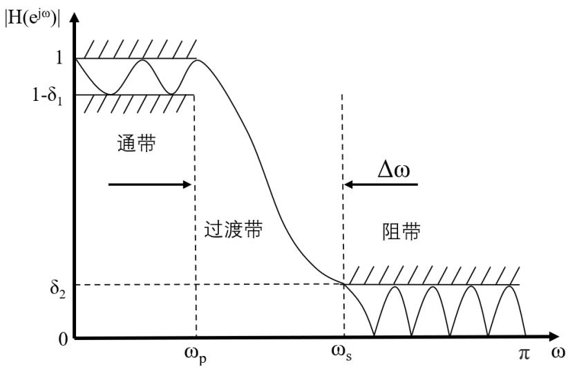  
图2.3FIR低通滤波器参数

在某些情况下，FIR滤波器需要较高采样率和实时性要求，应用在FPGA设计中，可以采用全并行结构来实现。如下图所示为四抽头的全并行FIR滤波器结构，输入数据 $\text{din}$ 同时传送到每个乘法器的输入端与相应的系数 $h(n)$ 相乘，并通过DSP48E1[63]逻辑运算单元（图中的虚线框）的级联方式来实现信号滤波运算。因此，全并行结构思想就是通过多个乘法器同时执行来完成一次滤波操作，从而实现“以资源换速度”的目的。

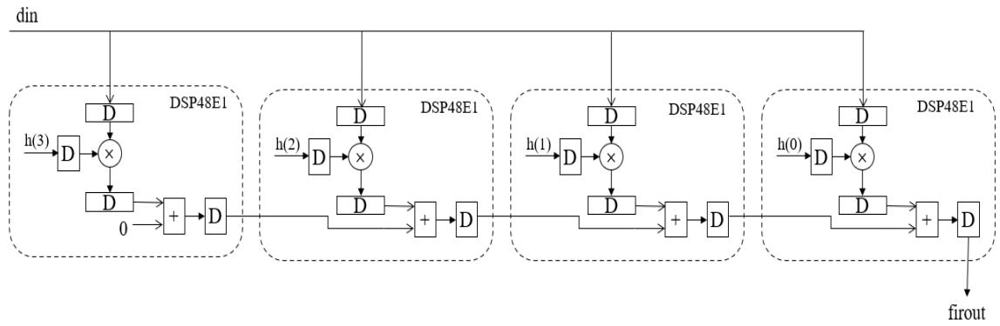  
图2.4四抽头全并行FIR滤波器硬件结构

# 2.3 数字信号处理手段

# 2.3.1 多速率数字信号一整数倍抽取

多速率数字信号处理是重新改变信号采样过后的数据率，以满足新的信号处理要求，且可以无失真地还原信号。在多速率数字信号处理中，主要有两种方法：抽取（Down Sample）和内插（Up Sample），分别用于减小和增大信号的数据率。本节主要讨论整数倍抽取[64]。

例如原始序列为 $x(n)$ , 采样率为 $f_{x}$ , 在抽取因子 $\mathrm{D}$ 的作用下, 得到新的采样序列 $y(m)$ , 其数学表达式为:

$$
y (m) = x (m D) \tag {2-(7)}
$$

用 $f_{y}$ 表示 $y(m)$ 的采样率, 则抽取前后采样率关系可表示为:

$$
f _ {y} = f _ {x} / D \tag {2-(8)}
$$

原始序列 $x(n)$ 的采样实现的是模拟域到数字域的转变，而 $y(m)$ 的采样前后都在数字域，不同的是在数字域上的数据率。以正弦序列为例，对其进行四倍抽取得到新序列，如图2.5所示。

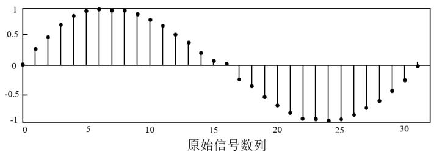

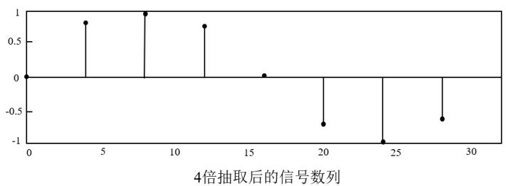  
图2.5抽取前后序列的时域变化

上述均为从时域角度对抽取进行描述。从频域来看，抽取后的信号序列 $y(m)$ 的频率响应为：

$$
Y \left(e ^ {j \omega}\right) = \frac {1}{D} \sum_ {k = 0} ^ {D - 1} X \left[ e ^ {j (\omega - 2 \pi k) / D} \right] \tag {2-(9)}
$$

由于时域的离散性，频域的周期性也随之产生，频域的周期即为采样角频率（ $2\pi/\mathrm{D}$ ）。如图 2.6 显示了经四倍抽取前后 $X(f)$ 与 $Y(f)$ 频谱关系。抽取后序列的频谱 $Y(f)$ 是以 $f_y$ 为周期进行周期延拓，与抽取前的延拓周期 $f_x$ 减小了 $D$ 倍。除此之外，重采样之后仍需满足采样定理的要求，用 $B_x$ 表示原始序列的带宽，则抽取后序列 $y(m)$ 的延拓周期 $f_y$ 应大于等于两倍的原始序列带宽，即 $f_y \leq 2B_x$ 。

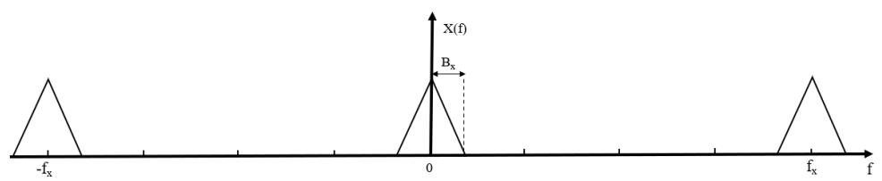

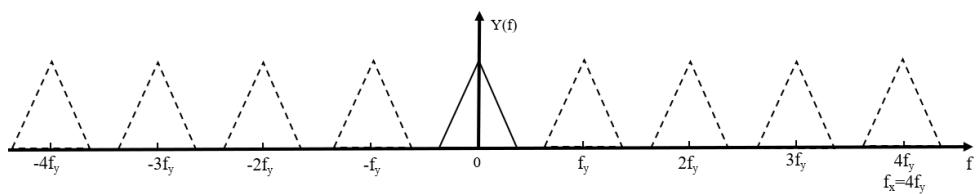  
图2.6抽取前后序列的频谱关系

多速率信号处理中，恒等式[63]是一种广泛使用的技术，可以有效提高效率，也为后续多相滤波信道化处理的FPGA设计与实现提供理论依据。其中，关于抽取的恒等式有三个。

第一恒等式表明抽取位于乘加操作之后等效于抽取在乘加操作之前。利用此等式将抽取放在乘加运算之前，可有效使乘法器与加法器以较低的数据速率工作，减少系统功耗与复杂度。

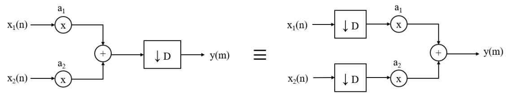  
图2.7 第一恒等式

第二恒等式表明先进行 $D$ 个延迟再进行 $D$ 倍抽取等效于先进行 $D$ 倍抽取再进行1个延迟。

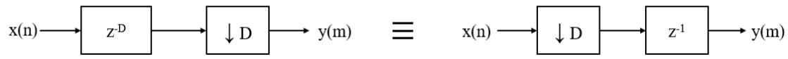  
图2.8 第二恒等式

第三个恒等式表明信号先通过滤波器 $H(z^{D})$ 再经 $D$ 倍抽取等效于信号先经过 $D$ 倍抽取再通过滤波器 $H(z)$ 。

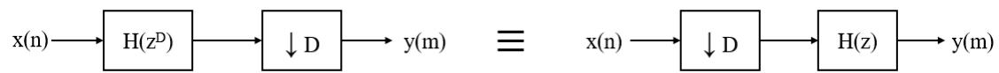  
图2.9 第三恒等式

# 2.3.2 CORDIC 算法

CORDIC 算法[65]是一种数学计算的逼近方法，它可以将某一运算如开方、三角函数和反三角函数分解为一系列的加减和移位计算。CORDIC有两种迭代方式，分别是旋转模式和向量模式。旋转模式迭代时使得 $z$ 趋向于 0，而向量模式下则是使 $y$ 趋向于 0。在向量模式的迭代过程中，根据 $y_{i}$ 的符号确定旋转方向，直至向量至 $X$ 轴的正半轴，该旋转过程中每次微旋转的旋转角度都会被累加存储在变量 $z$ 中，最终得出旋转角度的累加和 $\theta$ 。下图展示了矢量旋转图，以及相应迭代公式如下：

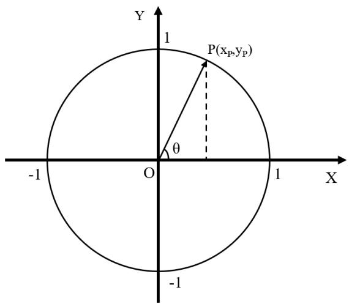  
图2.10 向量模式矢量旋转图

$$
\left\{ \begin{array}{l} x _ {i + 1} = x _ {i} - d _ {i} y _ {i} 2 ^ {- i} \\ y _ {i + 1} = y _ {i} + d _ {i} x _ {i} 2 ^ {- i} \\ z _ {i + 1} = z _ {i} - d _ {i} \tan^ {- 1} 2 ^ {- i} \end{array} \right.
$$

$$
d _ {i} = \left\{ \begin{array}{l l} + 1 & y _ {i} \geq 0 \\ - 1 & y _ {i} <   0 \end{array} \right. \tag {2-(10)}
$$

经过 $n$ 趋近于无穷次旋转, 得到的最终结果为:

$$
\left\{ \begin{array}{l} x _ {n} = A _ {n} \sqrt {x _ {0} ^ {2} + y _ {0} ^ {2}} \\ y _ {n} = 0 \\ z _ {n} = z _ {0} + \tan^ {- 1} \left(y _ {0} / x _ {0}\right) \\ A _ {n} = \prod_ {i = 0} ^ {n - 1} \sqrt {1 + 2 ^ {- 2 i}} \end{array} \right. \tag {2-(11)}
$$

根据式2-(11)，令 $x$ 作为复数实部， $y$ 作为复数虚部，进行CORDIC算法计算后可以求得复数模值，也可以求得复数的相位。如下图所示为向量模式下CORDIC算法示意图。

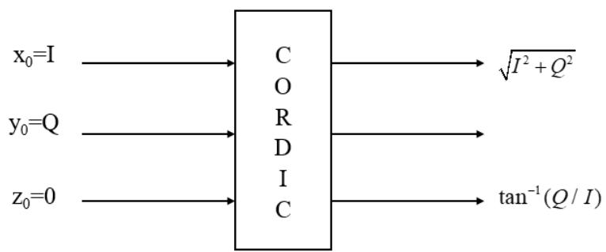  
图2.11 向量模式下CORDIC算法示意图

# 2.4 数字信道化接收模型

信道化基本原理是将输入的全带信号进行频带分割，分割成多个子频带或者子信道，然后对各自信道分别进行处理，可有效缩小雷达信号的带宽检测范围。对于传统的信道化实现方法是通过设计多个单独的滤波器，每个滤波器具有特定的中心频率和带宽，但这种设计的滤波器组处理数据时的运算量很大。相比之下，采用多相滤波结构[66-68]的信道化接收机能够实现频率分辨率相一致，即各信道中滤波器具有相同的特性和带宽，以便对滤波器的特性加以控制，从而可以极大地提高雷达信号的处理效率和准确性。

# 2.4.1 基于带通滤波器组的数字信道化

传统的基于带通滤波器组信道化工作原理如图2.12所示。

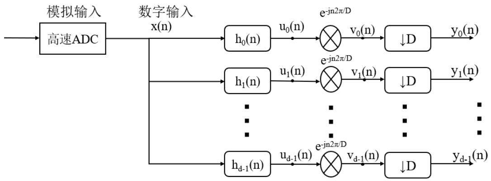  
图2.12 数字信道化接收机基本功能框图

对接收到的中频信号进行模拟采样，得到数字信号 $x(n)$ 。接着，该信号会经过滤波器组处理，滤波器组包含 $D$ 个由原型低通滤波器调制到不同的频带的带通滤波器。这些带通滤波器能够将输入的宽带信号进行频带分割，使其能够在通过第 $K$ 个带通滤波器后下变频得到基带信号。最后，对基带信号进行 $D$ 倍抽取，从而获得最终的输出结果。

滤波器组包含的滤波器，分别为 $h_0(n), h_1(n), \ldots, h_k(n), \ldots, h_{d-1}(n)$ 。特别地， $h_0(n)$ 作为原型低通滤波器，截止频率为 $f_s / 2D$ ，其长度设为 $L(L = DN)$ ，N 为整数。其余带通滤波器与 $h_0(n)$ 的关系则为：

$$
h _ {k} (n) = h _ {0} (n) e ^ {j \frac {2 \pi}{D} k n} \tag {2-(12)}
$$

以采用率 $512 \mathrm{MHz}$ , 16 信道为例, 则每一个的宽度为 $512 \mathrm{MHz} / 16 = 32 \mathrm{MHz}$ , 设计如下低通滤波器和其他信道的带通滤波器。

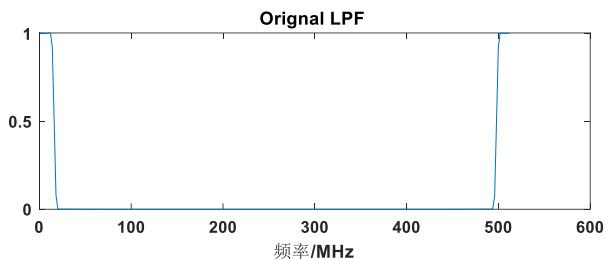

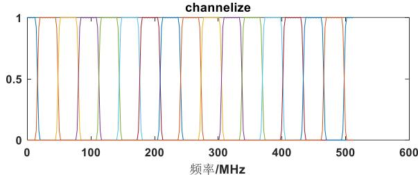  
图2.13 滤波器设计

以中心频率为 $70\mathrm{MHz}$ 的单载波余弦实信号进行直接信道化仿真，得到如图2.14所示的信道化分布图。因实信号的共轭对称性，可以看到信号落在3以及15信道上，不过在相邻的信道上也有该信号的尖峰，如2，4，14，16信道，兔耳效应较为明显。

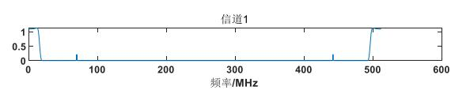

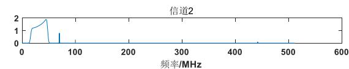

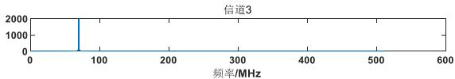

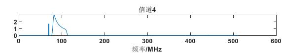

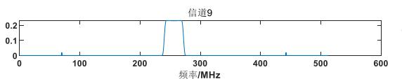

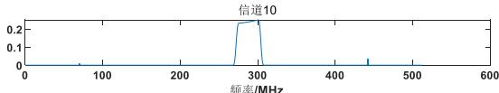

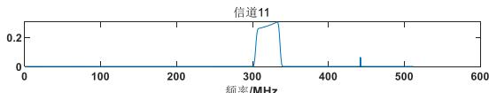

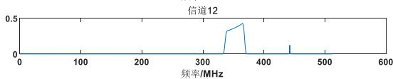

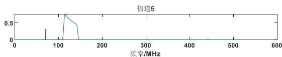

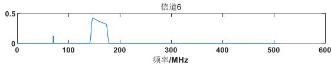

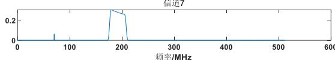

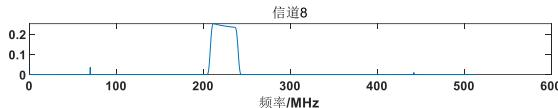

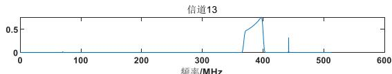

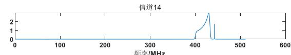

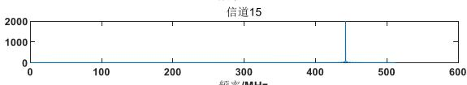

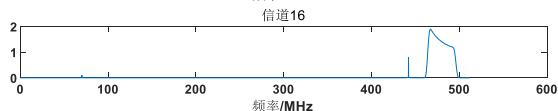  
图2.14 信道化分布图

基于这种结构的信道化接收机难以实现，原因有以下几点。首先，数字滤波速率与ADC采样速率很难做到相互匹配，这会导致信道化部分的计算量变得非常大。其次，通常原型滤波器的阶数很高，才能达到较好的滤波效果，这就需要硬件系统有着较高的标准。另外，信号滤波与调制放在抽取之前，这就使得前端大量计算的数据被丢弃，造成了严重的硬件资源浪费。因此，为解决上述问题，需要一种更加高效且易于实现的数字信道化接收模型。

# 2.4.2 基于多相滤波器组的数字信道化

如果将传统的信道化接收模型中的原型低通滤波器用多相分解的方式进行改进，并且根据多速率信号处理中的第三恒等式，先滤波后抽取等效于先抽取后滤波，将抽取处理放在多项滤波之前，则可以有效地解决数据处理时运算量大和资源浪费等问题。文献[69]通过设计推导出基于多相滤波器组信道化结构，能够将基于带通滤波器组信道化结构所遇到的问题得到很好的解决，有效降低数据运算量与复杂度，其设计原理如图2.15所示。

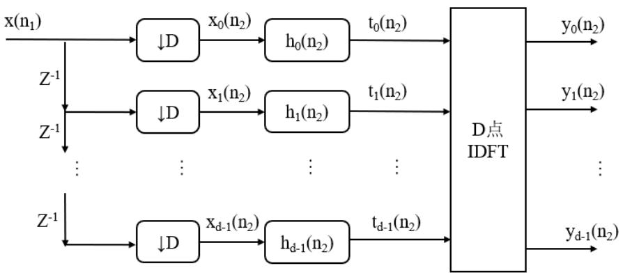  
图2.15 基于多相滤波器组的数字信道化结构

图2.12中第 $k$ 信道上经带通滤波器得到的信号 $u_{k}(n_{1})$ 为：

$$
\begin{array}{l} u _ {k} \left(n _ {1}\right) = \sum_ {m = 0} ^ {L} x \left(n _ {1} - m\right) h _ {k} (m) \\ = \sum_ {m = 0} ^ {L} x \left(n _ {1} - m\right) h _ {0} (m) e ^ {j \frac {2 \pi}{D} k m} \tag {2-(13)} \\ \end{array}
$$

抽取后的输出 $y_{k}\left(n_{2}\right)$ 为:

$$
y _ {k} \left(n _ {2}\right) = v _ {k} \left(n _ {2} D\right) \tag {2-(14)}
$$

$$
v _ {k} \left(n _ {1}\right) = u _ {k} \left(n _ {1}\right) e ^ {- j \frac {2 \pi}{D} k n _ {1}} \tag {2-(15)}
$$

将式2-(13)代入式2-(15)，得到：

$$
v _ {k} \left(n _ {1}\right) = \sum_ {m = 0} ^ {L} x \left(n _ {1} - m\right) e ^ {- j \frac {2 \pi}{D} k \left(n _ {1} - m\right)} h _ {0} (m) \tag {2-(16)}
$$

则进一步得到：

$$
\begin{array}{l} y _ {k} \left(n _ {2}\right) = v _ {k} \left(n _ {2} D\right) \\ = \sum_ {m = 0} ^ {L} x \left(n _ {2} D - m\right) h _ {0} (m) e ^ {- j \frac {2 \pi}{D} k \left(n _ {2} D - m\right)} \\ = \sum_ {m = 0} ^ {L} x \left(n _ {2} D - m\right) h _ {0} (m) e ^ {j m \frac {2 \pi}{D} k} \tag {2-(17)} \\ \end{array}
$$

利用多相形式来表示，令 $m = rD - p$ ， $0\leq r\leq N - 1$ ， $0\leq \mathfrak{p}\leq D - 1$ (其中， $N = L / D$ ， $p$ 表示每项支路元素序号， $r$ 是引入的临时变量)，则：

$$
\begin{array}{l} y _ {k} \left(n _ {2}\right) = \sum_ {p = 0} ^ {D - 1} \sum_ {r = 0} ^ {N - 1} x \left[ n _ {2} D - (r D - p) \right] h _ {0} (r D + p) e ^ {- j (r D - p) \frac {2 \pi}{D} k} \\ = \sum_ {p = 0} ^ {D - 1} \sum_ {r = 0} ^ {N - 1} x [ (n _ {2} - r) D + p) ] h _ {0} (r D - p) e ^ {j \frac {2 \pi}{D} k p} \tag {2-(18)} \\ \end{array}
$$

令 $x_{p}(n - r) = x[(n - r)D + p]$ ， $h_{p}(r) = h_{0}(rD - p)$ ，则：

$$
\begin{array}{l} t _ {p} \left(n _ {2}\right) = \sum_ {r = 0} ^ {N - 1} x _ {p} \left(n _ {2} - r\right) h _ {p} (r) \\ = \mathrm {x} _ {\mathrm {p}} \left(\mathrm {n} _ {2}\right) * \mathrm {h} _ {\mathrm {p}} \left(\mathrm {n} _ {2}\right) \tag {2-(19)} \\ \end{array}
$$

得到多相滤波器组的输出 $y_{k}(n_{2})$ 为:

$$
y _ {k} \left(n _ {2}\right) = \sum_ {p = 0} ^ {D - 1} t _ {p} \left(n _ {2}\right) e ^ {j p \frac {2 \pi}{D} k} \tag {2-(20)}
$$

以滤波器抽头数 $L = 256$ ，抽取率（信道个数） $D = 16$ 为例，对于基于带通滤波器组的信道化接收模型，在每个信道输出1个数据需要乘法： $A1 = D^{*}L = 4096$ 次，而基于多相滤波器的信道化需要乘法： $A2 = L + 2^{*}D + D^{*}\log D = 352$ 次。可见，基于多相滤波器组的信道化减小了运算，节省了资源，利于硬件实现。

上述多相滤波信道化处理在计算量上有了很大的改进，但仍然存在着问题。在滤波器设计中，因实际低通滤波器存在着过渡带，不像理想低通滤波器的带宽为 $f_{s} / 2D$ 。虽各滤波器没有发生相互交叠，但如果信号落入两个滤波器之间，如图2.16所示，则会因为信道间盲区导致信号无法检测。

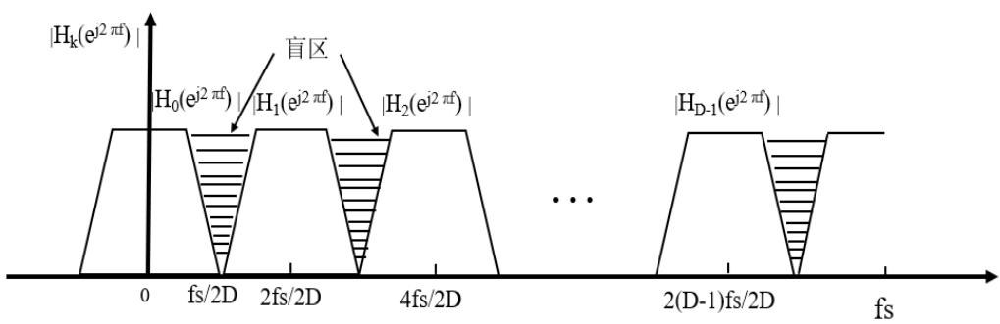  
图2.16 多相滤波器组在D倍抽取后的频率响应

采用如下图2.17所示重叠一半滤波器组结构，来解决上述滤波器组在频域上不连续，出现信道间盲区的问题。该滤波器组，前后滤波器之间相互重叠一半，低通滤波器 $h_0(n)$ 的截止频率由原先的 $f_s / 2D$ 增加到 $f_s / D$ ，通带频率也增加了一倍变为 $f_s / 2D$ ，避免了滤波器组在频域上的不连续，保证了频段的全覆盖。同时，因各滤波器带宽展宽了一倍，抽取因子 $D$ 也应改为原来的一半 $D / 2$ 。

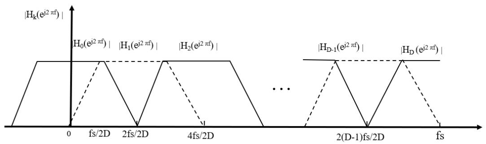  
图2.17 多相滤波器组在重叠一半后频率响应

设低通滤波器 $h_0(n)$ 的长度为 $L$ ， $L = MN'$ ，在进行 $M(M = D / 2)$ 倍抽取后，其中 $M$ 和 $N'$ 均为整数，则第 $k$ 信道的输出为：

$$
\begin{array}{l} y _ {k} \left(n _ {2}\right) = v _ {k} \left(n _ {2} M\right) \\ = \sum_ {m = 0} ^ {L} x \left(n _ {2} M - m\right) h _ {0} (m) e ^ {- j \left(n _ {2} M - m\right) \frac {2 \pi}{D} k} \\ = \sum_ {m = 0} ^ {L} x \left(n _ {2} D - m\right) h _ {0} (m) e ^ {- j n _ {2} \pi k} e ^ {j m \frac {2 \pi}{D} k} \\ = (- 1) ^ {k n _ {2}} \sum_ {m = 0} ^ {L} x \left(n _ {2} D - m\right) h _ {0} (m) e ^ {j m \frac {2 \pi}{D} k} \tag {2-(21)} \\ \end{array}
$$

将式2-(21)同样进行多相形式转换，得到输出 $y_{k}(n_{2})$ 为：

$$
y _ {k} \left(n _ {2}\right) = (- 1) ^ {k n _ {2}} \sum_ {p = 0} ^ {D - 1} t _ {p} \left(n _ {2}\right) e ^ {j p \frac {2 \pi}{D} k} \tag {2-(22)}
$$

重叠一半多相滤波信道化因信道的奇偶，输出略有不同。当 $k$ 为偶数时，输出不做改变；但当 $k$ 为奇数时，输出的符号会正负交替变化，如图2.18为重叠一半多相滤波信道化实现原理。与前一种信道化模型类似，该模型仍然由 $D$ 个滤波器组成。不过，对于 $M(M = D / 2)$ 倍抽取时因每个滤波器的长度为 $N^{\prime}$ ，则全部 $D$ 个滤波器的总长度为 $DN^{\prime}$ ，这一长度是低通滤波器 $h_0(n)$ 的2倍，因此需要对滤波器补零。

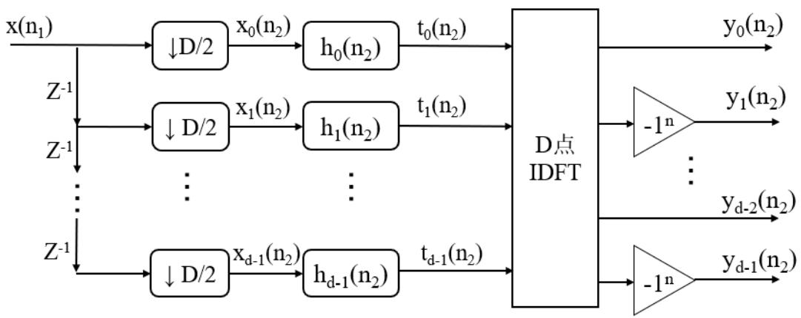  
图2.18 重叠一半多相滤波器组的信道化模型

对重叠一半多相滤波器组的信道化模型进行仿真，以采样率 $512\mathrm{MHz}$ ，32信道为例，中心频率为 $72\mathrm{MHz}$ 的单载波余弦实信号进行仿真测试。利用Matlab工具箱fdatool创建低通滤波器，设计方式选择FIR的Window类型，窗函数选用Hamming窗，阶数设置为255阶， $f_{s} = 512\mathrm{MHz}$ ， $f_{c}$ 通带频率为 $f_{s} / 2D = 8\mathrm{MHz}$ ，滤波器设计如图2.19所示。

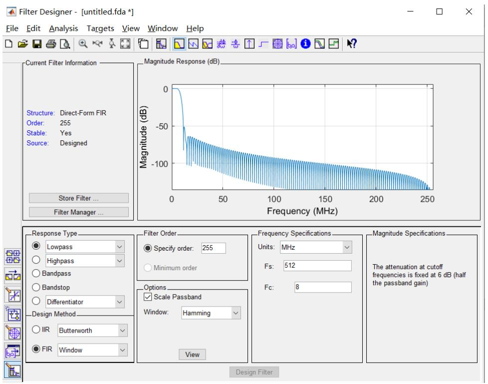  
图2.19 滤波器设计

信道分布图如图2.20所示。因重叠一半的多相滤波器组设计，72MHz位于第四信道和第五信道上，又因为实数的共轭对称性，在27和28信道上同样也可以看到此信号。因此，重叠一半的多相滤波信道化结构可以实现检测频段的全覆盖，并且采用实数滤波使得运算量减少了一半，便于高脉冲流密度下的实时处理与快速实现。

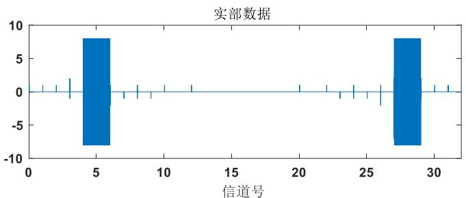

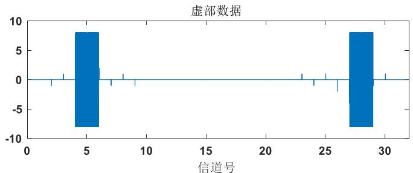  
图2.20 信道分布图

# 2.5 本章小结

本章主要介绍了雷达信号中频接收所涉及的基本理论，包括采样定理、FIR数字滤波器设计、整数倍抽取理论与CORDIC算法。除此之外，重点对数字信道化接收模型，包括基于带通滤波器组的信道化结构和基于多相滤波器组的数字信道化结构进行了流程介绍和公式推导，以及展开Matlab仿真分析，从而为后续雷达信号的脉冲检测与调制识别奠定了基础。

# 第三章 雷达信号检测的仿真分析与实现验证

当雷达信号经过数字信道化处理后，从原先的全带信号划分成多个子信道，信号根据自身的频段也就出现在指定的子信道上。然而，雷达信号通常以脉冲的形式出现，并且具有一定的占空比。这种特性使得我们无法确定信号的确切位置和信号数据的长度，无法像处理连续波雷达那样抽取固定长度数据进行信号处理。否则，将会不可避免的出现虚警现象，影响参数测量。因此，在处理脉冲信号数据时，第一步就是要检测信号的存在和大致位置，以确保信号参数估计的准确性与可靠性。

# 3.1 常见的信号检测方法分析

# 3.1.1 滑动能量积累检测法

# 一、滑动能量检测法原理

能量积累信号检测方法[70,71]，其主要思路是在高斯白噪声的前提下，利用信号和噪声在时域上的能量差异，通过设定门限值来完成对信号的检测。

对于待检测的信号 $x(t) = s(t) + n(t)$ ，其中 $s(t)$ 为原始信号， $n(t)$ 为噪声，取一个长度为 $N$ 的采样窗，并对窗内的所有数据样本进行能量分段。然后，对窗内的采样点进行 $N$ 点的能量累加，并求均值。最后，通过设置一个适当的门限值，对累加后的能量进行判断，来实现信号的检测。为了更好地理解该方法，图3.1展示了滑动能量积累检测原理。

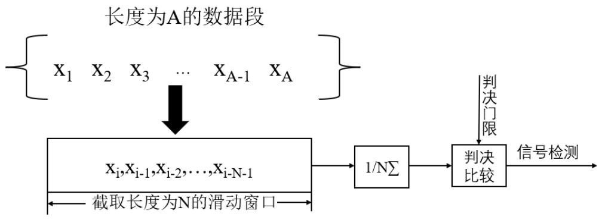  
图3.1滑动能量积累检测

# 二、仿真分析

选取带宽为 $96 \mathrm{MHz}$ 、时宽为 $6 \mu \mathrm{s}$ 、初始频率为 $70 \mathrm{MHz}$ 的线性调频信号 (LFM), 采样频率为 $384 \mathrm{MHz}$ , 信噪比为 $5 \mathrm{~dB}$ (无特殊说明, 本文的信噪比都是指信号的全频段信噪比[72])。

(1)如图3.2所示，展示了未加噪的LFM信号的时频域波形。可以看出，在未加噪的情况下，信号的时频域波形呈现出明显的线性特征，且能量集中在中心频率处。而图3.3为加噪后的时频域波形。可以看出，加噪后的信号时频域能量分布较为分散。

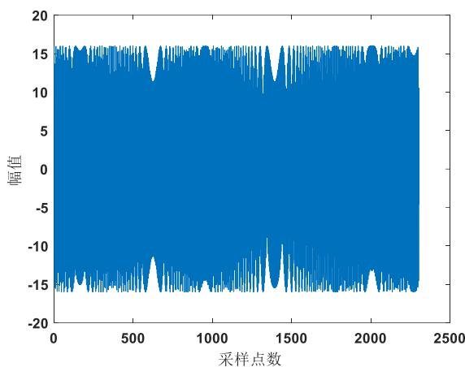  
(a) LFM 信号时域

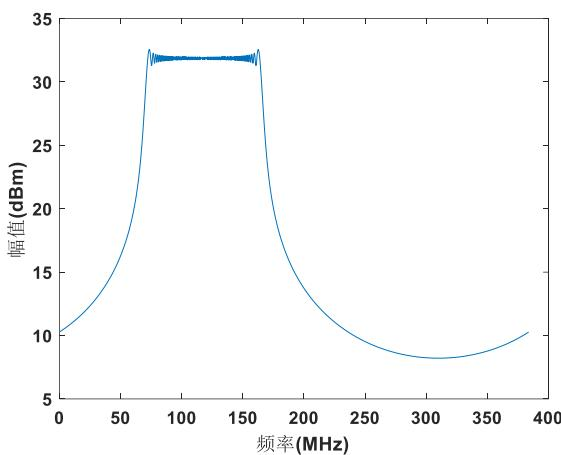  
(b) LFM 信号频域

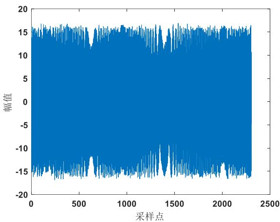  
图3.2 未加噪的LFM信号  
(a) LFM 信号时域

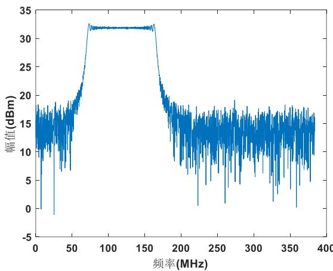  
(b) LFM 信号频域  
图3.3加噪后的LFM信号

(2)选取 $N = 8$ 的滑动窗长度，并采用能量积累检测法进行仿真分析，如图3.4所示。在信号能量积累到一定程度时，通过设置一个适当的门限值，来判断信号是否存在。需要注意的是，门限值的设置需要根据具体情况进行调整，以确保信号检测的准确性和鲁棒性。

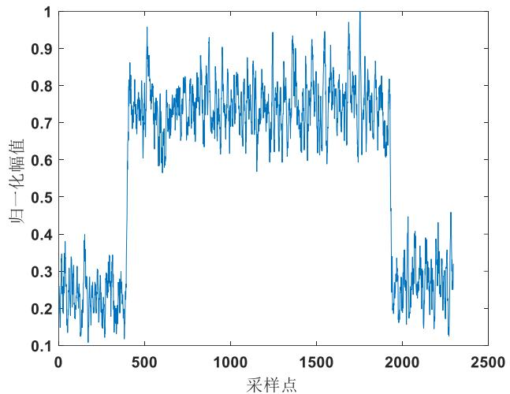  
图3.4滑窗能量积累检测法

# 3.1.2 自相关检测法

# 一、自相关检测法原理

自相关处理[73-75]是利用信号之间的相关性、噪声之间的独立性，使信号进行相关运算后，真脉冲凸显出来，提高了信号功率，便于门限判决。

输入数字中频信号 $X(n)$ , 其复数表达式为:

$$
X (n) = A e ^ {j \varphi} e ^ {j 2 \pi f n _ {\Delta} t} + \omega (n) \tag {3-(1)}
$$

其中 $A$ 为信号幅值, $\varphi$ 为信号初始相位, $f$ 为载频, $\Delta t$ 为采样时间间隔; $\omega (n)$ 是均值为零, $\sigma^2$ 方差为的高斯白噪声。

自相关的思想是将信号自身的共轭与信号时延后的乘积，对 $X(n)$ 进行相关处理得：

$$
\begin{array}{l} R (n) = \frac {1}{N} \sum_ {i = n - N - 1} ^ {n - 2} X (i + 1) X ^ {*} (i) \\ = \frac {1}{N} \sum_ {i = n - N - 1} ^ {n - 2} \left[ A e ^ {j \varphi} e ^ {j 2 \pi f (i + 1) \Delta t} + \omega (i + 1) \right] ^ {*} \left[ A e ^ {- j \varphi} e ^ {- j 2 \pi f i \Delta t} + \omega^ {*} (i) \right] \\ = A ^ {2} e ^ {j 2 \pi f \Delta t} + \omega^ {\prime} (n) \quad n = 1, 2, 3, \dots \tag {3-(2)} \\ \end{array}
$$

在式3-(2)中， $N$ 是自相关点数； $X^{*}(i)$ 是对输入信号的共轭； $\omega^{\prime}(n)$ 是相关后的噪声值。

$$
\begin{array}{l} \omega^ {\prime} (n) = \frac {1}{N} \sum_ {i = n - N - 1} ^ {n - 2} \left[ A e ^ {j \varphi} e ^ {j 2 \pi f (i + 1) \Delta t} \omega^ {*} (i) \sum_ {i = 1} ^ {n} \left(X _ {i} - \bar {X}\right) ^ {2} \right. \\ + A e ^ {- j \varphi} e ^ {- j 2 \pi f i \Delta t} \omega (i + 1) + \omega (i + 1) \omega^ {*} (i) ] \tag {3-(3)} \\ \end{array}
$$

根据中心极限定理，当 $N$ 较大时， $\omega^{\prime}(n)$ 可以被看作是一个高斯分布，其均值为0，方差为 $(2A\sigma^{2} + \sigma^{4}) / N$ 。因此，考虑功率之间的关系，得到输出 $R(n)$ 的功率信噪比为：

$$
\begin{array}{l} S N R _ {R} = \frac {N A ^ {4}}{\left(2 A ^ {2} + \sigma^ {2}\right) \sigma^ {2}} \\ = \frac {N A ^ {2}}{\left(2 A ^ {2} + \sigma^ {2}\right)} \frac {A ^ {2}}{\sigma^ {2}} = \frac {N A ^ {2}}{\left(2 A ^ {2} + \sigma^ {2}\right)} S N R _ {x} \tag {3-(4)} \\ \end{array}
$$

从上式可得，相关输出 $R(n)$ 的信噪比相对输入 $X(n)$ 提高了 $N / (2 + \sigma^2 / A^2)$ 倍。因此，当 $R(n)$ 取模后，使得真脉冲出现峰值，再与确定的门限值比较，可以轻松判决出信号。

从式3-(2)可知，在进行 $N$ 点相关运算时，每计算一点 $R(n)$ ，需要进行 $N$ 次复数乘法和 $N$ 次复数加法。为降低算法的复杂度，在硬件上采用如下滑动递推计算：

$$
\begin{array}{l} R (n) = R (n - 1) + 1 / N [ X (n - 1) X ^ {*} (n - 2) \\ - X (n - N - 1) X ^ {*} (n - N - 2) ] \tag {3-(5)} \\ \end{array}
$$

每计算一个新 $R(n)$ 需进行一次复数乘法 $X(n - 1)X^{*}(n - 2)$ ，而 $X(n - N - 1)X^{*}(n - N - 2)$ 在求 $R(n - N)$ 已经获得， $R(n - 1)$ 也是已经得到的，所以计算一个新 $R(n)$ 还需要两次复数加法， $1 / N[X(n - 1)X^{*}(n - 2)]$ 加上 $-1 / N[X(n - N - 1)X^{*}(n - N - 2)]$ 再加上 $R(n - 1)$ ，即可获得 $R(n)$ 。这种流水处理的计算方法便于硬件实现，对提高运算速度和节省硬件资源有利。

# 二、仿真分析

针对实测的常规脉冲信号进行相关算法检测，其中常规脉冲信号载频 $256\mathrm{MHz}$ ，脉宽 $2.5\mu \mathrm{s}$ ，SNR为5dB，信号采样频率为 $384\mathrm{MHz}$ 。由图可知，通过相关检测，依据相关性原理，真脉冲凸显出来，提高了信号功率，再设置合适的门限即可完成对信号的检测。

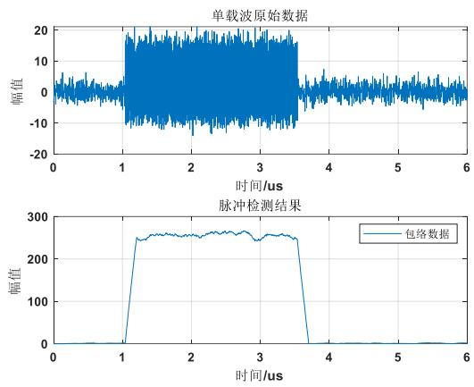  
图3.5 信号的自相关检测

# 3.1.3 小波阈值去噪检测法

# 一、小波阈值去噪原理

小波阈值去噪[71]是一种基于小波变换的信号处理方法，其基本思想是通过对信号进行小波分解，利用小波系数中的重要信息来去除噪声。在小波分解的过程中，噪声的小波系数通常要小于信号的小波系数，并且数值较小。因此，选取一个合适的阈值，将阈值以上的小波系数认为是信号的产生，进行保留，而阈值以下的则认为是噪声的产生，将其置为零，从而达到去噪的目的。

假设含噪的信号为 $f(t) = s(t) + n(t)$ ，其中 $s(t)$ 为信号， $n(t)$ 为噪声信号，可以通过小波阈值去噪方法将 $n(t)$ 去除，从而还原出原始信号 $s(t)$ 。小波阈值去噪的具体过程如下：

(1)处理加噪信号 $f(t)$ ，首先进行小波分解。在进行分解的过程中，需要选择适合的小波基和分解层数 $N$ ，以得到加噪信号在第 $N$ 层的小波系数 $cD(N)$ 和 $cA(N)$ 。图3.6展示了加噪信号的小波分解树，可以清晰地看到每一层的小波系数和小波基的关系，以及经分解后信号 $f(t)$ 的表达式：

$$
f = A + D 3 + D 2 + D 1 \tag {3-(6)}
$$

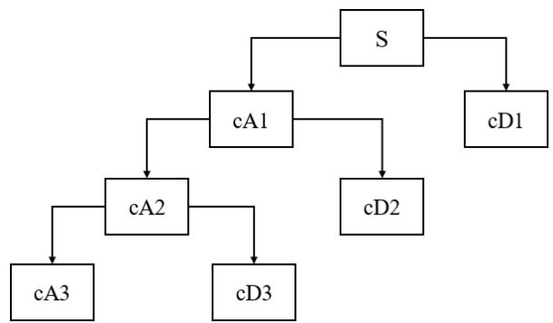  
图3.6 信号的小波分解树

(2)选取阈值。对于小波分解的第一层到第 $N$ 层，需要为每一层设置适当的阈值 $\lambda$ ，以处理小波系数。根据所选的阈值原则，对每层小波系数进行硬阈值或软阈值处理，以达到去噪的效果。  
(3)经过去噪处理后，需要将每一层的小波系数重新融合，以生成去噪信号的估计值 $\hat{s}(t)$ ，即重构信号。这样重构出的信号将不仅仅是去噪处理后的结果，还包含了原始信号的信息，因此能够更好地反映出信号的特征和本质。

# 二、仿真分析

以正弦信号 $s(t) = \sin (2\pi f_0t)$ 为例，其中载频 $f_0 = 10Hz$ ，采样率 $f_{s} = 1KHz$ ，在 $SNR = 8dB$ 条件下的仿真测试。

选用了适当的小波基 $db8$ 对加噪信号进行四层小波分解，得到了各层低频和高频系数的波形，如图3.7所示。

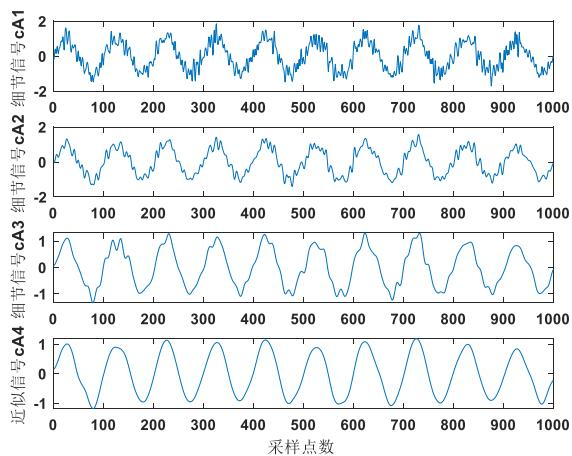  
(a) 低频系数波形

  
(b) 高频系数波形  
图3.7 各层低频、高频系数波形

通过小波分解，信号可以被拆分为低频和高频两部分。其中，低频部分更能够展现信号的整体波动情况，而高频部分则更能够反映信号的细节信息。由于经过小波分解后的高频信号和噪声呈现出不一样的特点，可以利用它们所呈现出的不同波形来区分信号和噪声。

将经过启发式阈值处理后的每一层小波系数进行重构，得到消噪之后的信号。图3.8展示了处理前后波形的对比图，可以看出消噪处理显著提高了信号的质量和可靠性。

  
图3.8 正弦信号去噪前后对比

同样对线性调频信号进行小波阈值去噪，选用带宽为30M、初始频率为10MHz的LFM信号，采样频率为60MHz，时宽为10μs，信噪比设置为8dB。图3.9为在小波基db8下，进行五层小波分解后得到各层波形。通过观察图3.9，发现LFM信号的高频系数更为密集且数值较大，而低频系数更为分散且数值较小，这种分布特点与高斯白噪声的系数分布相似，由于系数更集中在高频部分，因此对消噪产生一定的难度。

  
(a) 各层低频系数

  
(b) 各层高频系数  
图3.9LFM信号进行小波分解

下图为LFM信号在频域里去噪前后波形对比。LFM信号在频域中小波系数更多的集中在低频系数中，与在时域中小波系数分布相反，更有助于去噪。另外，LFM信号从时域到频域变换后能量不会发生较大变化，幅值特征呈现矩形形状，

且谱能量更多的集中在带宽里面，因此在频域上进行LFM信号的小波去噪可以取得更好的效果。

  
图3.10LFM信号频域去噪波形对比

根据上述三种信号检测方法仿真可知，滑窗能量累积法在处理较低信噪比时，因脉冲包络上下波动较大，凸出也不明显，给门限的设置增加了困难；小波阈值去噪检测法虽能通过逐级分解的方式将信号检测出来，但变换步骤较为繁琐，不适合应用在实时处理的硬件设计上。因此，综合以上考虑，选择门限设置更加方便、更适合在硬件实现的自相关算法进行信号检测处理。

# 3.2 脉冲门限检测方法分析

# 3.2.1 噪声方差法

噪声方差法[76]是一种在检测信号前需要先对噪声的方差进行无偏估计，来确定检测门限的方法。噪声的标准方差的无偏估计值可以通过下式来计算：

$$
\hat {\sigma} = \sqrt {\frac {\sum_ {i = 1} ^ {n} n ^ {2} {} _ {i}}{N - 1}} \tag {3-(7)}
$$

式中， $n_i^2$ 代表的是在复变换之前第 $i$ 个时刻的噪声值。通过对噪声进行相关运算后，可以得到一个服从 $N(0,4N\sigma^4)$ 分布的噪声变量。在实际应用中 $\sigma$ 由 $\hat{\sigma}$ 来近似，其模值服从均值为 $\mu$ ，从方差为 $\sigma_1^2$ 的瑞利分布。

$$
\mu = 1. 2 3 5 \sqrt {2 N} \sigma^ {2} \tag {3-(8)}
$$

$$
\sigma_ {1} = 0. 4 3 \sqrt {2 N} \sigma^ {2} \tag {3-(9)}
$$

利用噪声的概率分布来确定检测门限 $V_{T}$ 为:

$$
V _ {T} = \mu + a \sigma_ {1} \tag {3-(10)}
$$

式中，a由实际中的信噪比情况确定，一般情况下，a的范围为 $2\sim 10$

以单载波脉冲信号为例，利用上述噪声方差法得到检测门限，并且分别在 $SNR = 5dB$ 、 $SNR = 8dB$ 下进行仿真实验。图3.11(a)中 $SNR = 5dB$ 的情况下，只有 $a = 2$ 得到的检测门限可以正确无漏警的检测出信号，而在图3.11(b)中 $SNR = 8dB$ 时， $a = 2$ 与 $a = 5$ 得到的门限值也可以检测出信号。虽然利用噪声方差法可以得到信号的检测门限，但由于信号信噪比的不确定性与未知性，对检测门限的选取也就缺乏灵活性，在硬件实现上噪声方差法确定门限值也较为复杂繁琐。所以，需要提出更加灵活方便的门限检测方法。

  
(a) $\mathrm{SNR} = 5\mathrm{dB}$

  
(b) $\mathbf{SNR} = 8\mathbf{dB}$   
图3.11 噪声方差法检测门限

# 3.2.2 相关差值法

# 一、相关差值法原理

相关后的脉冲包络 $|R(n)|$ 并非是理想脉冲的直上直下，而是存在着脉冲前沿与脉冲后沿。其中，脉冲前沿与脉冲后沿的长度由式3-(2)自相关点数 $N$ 近似确定，并且实际工程中 $N$ 一般取2的整数幂，如32、64等。由于存在着过渡沿，因此可以采用隔点差值处理方式，去寻找最大变化值作为脉冲判决的门限选择。

门限设定过程如下：对模值进行隔点差值计算，对差值结果进行统计，求得该段数据极大值与极小值的绝对值作为门限。设定极大值为高门限 thdH、极小值为低门限 thdL，其中 thdH 确定脉冲到达，thdL 确定脉冲结束。通过双门限的设定来达到脉冲检测的目的。该方法相对方便、简单，并且通过类内方差最小准则[77]的最优门限判定也验证了该方法的合理性。

类内方差最小准则是对于给定的门限 $V_{T}$ ，通过求得判决门限统计量 $V(\beta ,V_{T})$ 来验证门限设定的合理性。门限 $V_{T}$ 将包络数据分为脉内数据与非脉内数据两类，分别对这两类数据进行分析。整个数据包络个数 $\mathrm{N}(\mathrm{V}_{\mathrm{T}})$ ，包络均值 $M_r(V_T)$ ；脉内数据个数 $\mathrm{N}_1(\mathrm{V}_\mathrm{T})$ ，均值 $M_1(V_T)$ ，方差 $\sigma_1^2 (\mathrm{V_T})$ ；非脉内数据个数 $\mathrm{N}_2(\mathrm{V_T})$ ，均值 $M_2(V_T)$ ，方差 $\sigma_2^2 (\mathrm{V_T})$ 。

类内数据方差计算公式为：

$$
\begin{array}{l} \sigma_ {\mathrm {w}} ^ {2} \left(\mathrm {V} _ {\mathrm {T}}\right) = \left[ \mathrm {N} _ {1} \left(\mathrm {V} _ {\mathrm {T}}\right) / \mathrm {N} \left(\mathrm {V} _ {\mathrm {T}}\right) \right] ^ {\beta} \sigma_ {1} ^ {2} \left(\mathrm {V} _ {\mathrm {T}}\right) \\ + \left[ \mathrm {N} _ {2} \left(\mathrm {V} _ {\mathrm {T}}\right) / \mathrm {N} \left(\mathrm {V} _ {\mathrm {T}}\right) \sigma_ {2} ^ {2} \left(\mathrm {V} _ {\mathrm {T}}\right) \right] \tag {3-(11)} \\ \end{array}
$$

上式中， $0 < \beta \leq 2$ 为调节脉冲比例因子。

类间方差计算公式为：

$$
\begin{array}{l} \sigma_ {b} ^ {2} \left(V _ {T}\right) = \left[ N _ {1} \left(V _ {T}\right) / N \left(V _ {T}\right) \right] ^ {\beta} \mid M _ {r} \left(V _ {T}\right) - M _ {1} \left(V _ {T}\right) \\ + \left[ N _ {2} \left(V _ {T}\right) / N \left(V _ {T}\right) \right] \left| M _ {r} \left(V _ {T}\right) - M _ {2} \left(V _ {T}\right) \right| \tag {3-(12)} \\ \end{array}
$$

由类内方差与类间方差，得到判决门限统计量为：

$$
V \left(\beta , V _ {T}\right) = \beta \sigma_ {b} ^ {2} \left(V _ {T}\right) / \sigma_ {w} ^ {2} \left(V _ {T}\right) \tag {3-(13)}
$$

判决门限统计量 $V(\beta, V_{T})$ ，反映的是门限设定的优劣。当判决门限统计量 $V(\beta, V_{T})$ 越高，脉内数据与非脉内数据这两类数据越容易区分开，区别越明显，说明门限选择的就越好，越趋近于最优门限。

  
图3.12 门限统计量图

在 $\beta$ 为2时，3dB信噪比环境下，进行200次独立实验测得最优门限的门限统计量 $V(\beta, V_{T})$ 为2.0965，此时隔八点差值测得门限其 $V(\beta, V_{T})$ 为1.7562，较为接近，虽达不到理论上最优解，但该方法相较于其他门限设定方法相对简单，已满足快速实现门限设定的目的，可以近似当作最优门限处理。图3.12也给出了信噪比同为3dB情况下，调节比例因子 $\beta = 1,2$ 时不同间隔点数门限统计量图。由图可知，在 $\beta = 2$ ，八点差值求得的 $V(\beta, V_{T})$ 是最高的，门限的设定也是最好的，是能够作为门限设定的选择。

# 二、仿真分析

利用相关差值法对典型的脉内调频信号进行脉冲检测，其中实测的脉内调频信号条件如下：初始频率 $256\mathrm{MHz}$ ，脉宽 $2.5\mu \mathrm{s}$ ，带宽 $80\mathrm{M}$ ，信号采样频率为 $384\mathrm{MHz}$ ，SNR 为 $3\mathrm{dB}$ 。


  
(a) 脉冲检测结果   
(b) 脉内调频信号频谱图  
图3.13 脉内调频信号检测结果

如图3.13(a)所示，低信噪比使得信号几乎湮没在噪声中，通过相关运算使得脉冲包络凸显出来，方便判决，并且从图3.13(b)频谱图可以看出脉冲信号的带内信噪比约为20dB。对得到的包络数据进行八点前后差值计算，统计差值的极值得到高门限thdH与低门限thdL，并进行脉冲起始与结束的判决。因此利用该双门限能够识别脉冲，为后续到达时间、脉宽等时域参数的测量奠定了基础。

  
(a) 到达时间测量

  
(b) 脉宽测量  
图3.14时域参数比较

时域参数中到达时间、脉宽等特征的测量主要依靠门限值的设定，这些特征的精确程度也是反映门限设定优劣的方式之一。下面在相关差值法求得双门限的基础上，对信号到达时间和脉宽进行不同信噪比环境下仿真估计，并与噪声方差法进行方法对比，得到图3.14仿真对比结果。其中，实际到达时间为 $1.114\mu \mathrm{s}$ ，脉宽为 $2.5\mu \mathrm{s}$ 。可以看出，运用相关差值法得到的双门限，对到达时间和脉宽的测量有了很大的提升。在3dB信噪比环境下，相关差值法求得的到达时间比噪声方差法测量误差分别减小了 $16.18\%$ ，脉宽测量误差分别减小了 $12.87\%$ ，且在5dB时相关差值法测得的到达时间和脉宽与真实值误差均小于 $2\%$ ，而噪声方差法测得的到达时间与真实值误差均大于 $10\%$ ，脉宽与真实值误差均大于 $5\%$ 。

将该方法与噪声方差法比较，仿真在不同信噪比条件下，该相关差值法进行脉冲检测会存在多少的虚警率。如图3.15所示，采用噪声方差法在较低信噪比下得到脉冲门限值判决出的数据存在假的弱脉冲，门限设置不灵活，导致虚警概率高。而相关差值法利用相关运算优化了脉冲包络，并采用差值处理，求得高低双门限进行脉冲起始与脉冲结束检测，有效降低了虚警概率，尤其是在0dB时，减少了将近 $40\%$ 的虚警概率，从3dB开始虚警概率接近为 $10\%$ ，并从5dB开始虚警概率接近为0，能够有效降低较低信噪比环境对脉冲检测性能的影响。

  
图3.15 虚警概率估计

# 3.3 信号检测的FPGA实现

# 3.3.1 自相关算法模块设计

回顾式3-(5)：

$$
\begin{array}{l} R (n) = R (n - 1) + 1 / N [ X (n - 1) X ^ {*} (n - 2) \\ - X (n - N - 1) X ^ {*} (n - N - 2) ] \tag {3-(14)} \\ \end{array}
$$

每计算一个新 $R(n)$ 需进行一次复数乘法 $X(n - 1)X^{*}(n - 2)$ ，还需进行两次复数加法， $1 / N[X(n - 1)X^{*}(n - 2)]$ 加上 $-1 / N[X(n - N - 1)X^{*}(n - N - 2)]$ 再加上 $R(n - 1)$ ，即可获得 $R(n)$ 。图3.16为上式的具体实现原理，可以将自相关算法粗略的分成以下三部分。首先，复信号 $X(n)$ 与延迟 $k$ 拍（不失一般性，取 $k = 1$ 为例）的 $X(n - k)$ 进行共轭相乘；然后，对共轭相乘的结果 $Y(n)$ 进行复数延拍得到 $Y(n - N)$ ；最后，进行 $Y(n)$ 、 $Y(n - N)$ 和 $R(n - 1)$ 的三路加减运算。

  
图3.16 自相关实现原理

共轭相乘可以采用复数乘法器进行实现。图3.17展示了复数乘法器的具体实现方式。其设计思路如下：通过使用DataIn和DataIn_D两个输入来完成相邻两个复数相乘。在这个过程中，将利用D触发器对实部为a虚部为b的DataIn进行延迟，得到实部为c虚部d的DataIn_D。经过乘法器的运算，从而得到实部数据 $R = ac - bd$ ，虚部数据 $I = ad + bc$ 。

  
图3.18SRLC32E与FDRE原语的使用

图3.17 复数乘法器设计流程

在底层逻辑中，常常会使用 FIFO[78](First In First Out，即先进先出)来实现数据的延迟处理。但有时对于较少的数据延迟，可以使用 SRLC16E、SRLC32E 等移位寄存器处理，它们通过移位来实现数据的延迟，与 FIFO 相比，移位寄存器的硬件资源需求更少，更适用于较小规模的数据延迟处理。

```javascript
//////////////////////////////////////////////////////////////////////////////////////////////////////////////////////////////////////////////////////////////////////////////////////////////////////////////////////////////////////////////////////////////////////////////////////////////////////////////////延迟N拍 N=32////延迟N拍 N=32////延迟N拍 N=32////延迟N拍 N=32////延迟N拍 N=32////延迟N拍 N=32////延迟N拍 N=32////延迟N拍 N=32////延迟N拍 N=32////延迟N拍 N=32////延迟N拍 N=32////延迟N拍 N=32////延迟N拍 N=32////延迟N抬 N=32////延迟N抬 N=32////延迟N抬 N=32////延迟N抬 N=32////延迟N抬 N=32////延迟N抬 N=32////延迟N抬 N=32////延迟N抬 N=32////延迟N抬 N=32////延迟N抬 N=32////延迟N抬 N=32////延迟N抬 N=32////延迟N抬 N=3 
```

SRLC16E、SRLC32E 分别可以支持 16 位、32 位数据移位。由图 3.18 显示 SRLC32E 与 FDRE 原语的使用，CLK 表示时钟，CE 则是时钟使能，高电平有效；D 则是数据输入；A[4:0]为移位长度配置（支持 1~32 位）；Q 是指当移位长度 A 被确定后，数据就会从 Q 端输出。FDRE 为带使能功能同步清除 D 触发器，目的是使寄存器与时钟同步打拍，其接口含义与 SRLC32E 类似。

经过上述原理的分析，通过Vivado软件对相关检测法进行硬件实现。仿真数据为脉内单载波信号，载频 $256\mathrm{MHz}$ ，采样率 $384\mathrm{MHz}$ ，输入信噪比5dB。3路加减运算后的相关值 $R(n)$ ，经过CORDIC求得模值 $\left|R(n)\right|$ ，即脉冲信号包络数据，如图3.19中的o Calc_data_amp所示，o calc_data_vld为包络数据的有效值。i_data_real与i_data imag分别是输入脉冲信号实部与虚部数据。


  
图3.19 自相关检测法硬件实现结果

# 3.3.2 脉冲检测模块设计

整体脉冲信号动态检测实现流程，如图3.20所示。输入 $X(n)$ 经自相关运算得到 $R(n)$ ，再通过CORDIC算法得到相关模值。一方面对模值 $\left|R(n)\right|$ 进行八点差值计算，轮循比较得到高低门限分别存于双端口RAM中；同时对模值 $\left|R(n)\right|$ 通过FIFO进行延迟，延迟的模值与存于RAM中的高低门限进行脉冲判决，判断是否是脉冲，并对应的生成脉冲标识位FLAG。

对于双门限脉冲判定，首先高门限判断脉冲起始。当模值大于 thdH，FLAG 为“1”，并且在连续多个数据都为“1”时，则认为有信号。其起始点为这多个点当中第一次出现“1”的时刻。反之，则认为没有信号。低门限判断脉冲结束后，对于小于 thdL，FLAG 为“0”，并且在连续多个数据都出现“0”，则认为信号已结束，其结束点在多点中第一次出现“0”的时刻。反之，则认为没有结束。最后分析脉冲时域参数，并重置双门限值至默认值，开始下一轮检测。

  
图3.20脉冲动态检测模块

脉冲检测流程图对应的RTL (Register Transfer Level)视图如3.21所示，整体实现包括四个部分。u_sig_xcorr为自相关模块，完成输入中频信号 $X(n)$ 到自相关 $R(n)$ 的计算；u_circular_vector_cordic为CORDIC模块，用到的是向量模式，来完成 $\left|R(n)\right|$ 绝对值的处理；u_xcorr_sub为作差模块，以完成对高低门限的求取；u_sig_DET为脉冲门限比较模块，输出的o_pw_sim来表示脉冲信号的脉宽测量值，o_sig_flag为脉冲信号标识位，来表示是否存在脉冲信号。图中接口含义如下：

sys_clk，sys_RST：系统时钟、复位；

i_data_en、i_data_real、i_data imag：输入数据使能、实部虚部数据；

o_ri、o_rq、o_r_vld：相关后的实部虚部数据以及有效值；

abs_r_amp、abs_r_vld：相关后的幅值数据、幅值使能；

r_sub_data、i_thd_h、i_thd_l：差值数据、高低门限；

o_pw_sim、o_sig_flag：脉宽测量、脉冲标识位；

  
图3.21 脉冲检测模块RTL视图

脉冲估计是在相关累加后进行，因此估计的起始时刻需要根据信噪比进行修正[79]。对于信噪比较高时，通过3-(14)求得 $R(n)$ ，并没有全部使用到第n时刻到第n-N时刻的所有样本，信号起始较接近第n时刻，即 $R(n)$ 首次高于门限值时；但当信噪比较低时，信号起始则较接近第n-N时刻，即 $R(n)$ 首次高于门限值并延迟了N个时刻。

  
图3.22 硬件仿真结果

对上述脉冲检测进行仿真测试，输入信号脉宽 $2\mu \mathrm{s}$ ，信噪比5dB，脉冲流密度 $2^{*}10^{5}$ ，如图3.22所示为硬件仿真结果。通过相关差值法设定了高低双门限，并根据不同的脉冲灵活改变门限值的大小。图中第一个脉冲高门限值thdH为2322，低门限值thdF为1772，第二个脉冲thdH为2333，thdF为1914，动态调整了门限值的大小，进行脉冲检测。观察脉冲标识位FLAG连续为“1”，判定存在脉冲信号。

经过了脉冲起始点和脉宽的修正，如图3.22所示测得第一个脉冲FLAG标识位pw_cnt存在777个时间单位，系统时钟采用 $384\mathrm{MHz}$ ，得到脉宽计算得， $(777 + 1) / 384\mathrm{MHz} = 2.026\mu \mathrm{s}$ ，测量误差为(2.026-2)/2*100% = 1.30%；第二个脉冲FLAG标识位pw_cnt存在775个时间单位，得到脉宽 $2.020\mu \mathrm{s}$ ，测量误差为1.041%。

接着对其它脉冲流密度也进行硬件实测，统计脉宽测量误差和漏警率得表3.2。其中，脉宽测量误差与仿真结果对比，均控制在 $2\%$ 以内；漏警率接近于0，与仿真结果相同。

表 3.2 不同脉冲流密度下脉宽测量误差与漏警率  

<table><tr><td>脉冲流密度（pps）</td><td>脉宽测量误差</td><td>漏警率</td></tr><tr><td>1*10^5</td><td>1.04%</td><td>0.00%</td></tr><tr><td>2*10^5</td><td>1.12%</td><td>0.00%</td></tr><tr><td>4*10^5</td><td>1.15%</td><td>0.00%</td></tr></table>

上述的相关差值的脉冲检测方法，在硬件资源占用率如表3.3所示。其中，查找表LUT使用了2359个，占总资源的 $0.78\%$ ；触发器FF使用了2810个，占总资源的 $0.48\%$ ；另外，在时钟和数据缓冲用到的IO与BUFG也相对占用较少，节省了大量硬件资源。

表 3.3 硬件资源占用率  

<table><tr><td>资源</td><td>已使用</td><td>可使用</td></tr><tr><td>LUT</td><td>2359</td><td>303600</td></tr><tr><td>LUTRAM</td><td>65</td><td>130800</td></tr><tr><td>FF</td><td>2810</td><td>607200</td></tr><tr><td>IO</td><td>36</td><td>600</td></tr><tr><td>BUFG</td><td>1</td><td>32</td></tr></table>

# 3.4 本章小结

本章主要研究了几种常规的信号检测方法，包括滑动能量积累检测法、自相关检测法以及小波阈值去噪检测法，经过理论分析并结合实测数据，选用自相关算法对脉冲进行检测，然后对自相关检测法进行门限设定改进，对比传统的噪声方差法改进的相关差值法灵活度更强，门限设定更加方便快捷，更易适用于实时处理的脉冲信号检测。最后根据改进的脉冲门限检测法进行了FPGA硬件设计以及仿真分析，最终实现了脉冲信号的准确检测。

# 第四章 雷达信号调制识别的仿真分析与实现验证

从第三章我们可以得知，自相关算法可以有效快速的检测脉冲信号，但对于已检测出的脉冲信号，还需进行调制类型识别等处理，以获取信号全面详细的信息。在数字通信领域，信号调制识别一直是一个重要的研究课题，随着雷达技术的不断发展，电子战环境的复杂性日益增加，现代数字通信信号的制式也变得复杂多样，不同调制的雷达信号，其特征参数也不尽相同，只有正确识别接收信号的调制方式，才能够对其进行合理的解调。

# 4.1 脉内调制识别方法

# 4.1.1 基于瞬时频率的调制识别方法

# 一、方法介绍

瞬时频率作为信号的重要特征，不同的调制信号会存在着不同的瞬时频率变化。因此，可以通过提取瞬时频率信息[80]来识别雷达信号的调制类型，下面对基于瞬时频率的调制识别方法作简要介绍。

雷达信号瞬时频率的表达式为：

$$
f (n) = \frac {1}{2 \pi} [ \varphi (n) - \varphi (n - 1) ] f _ {s} \tag {4-(1)}
$$

式中 $\varphi(n)$ 为雷达信号的相位， $\varphi(n-1)$ 为延迟一拍的相位值，通过相位差与采样频率相乘，得到雷达信号的频率。

对 4-(1)式进行改进，让其基于瞬时自相关的瞬时频率估计。回顾第三章自相关算法原理为信号自身的共轭与信号延迟的乘积，其表达式为：

$$
R (n, m) = s ^ {*} (n) s (n + m) \tag {4-(2)}
$$

式中 $s(n)$ 为中频数字信号， $m$ 为时延时间，通常情况下取 $m > 0$ 的整数。

瞬时相位可求得为：

$$
\theta (n, m) = \arctan \left[ \frac {\operatorname {I m} \left(R _ {s} (n , m)\right)}{\operatorname {R e} \left(R _ {s} (n , m)\right)} \right] \tag {4-(3)}
$$

因此，式4-(1)瞬时频率可改写为：

$$
f (n, m) = \frac {\theta (n , m) * f _ {s}}{2 \pi} \tag {4-(4)}
$$

对常见的信号分析可知，调频信号与调相信号的频谱形状呈现不一样的外形特征[81]。前者的频谱带宽相对较宽，外形类似于矩形；后者的频谱带宽相对较窄，则外形类似于三角形。基于这种带宽差异，可以进行调频信号与调相信号之间的粗识别。具体实现流程如图4.1所示，首先通过FFT求得功率谱，然后根据功率谱计算出信号的3dB带宽。以信号的3dB带宽为特征量，设定一个阈值，将信号粗略地分为调频信号和调相信号两类。

  
图4.1 信号粗识别框图

对于调相信号而言，其瞬时频率随时间的变化特点比较平稳，变化率较小，而对于调频信号而言，其瞬时频率随时间的变化特点则比较剧烈，变化率较大。因此，采用基于瞬时频率估计的方法，可以分别对调相信号和调频信号进行频率信息的提取并进一步根据频率变化的特点来进行脉内识别。

# 二、仿真分析

对三种常见的调相信号 NS、BPSK 和 QPSK 进行瞬时测频仿真，以探究它们的频率变化规律。仿真条件为：载频 $128\mathrm{MHz}$ ，采样频率 $384\mathrm{MHz}$ ，信噪比 5dB，BPSK、QPSK 信号的子码元宽度均为 $1\mu s$ 。如图 4.2 所示，得到了三种调相信号的瞬时频率测量图。

  
(a) NS 信号瞬时频率

  
(b) BPSK 信号瞬时频率

  
(c) QPSK 信号瞬时频率   
图4.2PSK瞬时频率

同样对LFM、FSK、NLFM这三种调频信号进行频率测量，LFM起始频率 $70\mathrm{MHz}$ ，带宽 $80\mathrm{MHz}$ ，脉宽 $6\mu \mathrm{s}$ ；FSK采用二频编码，子码元宽度 $1\mu \mathrm{s}$ ，频率一为 $128\mathrm{MHz}$ ，频率二为 $64\mathrm{MHz}$ ；NLFM信号频率为正弦波的非线性调频方式。图4.3分别是上述三种调频信号的瞬时频率测量图。

  
(a) LFM 信号瞬时频率


  
(b) FSK 信号瞬时频率  
(c) NLFM 信号瞬时频率   
图4.3 FM信号的瞬时频率

不同的调制类型会带来不同的调制规律，这些规律会直接影响信号的瞬时频率特征，从而导致不同调制类型的信号在频率特征上呈现出差异。

通过上述信号调制识别的仿真可知，基于瞬时频率的信号调制识别，对频率测量要求较为严格，一旦频率误差较大或者信噪比较低时，调制识别就容易产生问题。为此，提出了基于瞬时相关和瞬时频率相结合的方法进行信号调制识别，该方法一方面通过窗函数幅值修正的手段改善了调相信号数据，另一方面利用八点滑动均值提高了频率测量精度，下面对此方法展开介绍。

# 4.1.2 基于瞬时相关和瞬时频率的调制识别方法

# 一、方法介绍

该方法前段部分信号的粗识别是通过功率谱 3dB 带宽，利用阈值比较的方式，将输入脉冲信号划分为脉内调相信号与脉内调频信号。针对脉内调相信号，是利用相关后根据峰值种类数进行识别；而针对脉内调频信号，则采用八点滑动均值法来精确频率测量进行识别。其具体识别流程如图 4.4 所示。

  
图4.4调制识别流程

由图4.4调制识别流程可知，调相信号采用窗函数滤波的方式增强瞬时自相关幅值的抗噪性能，根据峰值种类个数确定NS、BPSK以及QPSK；调频信号基于八点滑动均值的瞬时相位差法测量信号频率，根据频率变化趋势将调频信号细分为LFM、NLFM以及FSK。

# 二、仿真分析

# (a) 调相信号识别仿真

在SNR为5dB，采样率均在 $384\mathrm{MHz}$ 的条件下，对NS、BPSK、QPSK三种脉冲调制信号进行时延六点的瞬时自相关仿真测试，其中脉宽均为 $5\mu \mathrm{s}$ ，载频均为 $256\mathrm{MHz}$ ，图4.5所示调相信号相关后实部波形图。


  
(a) NS 脉冲调制信号  
(b) BPSK 脉冲调制信号

  
(c) QPSK 脉冲调制信号  
图4.5 调相信号波形图

从图4.5可以看出，对于NS信号进行相关运算后没有产生峰值，峰值种类数为0；BPSK信号在相位跳变点处产生明显的峰值，峰值种类数为1，而QPSK信号峰值种类数则是2个。由于是在低信噪比环境下，噪底的幅值波动较大，单独通过时延某点的相关运算使得峰值凸出不显著，易被误为噪声。如QPSK信号中的第二类峰值（图4.6(c)中红色框图标注）与噪底的差距不大，容易造成BPSK信号的误判，另外也对门限值的设定产生一定的影响。因此，需对瞬时相关后的数据进行优化处理。


  
图4.6滤波修正的信号实部波形

窗函数可以减少频谱能量泄漏，经常用于对信号进行傅里叶变换、滤波设计等数学处理。如图4.6所示为窗函数滤波幅值优化后的信号实部数据波形。图中选用的窗函数为汉宁窗。汉宁窗可以看作是三个矩形时间窗的频谱之和，或者说是三个 $\sin c(t)$ 型函数之和，其表达式为：

$$
\omega (n) = 0. 5 \left[ 1 - \cos \left(\frac {2 \pi n}{M + 1}\right) \right], 1 \leq n \leq M \tag {4-(5)}
$$

从图中可以看出，优化后的信号噪底变化更加平稳，BPSK与QPSK峰值凸出显著，且更加收敛，更易被筛选门限检测到。尤其是QPSK信号的第二类峰值不再淹没于噪声中，与噪底和第一类峰值都存在一个明显的幅值差距，能更好的确定信号峰值种类数，识别信号调相类型。除此之外，采用幅值修正方式的窗函数还适合底层逻辑的流水线设计。通过将加窗滤波过程中的各个小操作逐级完成，各小操作之间并行执行，能够大幅提高数据吞叶率和处理速度，进而提高信号处理的效率和精度。

# （b）调频信号识别仿真

通过运用CORDIC算法，可以获取脉冲调制信号的相位数据，而这些相位数据通常处于 $[0,2\pi ]$ 之间，以及相邻相位的差值中包含着频率信息。在对相位数据进行前后差分运算时，由于相位周期是 $2\pi$ ，因此在计算过程中可能会出现大于 $\pi$ 或小于一π的情况。这种情况下，为了保证相位数据的准确性和连续性，需要进行相位的解卷绕运算，使得相位差分值落在一π与 $\pi$ 之间。当相位差分数据大于 $\pi$ 时，后续需要补偿一 $2\pi$ 的相位；当相位差分数据小于一π时，后续需要补

偿 $2 \pi$ 的相位。此外，如果信号频率接近采样频率的一半，根据瞬时相位差法获得的频率往往是负频率，负频率的绝对值对应于实际频率，因此还需要对相位数据取反运算，即相位翻转。其调频信号识别流程如图 4.7 所示。

  
图4.7 调频信号识别流程

为了进一步提高瞬时频率的抗噪性能，采用八点滑动均值处理来测量频率点。由于瞬时频率本身是短时间段内信号的平均频率，因此可以用一个时间段内的平均频率来描述它。图4.8所示为LFM信号在直接相位差法和四点、八点平均法下，随着信噪比的变化所得到的均方误差随时间的变化曲线。对均方误差取完对数后，从图中可以看出，采用多点平均的方法有效减小了均方误差。此外，八点平均法相较于四点平均法，能够更加精确地测量频率，有效提高瞬时频率在抗噪性能方面的表现。

  
图4.8测频均方误差变化曲线图

  
图4.9不同信噪比下频率误差

图4.9是利用八点滑动均值对LFM信号在不同信噪比下进行频率测量。在SNR为5dB时，利用八点滑动均值得到测量误差在 $0.26\%$ 以内， $\pm 1\mathrm{MHz}$ 之间，随着信噪比的增加，测量误差也逐渐减小，在SNR增加到15dB时，测量误差可控制在 $\pm 0.2\mathrm{MHz}$ 以内，从而进一步精确信号频率，确定频率变化趋势，识别调频信号。

# 4.2 信号调制识别的FPGA设计

依据4.1.2小节的方法，其FPGA设计识别流程如图4.10所示。FM信号利用CORDIC算法获取相位信息，经瞬时相位差法求得频率值，然后对频率值进行八点滑动均值处理。PSK信号则是利用第三章介绍的自相关算法进行处理，得到相关值 $R(n)$ ，之后经DSP48E1逻辑运算单元实现窗函数滤波来改善幅值数据。

  
图4.10 调制识别流程

通过上图可知，调制识别流程可以大致分为两个部分：(1) 3dB频谱带宽测量的信号粗实别；(2) PSK与FM脉冲调制的具体识别。

# 4.2.1 3dB频谱带宽模块设计

对输入的连续数据，截取 $I(n)$ 、 $Q(n)$ 2048个16bit点，进行FFT数据预处理，为了防止频谱能量泄露，与ROM中预先存储的窗函数进行点乘；接着对加窗后的 $I^{*}(n)$ 、 $Q^{*}(n)$ 数据输入到FFT IP core进行串行快速傅里叶变换算得频谱数据，并利用CORDIC算法求得模值，然后取log计算得到功率谱。统计3dB带宽测量值，与规定阈值比较，实现信号粗实别。具体流程如图4.11所示。

  
图4.113dB带宽测量流程图

FFT IP 例化模块如图 4.12 所示，其中包括配置数据（s_axis_config）、从端数据（s_axis_data）以及主端数据（m_axis_data），其具体含义如下：

s_axis_config_tdata、s_axis_config_tvalid、s_axis_config_tready 表示 FFT IP core 的配置端口，其中输入的配置端口可以默认为 0，但输出配置

（s_axis_config_tready）需引出，来告诉用户此IPcore何时准备好，如果准备好则开启下一步操作。

s_axis_data_tdata、s_axis_data_tvalid、s_axis_data_tready、s_axis_data_tlast:从端用户的数据输入、有效值、准备和输入数据最后标识位，其中s_axis_data_tdata为32位，虚部在前16位，实部在后16位，s_axis_data_tlast是用户告诉IP是否到达最后一个数据，如果是拉高则标识位。

m_axis_data_tdata、m_axis_data_tvalid、m_axis_data_tready、m_axis_data_tlast、m_axis_data_tuser：主端IPcore的频谱数据输出、有效值、准备、输出数据最后标识位以及索引值，其中m_axis_data_tready可以默认一直为1，来表示从端设备始终接收，m_axis_data_tlast表示频谱输出的最后一个数据，用户可以通过端口来知道频谱是否完成，如果是则开启下一步处理。

```txt
xfft_2048 u_xfft_2048 (
. aclk(sys_clk), // input wire aclk
.s_axis_config_tdata(8'b0), // input wire [7:0] s_axis_config_tdata
.s_axis_config_tvalid(1'b0), // input wire s_axis_config_tvalid
.s_axis_config_tready(s_axis_config_tready), // output wire s_axis_config_tready
.s_axis_data_tdata({data imag_d1,data_real_d1}), // input wire [31:0] s_axis_data_tdata
.s_axis_data_tvalid(s_axis_tvalid), // input wire s_axis_data_tvalid
.s_axis_data_tready(s_axis_tready), // output wire s_axis_data_tready
.s_axis_data_tlast(s_axis_tlast), // input wire s_axis_data_tlast
.m_axis_data_tdata(m_axis_tdata), // output wire [63:0] m_axis_data_tdata
.m_axis_data_tuser(m_axis_tuser), // output wire [15:0] m_axis_data_tuser
.m_axis_data_tvalid(m_axis_tvalid), // output wire m_axis_data_tvalid
.m_axis_data_tready(1'b1), // input wire m_axis_data_tready
.m_axis_data_tlast(m_axis_tlast), // output wire m_axis_data_tlast
.event_frame_started(event_frame_started), // output wire event_frame_started
.event_tlast_unexpected(event_tlast_unexpected), // output wire event_tlast_unexpected
.event_tlast MISSING(event_tlast MISSING), // output wire event_tlast MISSING
.event_status_channel_halt(event_status_channel_halt), // output wire event_status_channel_halt
.event_data_in_channel_halt(event_data_in_channel_halt), // output wire event_data_in_channel_halt
.event_data_out_channel_halt(event_data_out_channel_halt) // output wire event_data_out_channel_halt); 
```

图4.12 FFT 例化模块

上述三种接口均遵循AXI(Advanced eXtensible Interface)总线协议[82]。该协议传输采用的是握手机制，通过相同的VALID、READY握手处理来传输地址、数据和控制信息，并且只有当VALID和READY信号同时为高时，即为“握手”成功，数据传输才会发生。另外，主机与从机之间都可以控制传输速率，以避免因传输速率过快或过慢而导致数据传输错误或数据丢失等问题。

  
图4.13 3dB带宽测量的RTL视图

3dB带宽设计包括四个部分：u_ftt_pre为FFT准备模块，完成 $I(n)$ 、 $Q(n)$ 数据的截取、加窗和FFT变换；u_circular_vector_cordic为CORDIC模块，实现频谱的绝对值处理；u_scan_amp_log为幅值处理模块，目的是对获得的模值取log运算；u-bandwidth_3db为带宽比较模块，输出的o_fm_en、o_psk_en来表示是FM或者是PSK调制信号。图4.13中接口的具体含义如下：

sys_clk：系统时钟；

i_data_en、i_data_real、i_data.imag：输入数据使能、实部虚部数据；

m_axis_data、m_axis_tvalid、m_axis_tlast：频谱数据、频谱有效值、频谱最后一个数据的标识位；

o Calc_data_amp、o_cala_data_vld：模值数据、模值有效值；

i_log_rom_rddata、o_log_rom_rdaddr、o_log_rom_en：读rom数据、rom地址与使能；

i/o_scan_amp_data、i/o_scan_amp_vld：频谱幅值、有效值；

o_fm_en、o_psk_en、three_sim：FM、PSK标识位以及3dB频谱带宽的测量值；

以LFM和NS脉冲调制信号为例，设置LFM带宽 $80\mathrm{MHz}$ ，脉宽 $2.5\mu \mathrm{s}$ ，NS载频 $256\mathrm{MHz}$ ，在采样率均为 $384\mathrm{MHz}$ ，信噪比5dB的条件下进行仿真测试，系统时钟200M，如图4.14所示为调制信号的粗实别。scan_amp_data端口表示功率谱的整数部分，单位是dBm。经过2048点串行FFT，频谱曲线中每一点代表 $384\mathrm{M} / 2048 = 0.1875\mathrm{M}$ ，可以看出，调相信号的频谱带宽较窄，调频信号的频谱带宽较宽。LFM信号3dB带宽测量为 $2125 / 5 = 425$ ，即带宽测量 $425^{*}0.1875 =$ 79.6875M，NS信号3dB带宽测量为4，与规定的阈值thd_val $= 20$ （检测带宽以 $3.75\mathrm{M}$ 为区分[83]）比较后生成FM、PSK标识位，完成信号粗实别。

  
(a) LFM 脉冲调制信号的粗实别

  
(b) NS 脉冲调制信号的粗实别   
图4.14 调制信号的粗实别

# 4.2.2 PSK与FM调制识别模块设计

# (a) PSK 信号识别

PSK信号在进行调制识别时，针对窗函数滤波操作，使用到了Xilinx7系列FPGA中的DSP48E1逻辑运算单元。DSP48E1作为一种常用的数字信号处理器，其结构主要分为5个部分，包括：对外端口、预加器、乘法器、逻辑运算单元和模式检测电路。简化的DSP48E1结构如图4.15所示。

  
图4.15 简化的DSP48E1结构

DSP48E1 支持多种独立功能。这些功能包括乘法，加法，三输入加法，卷积、滤波的加乘运算，以及桶形移位（barrel shift），幅度比较器等。如图 4.16 为级联的 DSP48E1 IP core 进行八抽头的滤波操作，来实现 $A^{*}B + C$ ，以及 $A^{*}B + PCIN$ 的运算。

```txt
mult u_multiple
{
    .CLK(sys_clk), // input wire CLK
    .A(data_real), // input wire [15:0] A
    .B(coef_h[127:112]), // input wire [15:0] B
    .C('b0'), // input wire [47:0] C
    .P(p[0]) // output wire [47:0] P
};
genvar ii;
generate
for(ii=0;i<N-1;ii=ii+1)
begin
multiplus u-multiplus
{
    .CLK(sys_clk), // input wire CLK
    .PCIN(p[ii]), // input wire [47:0] PCIN
    .A(data_real), // input wire [15:0] A
    .B(coef_h[(N-ii-1)*16-1:(N-ii-2)*16]),.
    .P(p[ii+1]) // output wire [47:0] P
}; 
```

图4.16级联的DSP48E1例化

在SNR5dB，载频 $256\mathrm{MHz}$ ，采样率均为 $384\mathrm{MHz}$ 的条件下，对PSK脉冲调制信号在Vivado上进行仿真测试，处理结果如图4.17所示。相比与单独做自相关处理的数据（data_real），PSK信号经加窗滤波优化后的数据，如实部数据（o_real_data）噪底更加平滑，显著提高了脉内信号比，各类峰值识别也更加明显。其中QPSK的第二类峰值有了很大的改进，峰值特征更加突出，且容易被门限检测到。

  
(a) NS 脉冲调制信号峰值检测


  
(b) BPSK 脉冲调制信号峰值检测   
(c) QPSK 脉冲调制信号峰值检测   
图4.17PSK脉冲调制信号检测

# (b)LFM 信号识别

同样对LFM、FSK脉内调制信号进行仿真测试，LFM起始频率70M，带宽80M，FSK信号采用二频编码，频率一为128M，频率二为64M。图4.18中显示的端口信号i_data_pha为相位信息，diff_pha为相位的前后差值，以及解卷绕得到的中间变量c_pha，o.fs_sim是经过八点滑动均值求得的频率测量值。可以看出，LFM频率呈线性递增趋势，而FSK频率呈两段交替变化，频率变化较为明显。因此，可以根据频率特征的明显差异，来实现FM信号的调制识别。

  
(a) LFM 脉冲调制信号频率检测

  
(b) FSK 脉冲调制信号频率检测   
图4.18 FM脉冲调制信号检测

# 4.3.本章小结

本章重点研究了几种脉冲信号调制识别方法，并对它们的优缺点进行综合分析和比较。同时，结合硬件实现的特点，选择基于瞬时相关和瞬时频率的方法来进行脉冲信号的调制识别。该方法首先根据脉冲信号的3dB功率谱带宽对输入脉冲进行粗分类，然后通过基于瞬时相关和瞬时频率的方法对PSK脉冲信号与FM脉冲信号分别进行幅值优化与频率值改进，并开展Matlab仿真和FPGA设计。经过硬件实现和仿真测试，验证了该调制识别方法的有效性与可行性。

# 第五章 基于FPGA接收机的系统集成

# 5.1 数字接收机系统平台搭建

数字雷达接收机作为雷达侦察系统中的重要组成部分，其用于接收雷达输出的中频信号，以及利用信道化的结构可以同时处理多个雷达信号。接收机通过对输入中频信号进行检测，分析测量信号时域参数，包括脉宽、载频、到达时间和结束时间等信息，以形成后续分选所需的PDW信息。接着，接收机还能够对信号进行调制类型分选和识别，以及脉内特征分析等功能，从而进一步提高雷达侦察的效率和准确性。

如图5.1(a)和5.1(b)分别展示了FPGA板卡内部结构与外观设计，在内部结构上本文的雷达接收机系统是基于AD9689芯片和FPGA芯片V7X690T。接收机模块将接收到的中频信号通过AD9689芯片进行高速采样和数字化，送入到FPGA芯片V7X690T上进行信号处理和分析。在外观设计上安置风扇与钢化外壳。图5.2为系统平台整体框架，通过信号源产生特定频率的中频信号，利用接收机模块进行接收，输入到FPGA芯片上进行数字信号处理，并利用JTAG接口来完成FPGA的在线调试与烧写功能。

  
(a) FPGA 板卡内部结构

  
(b) FPGA 板卡外观   
图5.1FPGA板卡

  
图5.2 系统整体框架图

# 5.2 数字接收机系统功能与信号参数测试

# 5.2.1 数字接收机系统功能

ADC 输出时钟为 $64\mathrm{MHz}$ ，ADC 数据通过 JESD204B 接口接收，每个时钟传输 128bit 数据，实现采样率 $512\mathrm{MHz}$ 。根据信道化结构模型图 2.18，这里进行 32 路重叠一半的多相滤波实数信道化，因为重叠一半，子信道带宽要展宽一倍，即 $512/32*2 = 32\mathrm{M}$ 。通过 32 点自相关算法检测出有效信号，并利用 CORDIC 提取幅值与相位信息，为后续时域参数测量和调制识别奠定基础。最后进行脉内综合分析，得到 PDW 的组帧信息，上传给上位机。另外进行频谱监测，将实时 AD 数据的频谱信息根据上位机指定的帧数进行累积，并产生相应中断信息进行上传。如图 5.3 所示为接收机系统功能。

  
图5.3接收机主要功能

主要功能实现的RTL视图如5.4所示。u_freq_map_process为频谱监测模块，完成实时AD数据的频谱监测；u_radar_channelize_process为数字信道化模块，可以实现对多种不同信号的传输，提高信号接收的质量和灵敏度，减少信号丢失和失真，改善系统的性能和可靠性；u_pdw_ftt_recombin为PDW参数整合模块，进行脉内的综合分析，测量并提取时域参数；inst_data_select为数据传输选择模块，根据上位机发送的指令，传输协议中的组帧信息，包括PDW、频谱信息以及各路信道的实虚部数据等，提高了数据传输的效率，保证了数据的完整性和正确性。

  
图5.4部分RTL视图

# 5.2.2 雷达信号参数测试

在完成系统的Matlab验证和仿真后，为了进一步验证系统的可靠性和稳定性，需要对系统进行硬件测试和分析。输入信号频率为367MHZ，脉冲宽度 $20\mu s$ ，重复周期 $40\mu s$ 。利用Vivado Simulation仿真得到PDW参数测量，如图5.5所示。其中到达相对时间（toa）、离开相对时间（toe）、脉宽（pw）的单位为15.625ns，在换算时需乘15.625。以脉宽1235为例，得到脉宽测量值为 $1235*15.625 = 19.296\mu s$ 。载频（cf）测量值需要乘以64才是单位为 $\mathrm{Hz}$ 的中心频率，以5,735,078为例，得到载频等于 $5735078*64 = 367,044,992\mathrm{Hz}$ 。

  
图5.5 PDW参数测量

利用信号源生成雷达中频脉冲信号，输入到接收机系统进行测试，信号增益-30dBm，信号频率为 $384\mathrm{MHz}$ ，通过Vivado在线逻辑分析工具ILA观察数据并保存，导入到Matlab上观察。保存了8K的AD数据并做了频谱处理得到图5.6(a)和5.6(b)所示。另外， $384\mathrm{MHz}$ 位于信道化处理第8信道上，图5.6(c)和5.6(d)是其在第8信道处理过后采集到的1K实部与虚部数据。

  
(a) AD 数据

  
(b) 频谱数据

  
(c) 实部数据

  
(d) 虚部数据   
图5.6中频脉冲信号实测

在 $370\mathrm{MHz} \sim 384\mathrm{MHz}$ 频率范围内对常规信号进行测频。信号源信号增益为 $-30\mathrm{dBm}$ ，每间隔 $2\mathrm{MHz}$ 改变输入频率，在FPGA板卡上完成测频。测频结果如表5.1所示。从表中数据可以看出，测量值与输入频率最大误差为 $0.41\mathrm{MHz}$ ，控制在 $0.5\mathrm{MHz}$ 以内，最小误差为 $0.01\mathrm{MHz}$ ，非常接近真实频率值，有效保证了待测频率的准确性。

表 5.1 测频结果  

<table><tr><td>输入频率/MHz</td><td>测量频率/MHz</td><td>输入频率/MHz</td><td>测量频率/MHz</td></tr><tr><td>370</td><td>369.999</td><td>378</td><td>377.999</td></tr><tr><td>372</td><td>372.041</td><td>380</td><td>380.029</td></tr><tr><td>374</td><td>374.032</td><td>382</td><td>382.012</td></tr><tr><td>376</td><td>375.999</td><td>384</td><td>383.999</td></tr></table>

同样是在信号源增益为-30dBm条件下进行脉宽测量，信号频率为384MHz，脉冲重复周期为50μs，每间隔10μs改变输入脉宽，测试结果如表5.2所示。由表中数据可以看出，在不同脉宽测量中，测量脉宽与真实输入脉宽误差均为0.0469μs，有效地抑制外部干扰的影响，保证了脉宽测量的准确性，提高了系统性能。

表 5.2 脉宽测量结果  

<table><tr><td>输入脉宽/μs</td><td>测量脉宽/μs</td></tr><tr><td>10</td><td>9.9531</td></tr><tr><td>20</td><td>19.9531</td></tr><tr><td>30</td><td>29.9531</td></tr><tr><td>40</td><td>39.9531</td></tr></table>

测试用到的仪器主要有①数字稳压电源、②信号源、③接收机模块、④计算机以及⑤FPGA板卡等，接收机系统测试场景如图5.7所示。

  
图5.7接收机系统测试场景

# 5.3 本章小结

本章主要介绍了接收机系统的平台实现和功能设计。在平台实现方面，首先介绍了硬件平台的搭建，包括重要元器件的选择和配置，以及提供了具体的系统实现方案。在功能设计方面，详细介绍了接收机系统的实现功能，并通过Matlab对接收到的信道化数据进行仿真验证，最后利用FPGA对雷达信号时域参数进行了测量与调试，以及对接收机系统性能进行了测试。

# 第六章 总结与展望

# 6.1 全文总结

随着电子战在高科技战争中的地位不断上升，电子侦察的重要性也越来越凸显。而数字接收机的出现，使得电子侦察技术得到了飞跃式的发展，它能够有效地提高信号处理的精度和速度，进一步提升了电子侦察的效能和水平。本文的研究重点是基于时域多门限的雷达信号检测与调制识别，其目的在于完成雷达数字接收机信号侦收功能。特别地，在一定信噪比条件下对脉冲信号检测展开重点研究，并对检测出的脉冲信号进行时域参数的测量，以形成信号分选所需的PDW信息，最后开展信号调制类型识别工作。

本文的主要研究内容以及研究成果如下：

1、信号检测部分：采用利于硬件实现的自相关算法来对信号进行检测，并对比分析传统的门限设定方法噪声方差法的不足之处，提出了一种新的门限设定方法——相关差值法。该方法利用模值进行隔点差值统计，求得此数据段的极大值与极小值作为门限，凭借双门限的设定来确定脉冲起始与结束，来达到快速检测脉冲的目的。通过仿真验证可知，从3dB信噪比虚警概率接近为 $10\%$ ，5dB虚警概率接近为0，从而为后续脉冲时域参数的测量提供了有力保障。  
2、信号调制识别部分：针对雷达信号调制识别问题，分析对比基于瞬时频率的信号调制识别方法，提出了一种基于瞬时相关与瞬时频率相结合的调制识别方法。该方法先是将信号粗分为FM与PSK信号，然后分别对FM、PSK信号采用不同的方法进行处理。FM信号采用八点滑动均值的测频方法分析信号频率，PSK信号则是利用窗函数滤波的手段增强幅值抗噪性能，使相位凸变位置更加明显，从而实现对NS、BPSK、QPSK、FSK、LFM、NLFM这6类雷达信号的正确识别。  
3、通过搭建硬件平台对接收机系统功能进行现场测试和分析，利用输入实际的中频信号，对系统中信号检测和参数测量等方面进行功能验证。测试结果表明，该系统具有良好的性能和可靠性，能够有效地实现宽带雷达信号的检测与PDW的生成。

# 6.2 工作展望

在实际的电子对抗中，对雷达信号的截获分析是一项非常复杂和关键的任务，需要考虑的因素还有很多方面。本文虽然研究了在时域上的雷达信号检测与调制识别相关方法，并取得了一定的研究成果，但由于研究时间和本人知识储备有限，

本文探索的方法仍然存在一些不足之处。在后续的研究工作中，可以考虑向以下几个方面进一步探索：

1、本文提出的相关差值门限设定方法对于常规的脉冲信号类型可以进行有效的检测，但针对更低信噪比的脉冲弱信号，存在的虚警率较高，时域相关的检测方法仍有不足之处，后续可以从基于分数阶自相关的角度来进行脉冲检测。  
2、目前基于瞬时相关与瞬时频率的脉内调制识别仍然处在仿真阶段，虽然在理论和硬件仿真上已实现了信号的调制识别，但还需进一步完善以达到工程应用的需求。

# 参考文献

[1] Joseph Mitola III. The software radio architecture[J]. IEEE Communications Magazine, 1995, 33(5):26-38.   
[2] Joseph Mitola III. Software radio architecture: a mathematical perspective[J]. IEEE Journal on Selected Areas in Communications, 1999, 17(4): 514-538.   
[3] 李思聪. 基于FPGA+DSP的中频数字化接收机及抗干扰实现[D]. 太原：中北大学，2022.  
[4] 高雪飞. 时域雷达接收机关键技术研究[D]. 成都：电子科技大学，2019.  
[5] 王硕. 雷达数字侦察接收机关键技术研究[D]. 石家庄：石家庄铁道大学，2022.  
[6] 杨小牛，陆安南，金飚译．宽带数字接收机[M].北京：电子工业出版社，2002.  
[7] 赵国庆. 雷达对抗原理(第二版)[M]. 西安：西安电子科技大学出版社，2015.  
[8] Yu Wenchao, Lu Xingyu, Su Weimin, et al. Coherent integration and detection algorithm for hypersonic target based on modified pulse compression and Keystone transform[J]. Electronics Letters, 2021,57(25):989-991.   
[9] Dan SONG, Chuang SHI, Zhipeng WANG, et al. Correlation-weighted least squares residual algorithm for RAlM[J]. Chinese Journal of Aeronautics, 2020, 33(05): 1505-1516.   
[10] Shunjí Yamada, Atsushi Kurotani, Eisuke Chikayama, et al. Signal Deconvolution and Noise Factor Analysis Based on a Combination of Time-Frequency Analysis and Probabilistic Sparse Matrix Factorization[J]. International Journal of Molecular Sciences,2020,21(08): 2978-2991.   
[11] Liu Ge, Chen Bin. Extraction characteristics of pressure signals of oil pulsating flow with different particle concentration based on wavelet analysis[J]. Petroleum Science and Technology, 2022,40(23): 2843-2860.   
[12] 王渝冲, 宿绍莹, 陈曾平. 基于小波变换的雷达信号调制类型识别方法[J]. 计算机工程, 2012, 38(23): 166-168.  
[13] 邹本振，张萌，王朝．脉冲压缩雷达的信号包络及检测模型研究[J]. 中国电子科学研究院学报，2019，14(01)：55-60.  
[14] Abdulhussien Amal S, Abdulsaddaa Ahmad T, lqbal Kamran. Automatic seizure detection with different time delays using SDET and time-domain feature extraction[J]. The Journal of Biomedical Research,2022,36(1): 48-57.   
[15] 杜兰，李林森，李玮路，等. 基于时域回波相关性特征的飞机目标分类方法[J]. 雷达学报，2015，4(06): 621-629.  
[16] 刘欢，王骏，林其光，等. 时域和频域特征相融合的语音端点检测新方法[J]. 江苏科技大学学报(自然科学版)，2017，31(01)：73-78.

[17] Arriandiaga Ander, Portillo Eva, Espinosa-Ramos Josafath Israel, et al. Pulsewidth Modulation-Based Algorithm for Spike Phase Encoding and Decoding of Time-Dependent Analog Data[J]. IEEE transactions on neural networks and learning systems, 2019,31(10): 3920-3931.   
[18] 李文吉，任丽香，范花玉，等. 低信噪比下脉冲重复周期渐变波形的相推测速实现[J]. 信号处理，2021，37(02)：159-166.  
[19] Qiao Guanyu, Dai Dahai, Zhang Caikun, et al. Recognition and parameter estimation of spaceborne synthetic aperture radar pulse repetition interval modulation based on short time modified pulse repetition interval transform[J]. IET Radar, Sonar & Navigation, 2022,16(10): 1696-1716.   
[20] 袁源, 张流强, 罗小丽, 等. 一种实时核脉冲信号峰值检测方法及能谱分析[J]. 核技术, 2019, 42(02): 51-57.  
[21] Zhibo Ma, Zechen Song, Xirui Huang, et al. A Zero-Cross Detection Algorithm for Cavity-Length Interrogation of Fiber-Optic Fabry-Perot Sensors[J]. Sensors, 2019,19(18): 3868-3882.   
[22] 赵炜. 基于 DSP+FPGA 的机载雷达伺服控制系统的硬件设计与开发[D]. 西安：西安电子科技大学，2022.  
[23] 董晖，毕大平，姜秋喜．基于瞬时自相关的脉冲时域参数高精度测量技术[J].航天电子对抗，2005，21(02)：47-50.  
[24] Galati Gaspare, Pavan Gabriele, Wasserzier Christoph. Signal design and processing for noise radar[J]. EURASIP Journal on Advances in Signal Processing, 2022,2022(52):1-29.   
[25] Kumlu Deniz, Erer lsin. Detection of buried objects in ground penetrating radar data using incremental nonnegative matrix factorization[J]. Remote Sensing Letters, 2019,10(7):649-658.   
[26] Hiroyuki Yamaguchi, Wataru Suganuma. CFAR Detection from Noncoherent Radar Echoes Using Bayesian Theory[J]. EURASIP Journal on Advances in Signal Processing, 2010,2010(1):969751.   
[27] 曹春燕，郁洋. 脉冲检测的影响因素分析[J]. 电子信息对抗技术，2020，35(05)：46-48.  
[28] Wen-mao Luo, Ye-rong Zhang. Non-periodic pulse signal detection based on variable scale coupled Duffing oscillators[J]. Electronics Letters, 2018,54(5): 280-281.   
[29] D.I. Popov .Detection and measurement of coherent-pulse signals[J]. Radio electronics and Communications Systems, 2015,58(10): 470-478.   
[30] Jinzhen Wang, Jiangwei Zou, Shaoying Su, et al. Detection and parameter estimation for space-borne radar linear frequency modulated pulse signal in low signal-to-noise ratio[J]. Journal of Applied Remote Sensing, 2015,9(01):95057-95067.   
[31] 周云松. 基于 LFM 信号检测的高斯窗短时傅里叶变换的窗参数选择[J]. 重庆邮电学院学报(自然科学版), 2005, 17(5): 558-560.

[32] 郭少琨，罗建，李毅，等．瞬时频率估计方法对比研究[J].国外电子测量技术，2010，29(6)：21-25.  
[33] Kwok HK, Jones DL. Improved instantaneous frequency estimation using all adaptive short-time Fourier transform[J]. IEEE Transactions on Signal Processing,2000,48(10): 2964-2972.   
[34] 黄安贻, 张理恒. 基于小波变换的信号检测及其在 DSP 上的实现[J]. 机电技术, 2010, 33(03): 1-4.  
[35] 孙宸, 胡嘉龙, 王昆, 等. 基于小波变换的激光雷达回波信号去噪方法研究[J]. 雷达与对抗, 2022, 42(04): 20-22.  
[36] Patel Hardik Anilkumar, P. Augusta Sophy Beulet. Lifting-based Discrete Wavelet Transform for Real-Time Signal Detection[J]. Indian Journal of Science and Technology, 2016,8(25):1-6.   
[37] 隋丹，葛临东，屈丹．一种新的基于能量检测的突发信号存在性检测算法[J].信号处理，2008，24(4)：614-617.  
[38] 刘轶凡，金虎，俞启明. 基于能量检测的抖动信号检测性能分析[J]. 航天电子对抗，2017，33(06): 49-57.  
[39] 文凯，姜赖赢. 一种基于噪声方差估计的自适应多门限能量检测算法[J]. 南京邮电大学学报，2017，37(3)：69-72.  
[40] Hou Shunhu, Fan Youchen, Han Bing, Li Yuhai, et al. Signal Modulation Recognition Algorithm Based on Improved Spatiotemporal Multi-Channel Network[J]. Electronics, 2023,12(02): 422-442.   
[41] 沈家煌, 黄建冲, 朱永成. 雷达辐射源信号快速识别综述[J]. 电子信息对抗技术, 2017, 32(5): 5-10.  
[42] Xian Rao, Xuezhi Zhao, Ling Zhang. MIMO radar signals modulation recognition based on partial instantaneous autocorrelation spectrum[J]. The Journal of Engineering, 2019, 2019(19): 5855-5859.   
[43] Jiang Kaiyuan, Qin Xvan, Zhang Jiawei, et al. Modulation Recognition of Communication Signal Based on Convolutional Neural Network[J]. Symmetry, 2021, 13(12): 2302-2317.   
[44] Liuxun Xue, Wenqi Zhang, Zhiyang Lin, et al. Radio signal modulation recognition algorithm based on convolutional neural network[J]. International Journal of Wireless and Mobile Computing,2022,22(3): 251-258.   
[45] 张胜利，潘继飞，韩振中，等. 基于BP神经网络的残缺LFM信号识别方法[J]. 电子信息对抗技术，2021，36(5)：59-62.  
[46] 张忠民，刘刚，刘鲁涛. 基于分数阶傅里叶变换和循环谱的雷达信号调制方式识别[J]. 应用科技，2020，47(03)：30-36.

[47] 谢存祥，张立民，钟兆根. 基于时频特征提取和残差神经网络的雷达信号识别[J]. 系统工程与电子技术，2021，43(04)：917-926.  
[48] 晕娇. 基于短时傅里叶变换的雷达信号脉内特征自动识别研究[J]. 现代信息科技, 2019, 3(1): 50-53.  
[49] 翟孝霏, 刘雅轩, 陈涛, 等. 一种快速雷达信号脉内调制识别分析方法[J]. 现代雷达, 2012, 34(6): 16-25.  
[50] Xian Rao, Xuezhi Zhao, Ling Zhang. MIMO radar signals modulation recognition based on partial instantaneous autocorrelation spectrum[J]. The Journal of Engineering, 2019,2019(19): 5855-5859.   
[51] 刘艳萍, 赵洋. 基于相位编码统计的数字调相信号调制识别[J]. 科学技术与工程, 2016, 16(2): 84-86.  
[52] 刘生，于万里，王勤民. 基于瞬时特征参数的调制识别方法[J]. 通信技术，2022，55(5)：559-562.  
[53] Jeff Dorsch. 现场可编程门阵列 FPGA 芯片及其应用[J]. 集成电路应用, 2018, 35(01): 77-79.  
[54] Li Zeyu, Huang Zhao, Wang Quan, et al. Implementation of Aging Mechanism Analysis and Prediction for XILINX 7-Series FPGAs with a 28-nm Process[J]. Sensors (Basel, Switzerland), 2022,22(12): 4439-4452.   
[55] 张黎明. 高性能数字接收机 FPGA 设计与实现[J]. 电子测量与仪器学报，2013，27(05)：479-483.  
[56] 杨媛媛，吕幼新. 基于 FPGA 的多通道数字接收机设计与实现[J]. 航天电子对抗，2011，27(05): 32-34.  
[57] 周盼. 基于接收机的复杂信号调制方式识别及 FPGA 实现[D]. 杭州：杭州电子科技大学，2021.  
[58]郑保佐．宽带数字信道化接收机综述[J].数字技术与应用，2018，335(05)：47-49.  
[59] 郝建民. 采样定理与奈奎斯特准则的研究[J]. 遥测遥控，1998，19(02)：11-19.  
[60] 杨福生，戴先中．带通信号的采样定理[J]. 信号处理，1986，2(1)：59-62.  
[61] 武攀. 数字信道化滤波算法与 FPGA 实现技术研究[D]. 西安：西安电子科技大学，2010.  
[62] 张维良, 张彧, 杨再初, 等. 高速并行 FIR 滤波器的 FPGA 实现[J]. 系统工程与电子技术 2009, 31(08): 1819-1822.  
[63] 高亚军. 基于FPGA的数字信号处理(第2版)[M].北京：电子工业出版社，2015.  
[64] 刘瀛祺, 金力军, 陈吉锋. 软件无线电中抽取滤波器的研究与FPGA实现[J]. 电子科技, 2006, 202(07): 38-42.

[65] Chandra Inguva Sharath, Seventiline J.B. Implementation of FPGA design of FFT architecture based on CORDIC algorithm[J]. International Journal of Electronics, 2021,108(11):1914-1939.   
[66] Lin Zhang, Yi Wen Liu, Yi Cao. Design of Digital Receiver Based on FPGA[J]. Applied Mechanics and Materials, 2013,2715(419):528-532.   
[67] Tsui J.B.Y, Stephens J.P.S. Digital microwave receiver technology[J]. IEEE Trans on Microwave Theory and Techniques, March 2002,50(3): 699-705.   
[68] Haijian Zhang, Didier Le Ruyet, Daniel Roviras, et al. Polyphase filter bank based multi-band spectrum sensing in cognitive radio systems[J]. International Journal of Communication Systems, 2016,29(12):1844-1862.   
[69] 董晖，姜秋喜，毕大平．多相滤波宽带信道化数字接收机[J]. 雷达科学与技术，2007，5(1): 74-77.  
[70] 周仟. 基于 FPGA 的雷达信号中频数字侦收与高精度参数测量技术研究[D]. 南京: 南京理工大学, 2008.  
[71] 董丹丹. 无源侦收设备中的信号检测与分选技术研究[D]. 哈尔滨：哈尔滨工程大学，2015.  
[72] 石荣，吴聪. 信噪比的不同定义及对调制识别性能评估的影响[J]. 通信技术，2019，52(7)：1556-1562.  
[73] 李全越，武明西，何航峰等.基于自相关的脉冲信号检测方法[J].雷达与对抗，2015，35(9):33-37.  
[74] 王，王小静，张锦中等. 低信噪比雷达脉冲检测算法[J]. 火控雷达技术，2014，43(4)：50-53.  
[75] 刁月月，申和平，孙春燕等. 基于滑动窗频域相关的脉冲检测算法[J]. 声学技术，2017, 36(5): 253-254.  
[76] 刘正平. 基于噪声分布特性的脉冲信号自适应门限检测[J]. 电讯技术, 2018, 58(10): 1212-1216.  
[77] 郭翠玲，高丽，余立建.一种判决门限自动推荐的脉冲检测方法[J].火力与指挥控制，2019，44(10)：71-74.  
[78] Mariem Abid, Khaled Jerbi, Mickael Raulet, et al. Efficient System-Level Hardware Synthesis of Dataflow Programs Using Shared Memory Based FIFO[J]. Journal of Signal Processing Systems, 2018,90(1):127-144.   
[79] 王琦. 基于FPGA的雷达信号数字接收机的实现[D]. 南京：南京航空航天大学，2008.  
[80] 王培培，徐才宏. 瞬时频率雷达信号脉内调制识别技术[J]. 现代电子技术，2016，39(13): 31-34.  
[81] 邹兴文, 张葛祥, 李明. 一种雷达辐射源信号分类新方法[J]. 数据采集与处理, 2009, 24(4): 487-493.

[82] Wang Boqian, Lu Zhonghai. Efficient Support of AXI4 Transaction Ordering Requirements in Many-Core Architecture[J]. IEEE ACCESS, 2020,8:182663-182678.   
[83] 李利. 脉压雷达信号的识别和估计算法研究及其实现[D]. 哈尔滨：哈尔滨工程大学，2009.