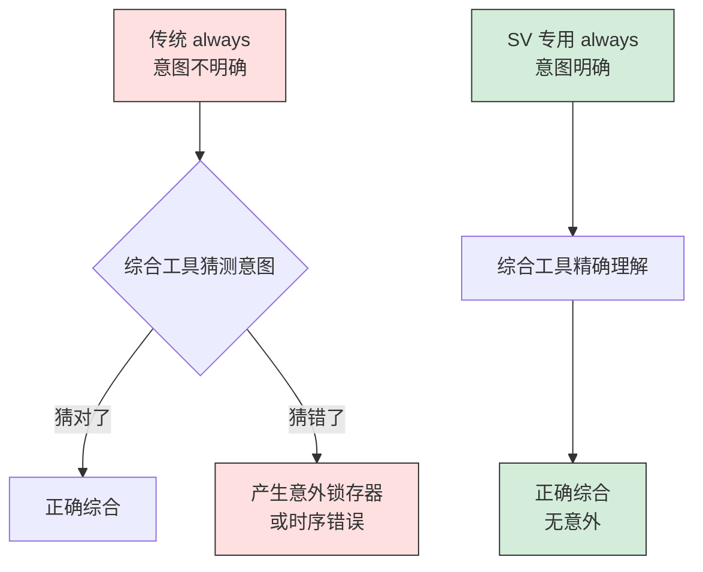

---
tags:
  - 数字IC
  - SystemVerilog
  - 基础语法
created: 2026-07-23
---

# SystemVerilog 基础语法

> 从 Verilog 到 SystemVerilog 的语法扩展。涵盖 always 块改进、接口、包、过程语句等基础内容。

---

## 核心概念

- **SV 基础语法**：Verilog 语法的扩展和改进，让代码更清晰、更安全
- **always_ff/always_comb/always_latch**：替代传统 `always`，意图更明确
- **Interface**：封装模块间的连接，减少连线错误
- **Package**：类似 C 的头文件，集中定义类型和参数

>  **大白话**：如果把 Verilog 比作手动挡汽车，SV 基础语法就是自动挡——功能一样，但开起来更安全、更省心。

---

## 一、always 块改进

### 1.1 三种专用 always 块

SV 引入了三个专用的 always 块，替代传统的 `always`：

| 关键字 | 用途 | 敏感列表 | 赋值方式 |
|--------|------|---------|---------|
| `always_ff` | **时序逻辑**（触发器） | `@(posedge clk)` | `<=` 非阻塞 |
| `always_comb` | **组合逻辑** | 自动推导（无需写） | `=` 阻塞 |
| `always_latch` | **锁存器** | `@(*)` 或电平敏感 | `=` 阻塞 |

```systemverilog
// 时序逻辑：用 always_ff
always_ff @(posedge clk or negedge rst_n) begin
    if (!rst_n)
        q <= 1'b0;
    else
        q <= d;
end

// 组合逻辑：用 always_comb（无需写敏感列表！）
always_comb begin
    y = a & b | c;
end

// 锁存器：用 always_latch
always_latch begin
    if (enable)
        q = d;
end
```

### 1.2 为什么需要专用 always 块？



**优势：**
1. **意图明确**：看到 `always_ff` 就知道是时序逻辑
2. **自动推导敏感列表**：`always_comb` 自动推导，不会漏写信号
3. **综合检查**：如果 `always_ff` 里写了组合逻辑，综合工具会报警
4. **防止意外锁存器**：`always_comb` 要求所有路径都有赋值，否则报警

>  ⚠️ **重要**：实际项目中**强烈推荐**使用 `always_ff`/`always_comb`，这是 SV 代码风格的基本要求。

---

## 二、接口（Interface）

### 2.1 什么是 Interface

**Interface** = 把模块间的连接信号封装在一起，类似"连接器的插头"。

```mermaid
flowchart TB
    subgraph 传统方式：每个信号单独连线
        A["模块 A"] -- "clk" --> C["模块 C"]
        A -- "rst_n" --> C
        A -- "data[7:0]" --> C
        A -- "valid" --> C
        A -- "ready" --> C
    end

    subgraph Interface 方式：打包成一个接口
        B["模块 B"] -- "bus_if" --> D["模块 D"]
    end

    style C fill:#ffe0e0,stroke:#333
    style D fill:#d4edda,stroke:#333
```

### 2.2 Interface 定义与使用

```systemverilog
// 定义接口
interface apb_if;
    // 信号声明
    logic       pclk;
    logic       preset_n;
    logic [31:0] paddr;
    logic [31:0] pwdata;
    logic [31:0] prdata;
    logic       pwrite;
    logic       psel;
    logic       penable;

    // 可以包含断言、任务、函数
    modport master(
        output pclk, preset_n, paddr, pwdata, pwrite, psel, penable,
        input  prdata
    );

    modport slave(
        input  pclk, preset_n, paddr, pwdata, pwrite, psel, penable,
        output prdata
    );
endinterface

// 模块使用接口
module apb_master (apb_if.master ifc);
    always_ff @(posedge ifc.pclk) begin
        if (ifc.psel)
            ifc.paddr <= next_addr;
    end
endmodule

module apb_slave (apb_if.slave ifc);
    always_ff @(posedge ifc.pclk) begin
        if (ifc.psel && ifc.penable)
            ifc.prdata <= mem[ifc.paddr];
    end
endmodule

// 顶层连接
module top;
    apb_if bus_if();  // 创建接口实例

    apb_master u_master (.ifc(bus_if));
    apb_slave  u_slave  (.ifc(bus_if));
endmodule
```

### 2.3 Interface 的优势

| 优势 | 说明 |
|------|------|
| **减少连线错误** | 信号打包，不会漏连、错连 |
| **便于修改** | 改接口定义，所有模块自动更新 |
| **支持 modport** | 明确信号方向，防止接反 |
| **可包含断言** | 接口级检查，早期发现问题 |
| **便于复用** | 标准接口（APB、AXI）可直接使用 |

>  **大白话**：Interface 就像 USB 接口——不管插什么设备，只要符合 USB 标准就能用。不用每次重新定义"哪根线是数据、哪根是电源"。

---

## 三、包（Package）

### 3.1 什么是 Package

**Package** = 集中定义类型、参数、函数的地方，类似 C 语言的**头文件**（.h）。

```systemverilog
// 定义包
package my_types_pkg;
    // 类型定义
    typedef enum logic [1:0] {
        IDLE    = 2'b00,
        RUNNING = 2'b01,
        DONE    = 2'b10,
        ERROR   = 2'b11
    } state_t;

    typedef struct packed {
        bit [31:0] addr;
        bit [31:0] data;
        bit        is_write;
    } transaction_t;

    // 参数定义
    parameter int FIFO_DEPTH = 16;
    parameter int DATA_WIDTH = 32;

    // 函数定义
    function automatic int clog2(int value);
        int result = 0;
        while (value > 0) begin
            value = value >> 1;
            result++;
        end
        return result;
    endfunction
endpackage

// 使用包
module my_module;
    import my_types_pkg::*;  // 导入包中所有定义

    state_t state;           // 使用包中定义的类型
    transaction_t txn;
    wire [clog2(FIFO_DEPTH)-1:0] addr;  // 使用包中的函数和参数
endmodule
```

### 3.2 Package  vs  `define

| 特性 | Package | `define |
|------|---------|----------|
| **作用域** | 需要 `import` 才可见 | 全局可见（容易冲突） |
| **类型安全** | ✅ 有类型检查 | ❌ 纯文本替换 |
| **调试友好** | ✅ 可跟踪定义位置 | ❌ 难以追踪 |
| **推荐程度** | ✅ 推荐 | ❌ 不推荐（除条件编译） |

>  ⚠️ **重要**：实际项目中**不要用 \`define\` 定义常量**，用 \`package\` 或 \`parameter\`。\`define 只用于条件编译（如 \`ifdef SIMULATION）。

---

## 四、过程语句改进

### 4.1 新的赋值语句

| 语句 | 用途 | 示例 |
|------|------|------|
| `assign` | 连续赋值（组合逻辑） | `assign y = a & b;` |
| `<=` | 非阻塞赋值（时序逻辑） | `q <= d;` |
| `=` | 阻塞赋值（组合逻辑） | `y = a & b;` |
| `unique case` | 互斥条件检查 | 见下方示例 |
| `priority if` | 优先级检查 | 见下方示例 |

### 4.2 unique case 和 priority if

**`unique case`**：要求所有条件互斥，且必须覆盖所有情况

```systemverilog
// 普通 case：不检查是否互斥或完整
case (sel)
    2'b00: y = a;
    2'b01: y = b;
    // 缺少 10 和 11，会产生锁存器！
endcase

// unique case：检查互斥性和完整性
unique case (sel)
    2'b00: y = a;
    2'b01: y = b;
    2'b10: y = c;
    2'b11: y = d;
    // 必须覆盖所有情况，否则编译报错
endcase
```

**`priority if`**：按顺序检查，第一个为真的分支执行

```systemverilog
// 普通 if：并行检查
if (req_high)
    grant = 3'b100;
else if (req_med)
    grant = 3'b010;
else if (req_low)
    grant = 3'b001;

// priority if：明确优先级顺序
priority if (req_high)
    grant = 3'b100;
else if (req_med)
    grant = 3'b010;
else if (req_low)
    grant = 3'b001;
else
    grant = 3'b000;  // 必须有默认分支
```

>  **大白话**：`unique case` 像"多选一"——必须选且只能选一个；`priority if` 像"排队优先"——前面的条件优先满足。

---

## 五、数组操作改进

### 5.1 数组方法

SV 为数组增加了许多内置方法：

```systemverilog
int data[8] = '{1, 2, 3, 4, 5, 6, 7, 8};
int result[$];

// 数组方法
result = data.unique();      // 去重
result = data.reverse();     // 反转
result = data.sort();        // 排序
result = data.rsort();       // 降序排序

// 数组归约方法
int sum = data.sum();        // 求和：36
int product = data.product(); // 乘积
int xor_all = data.xor();    // 异或

// 数组定位方法
int index = data.find_first(x) with (x > 5);  // 找第一个 >5 的元素
int count = data.count(x) with (x % 2 == 0);  // 统计偶数个数

// 数组赋值
data = '{8{0}};              // 所有元素赋值为 0
data = '{[0:3] = 1, default = 0};  // 部分赋值
```

### 5.2 队列操作

```systemverilog
int q[$] = {1, 2, 3, 4, 5};

// 插入
q.insert(2, 10);       // 在索引 2 处插入 10：{1,2,10,3,4,5}
q.insert(0, 0);        // 在开头插入：{0,1,2,10,3,4,5}

// 删除
q.delete(2);           // 删除索引 2：{0,1,10,3,4,5}
q.delete();            // 清空队列

// 切片
int slice[$] = q[1:3]; // 取索引 1~3：{1,10,3}

// 大小
int size = q.size();   // 队列大小
```

>  **大白话**：SV 的数组方法就像 Python 的列表操作——不用自己写循环，一行代码搞定排序、去重、统计。

---

## 六、SV 基础语法 vs Verilog 对比

```mermaid
flowchart TB
    subgraph Verilog
        V1["always @(*)"]
        V2["reg/wire"]
        V3["`define 常量"]
        V4["单独信号连线"]
    end

    subgraph SystemVerilog
        S1["always_comb<br/>自动推导敏感列表"]
        S2["logic<br/>统一类型"]
        S3["package<br/>类型安全"]
        S4["interface<br/>打包连接"]
    end

    V1 --> S1
    V2 --> S2
    V3 --> S3
    V4 --> S4

    style V1 fill:#ffe0e0,stroke:#333
    style V2 fill:#ffe0e0,stroke:#333
    style V3 fill:#ffe0e0,stroke:#333
    style V4 fill:#ffe0e0,stroke:#333
    style S1 fill:#d4edda,stroke:#333
    style S2 fill:#d4edda,stroke:#333
    style S3 fill:#d4edda,stroke:#333
    style S4 fill:#d4edda,stroke:#333
```

---

## 关键要点总结

- SV 基础语法是 Verilog 的**安全增强版**——功能一样，但更不容易出错
- `always_ff`/`always_comb` 替代传统 `always`，意图更明确
- `interface` 打包信号，减少连线错误，便于复用
- `package` 替代 `` `define`，提供类型安全的常量和类型定义
- `unique case` 和 `priority if` 让条件语句更安全
- SV 数组方法让数据处理更简洁（排序、去重、统计一行搞定）

## 延伸阅读

- [[数字IC/SystemVerilog核心特性]] — SV 高级特性（OOP、随机、覆盖率）
- [[数字IC/Verilog HDL核心语法与建模]] — Verilog 基础语法
- [[数字IC/UVM验证方法学入门]] — UVM 验证方法学
